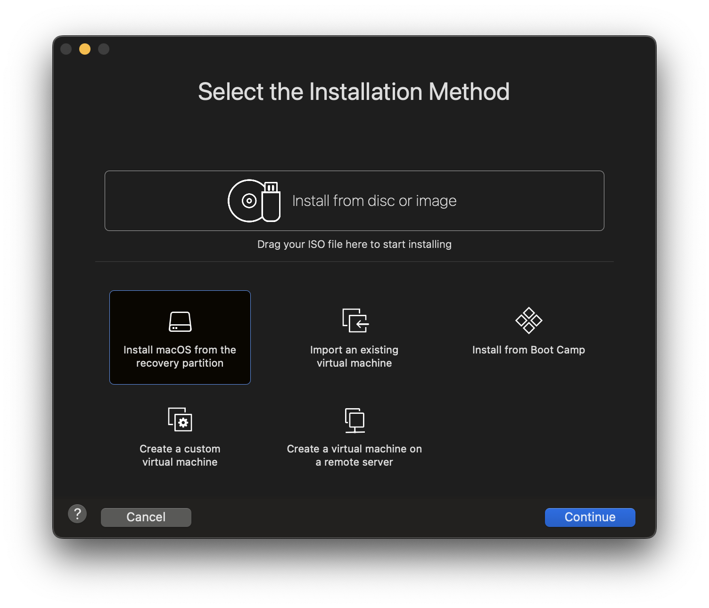
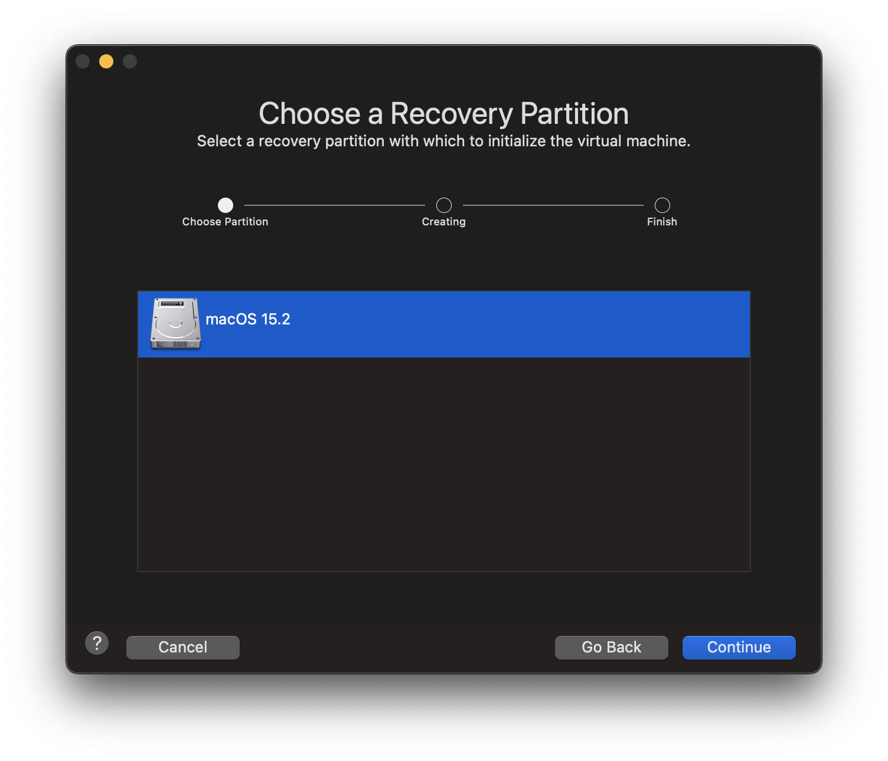
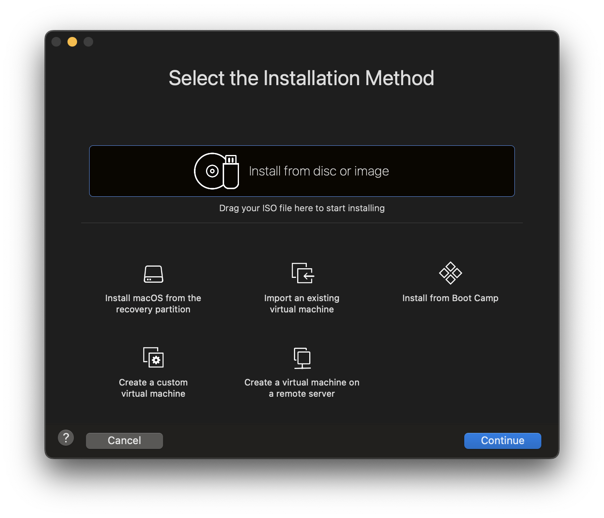
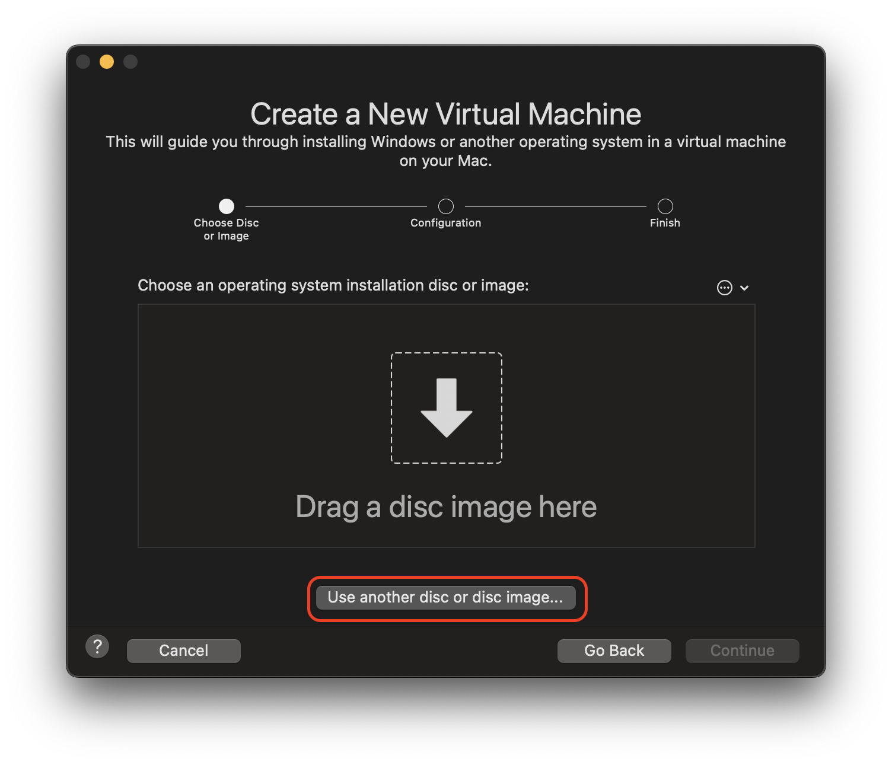
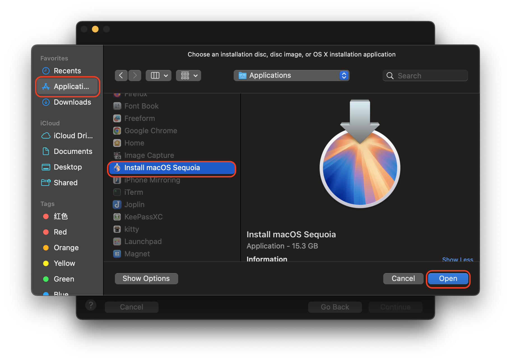
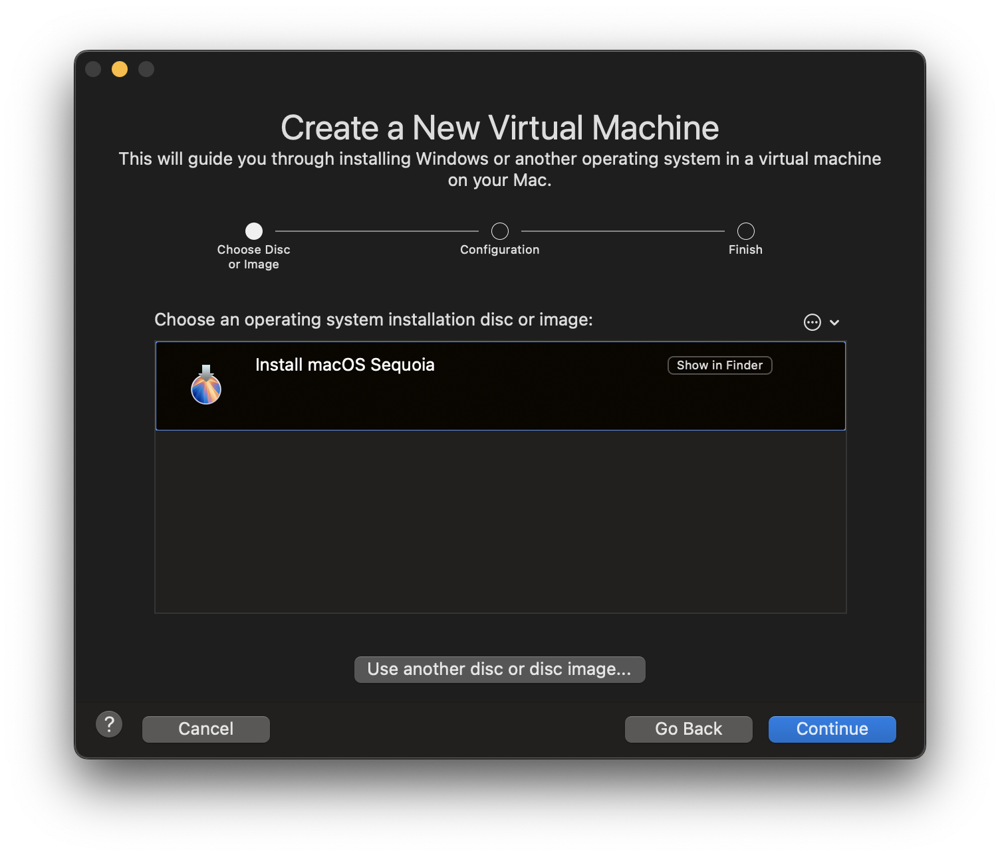
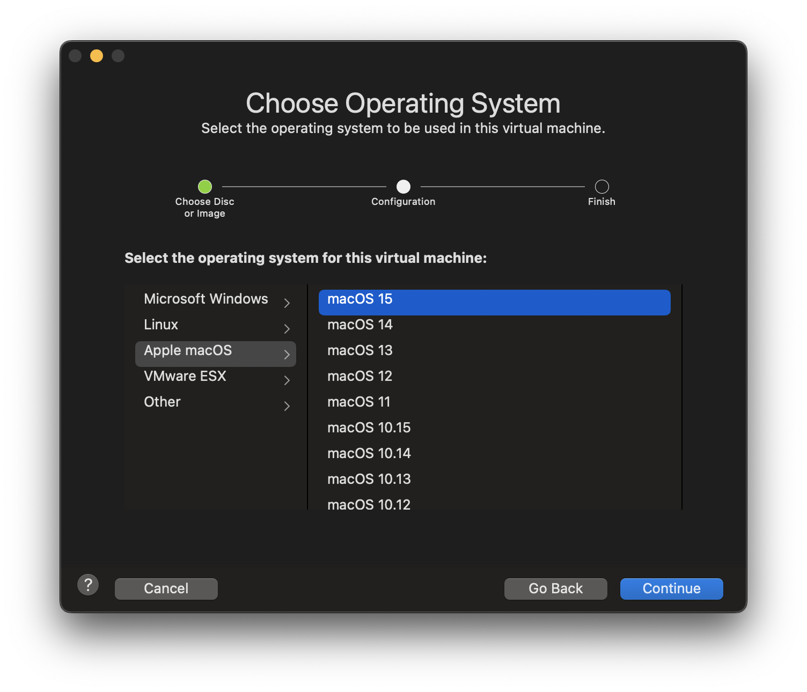
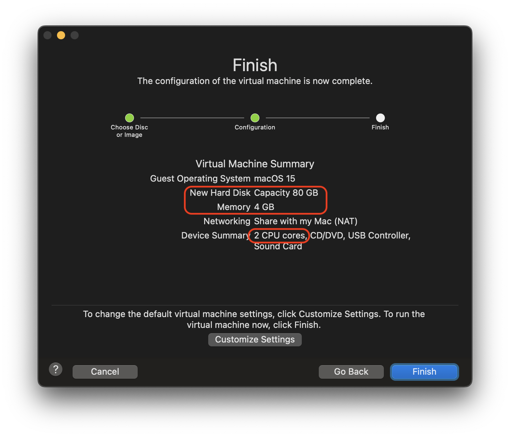
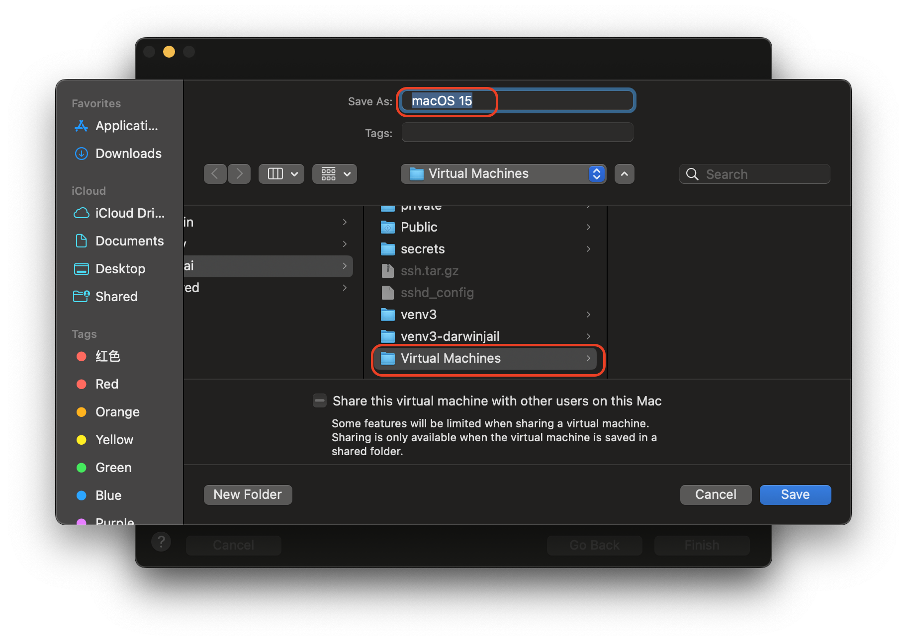

.. _vmware_macos_on_macos:

===================================
在macOS中使用VMware运行macOS虚拟机
===================================

制作 :ref:`macos_install_drive` 安装macOS虚拟机
===================================================

- 使用Disk Utility将U盘格式化成 ``Mac OS Extended(Jorunaled)`` 文件系统 - 这里假设格式化磁盘命名为 ``macos_installer`` ，则后续制作U盘的卷名就是 ``/Volumes/macos_installer``

- 在终端执行以下命令创建启动安装U盘:

.. literalinclude:: ../macos/macos_install_drive/createinstallmedia_sequoia
   :caption: 创建Sequoia启动安装U盘

.. note::

   需要确保U盘可用空间为 17.6 G以上，否则创建 Sequoia (macOS 15.3) 启动安装U盘会因容量空间不足而失败。

``以下是失败尝试，归档!!!``

从recovery分区安装macOS(失败)
===============================

安装了VMware Fusion之后，提供了选择安装模式( ``Select th Installation Method`` ):

- 选择 ``Install macOS from the recovery partition`` :

.. warning::

   从Recovery分区安装macOS似乎存在问题，我观察了很久没有任何网络流量、磁盘IO和CPU消耗，感觉存在bug (VMware Fusion 13.2)

   从 `Installing OS X from recovery partition fails <https://community.broadcom.com/vmware-cloud-foundation/communities/community-home/digestviewer/viewthread?MessageKey=35265828-9774-4e21-92f6-3a53697ae8e3>`_ 似乎确实不容易成功，所以我放弃这个方法。

从U盘或镜像安装macOS(失败)
============================

- 选择 ``Install from disc or image`` :

- 点击 ``Use another disc or disc image...``

- 选择 ``Applications`` 目录中的 ``Install macOS Sequoia`` (通过 AppStore 下载)

- 选择完成后可以看到 ``Install macOS Sequoia`` 位于 ``Choose an operating system installation disc or image`` 列表中，然后点击 ``Continue`` 按钮:

- 在 ``Choose Operating System`` 面板选择操作系统版本，这里选择 ``Apple macOS > macOS 15`` :

- 最后查看完成的默认配置:

可以看到默认配置是 ``2c4g80GB``

- 保存虚拟机的位置默认是 ``~/Virtual Machines``

.. warning::

   这里遇到一个异常提示 ``Create Install Media Failed`` ，看来是VMware Fusion创建安装镜像 ISO 失败，所以我改为采用 :ref:`macos_install_drive` 方法来制作安装启动U盘，然后通过这个U盘进行虚拟机安装(就好像实际主机安装一样)。

   目前验证下来只有这种自制安装启动U盘方式才能完成VMware macOS虚拟机安装。
