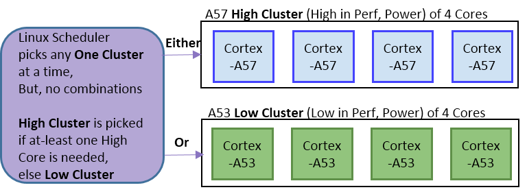

.. _arm_infra:

========================
ARM架构版本和处理器系列
========================

ARM公司
========

ARM是Advanced RISC Machine缩写，即高级精简指令集机器，早期也称为 Acorn RISC Machine(因为发明公司是Acorn电脑公司, Acorn Computers Ltd)。

ARM产品的特点是低功耗，广泛用于移动通信领域。ARM公司并不直接生产处理器，而是设计大量高性能、廉价、耗能低的RISC （精简指令集）处理器，将知识产权核心（IP core）授权给众多半导体、软件和OEM厂商，并提供技术服务。这种知识产权盈利模式和手机技术领域的高通公司一样，成为移动芯片隐形的王者。

AArch64
==========

2011年10月，ARM架构发布的ARMv8-A添加了一个可选的64位架构，称为 ``AArch64`` ，以及相关的新 ``A64`` 指令集。AArch64提供了与现有32位架构(AArch32/ARMv70A)和指令集(A32)的 **用户空间兼容性** : ARMv8-A允许32位应用程序在64位操作系统中执行，并且32位操作系统在64位hypervisor的控制下。

苹果公司率先在iPhone 5S中发布了ARMv8-A兼容内核。

ARM big.LITTLE
==================

ARM big.LITTLE 是ARM公司开发的一种异构计算架构，将相对省电和速度较慢的处理器核心(LITTLE)和相对更强大和耗电的处理器核心(big)相结合的技术。通常情况下，只有一侧或另一侧处于活动状态，但是所有内核都可以访问相同的内存区域，所以工作负载可以在大小核之间即时切换。这种大小核设计可以创建一个多核处理器，更好地适应动态计算需求，并且比单独的时钟频率伸缩(clock scaling)使用更少的功率。

2011年10月，big.LITTLE和Cortex-A7同时发布，后者在架构上与Cortex-A15兼容。

2012年10月，ARM发布了Cortex-A53和Cortex-A57(ARMv8-A)内核，也是相互兼容，可以在big.LITTLE芯片中使用。见下文 "集群交换(Clustered switching)" 示意图

2313年发布Cortex-A12和2014年发布Cortex-A17都可以在big.LITTLE配置中与Cortex-A7配对.

运行状态迁移(Run-state migration)
---------------------------------

根据内核中实现的调度程序，可以通过三种方式在 ``big.LITTLE`` 设计中安排不同的处理器内核:

集群切换(Clustered switching)
~~~~~~~~~~~~~~~~~~~~~~~~~~~~~~

集群模式(clustered model)实现是第一个也是最简单的实现，将处理器安排为大小相同的"大"或者"小"内核集群。操作系统调度程序一次只能看到一个集群；当整个处理器的负载在低和高之间变化时，系统会过度到另一个集群。所有的相关数据都是通过公共的L2缓存传递，使用高速缓存一致性互联(Cache Coherent Interconnect, CCI)，当前活动核心集群关闭并激活另一个核心集群。

   big.LITTLE 集群切换

.. _arm_v8.5-a:

ARMv8.5-A
===========

参考
======

- `ARM架构版本及处理器系列详细介绍 <https://blog.csdn.net/qq_34160841/article/details/105611131>`_
- `ARM Cortex-A系列（A53、A57、A73等）处理器性能分类与对比 <https://zhuanlan.zhihu.com/p/182992875>`_
- `wikipedia: AArch64 <https://en.wikipedia.org/wiki/AArch64>`_
