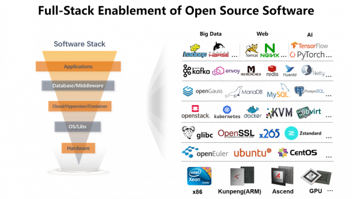
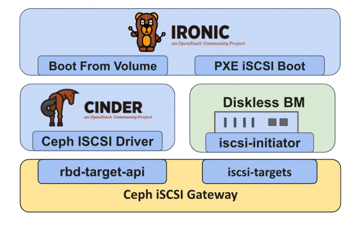

.. _intro_linaro:

======================
Linaro ARM生态简介
======================

`Linaro Ecosystem <https://www.linaro.org>`_ 是专注于ARM平台开源软件开发组织，由多家软件公司(RedHat、华为等)赞助和支持，并且在YouTube上提供了很多开发前沿信息，值得关注和参考。

作为 :ref:`openstack` 发展而来的 :ref:`openinfra` ，在边缘计算( :ref:`edge_cloud` ) 采用了基于 :ref:`arm` 硬件融合 :ref:`openstack` 以及 :ref:`kubernetes` 的软硬件堆栈:

- 近些年随着ARM服务器技术的广泛应用(曾经超算登顶的 `富岳(超级计算机) <https://zh.wikipedia.org/wiki/%E5%AF%8C%E5%B2%B3_(%E8%B6%85%E7%BA%A7%E8%AE%A1%E7%AE%97%E6%9C%BA)>`_ 就是ARM架构的HPC)，在边缘计算领域，ARM架构天然的低能耗高性能(苹果公司推出的M系列ARM处理器验证了同功耗下远超x86架构的性能)使之成为优选方案。

- 在各大云计算厂商中，各自推出了基于ARM架构的云计算产品，性价比不弱于Intel的X86架构

开源软件堆栈十分复杂，从底层到上层，需要结合不同领域的软件技术来实现大规模、可扩展、分布式计算。然而，对于上层最终用户来说，并不关心底层是X86还是ARM，最好对用户无感知才是云计算基础架构(Cloud Infrastructure)的终极目标。

Linaro的领域
=============

ARM要进入长期被X86所统治的开发领域，需要能够实现完整的 development pipeline ，这样才能降低开发人员的心智负担:

- 自动化的持续集成( :ref:`devops` )可以实现开发者代码自动完成完整的不同架构执行程序部署到对应架构的生产系统

- 持续的性能优化使得X86和ARM架构在性能上持平，并且现代的调度系统，例如 :ref:`kubernetes` 能够将架构差异抽象化对上层屏蔽，对最终用户透明，这样用户能够专注于业务系统开发和运行

- 虚拟化技术 :ref:`kvm` 和 :ref:`libvirt` 都对ARM架构提供了支持，在此基础上 :ref:`openstack` 也实现了 X86 和 ARM 多架构的融合支持

.. note::

   华为在 `鲲鹏计算 <https://kunpengcompute.github.io/arm-landscape/>`_ 验证了大量的开源软件在ARM架构上的实施，可以作为参考。

   实际上，类似阿里云内部也对ARM架构部署做了大量的整合工作，可以在阿里云官网选择对应ARM架构ECS体验。

Linaro是专注于ARM64的ecosystem的开源组织，主要聚焦于上游开发和维护，例如Linaro内核、toolchains、Android以及数据中心领域，并且深度参与开源架构社区以及维护ARM64 OpenDev CI资源。

**Linaro 开发云 是基于OpenStack和Ceph** 提供开发者使用ARM资源:

.. figure:: ../../../_static/arm/architecture/linaro/linaro_infrastructure.png

硬件自动化
===========

近些年，硬件自动化成为另外一个热门领域:

- 负载极高的应用需要完全运行在裸金属服务器上(例如在裸金属上运行云原生K8s，HPC)来获得最佳的网络和存储性能
- 虚拟化限制:  :strike:`ARM64不支持嵌套虚拟化(nested virtualization)` ARM从 Armv8.3-A开始支持嵌套虚拟化，并且在Arm8.4-A提高了性能( `Learn the architecture - AArch64 virtualization: Nested virtualization <https://developer.arm.com/documentation/102142/0100/Nested-virtualization>`_ )

Linaro支持ARM64的无盘启动(diskless boot)解决方案，结合了OpenStack Ironic管理平台，并使用 :ref:`ceph` ISCSI来提供卷支持。通过Ceph卷作为磁盘可以提供大规模启动磁盘交付，提升性能并降低RootFS安全隐患:

在各大云计算厂商内部，也是有直接操作物理服务器进行自动化系统安装的平台，可以从物理服务器上架加电开始，完成一整套自动安装OS，性能测试并自动完成交付给业务使用的平台。

用户案例
==========

Linaro的ARM架构客户案例是 `EasyStack <https://www.easystack.cn/>`_ ，属于中小型云计算厂商。这是一家北京的云计算公司，采用了OpenStack实现私有云解决方案，大约有1000+行业用户。

不过，从规模以及Linaro案例中提到的攻克难点案例，似乎还仅仅是整合开源技术，并未体现出性能和超大规模的优势。

.. note::

   我觉得精心设计和部署，工程上依然是能够实现ARM分布式大规模集群，甚至可以构建类似"富岳"的HPC集群。

参考
========

- `The Progress for Cloud Computing on Arm Architecture <https://superuser.openstack.org/articles/the-progress-for-cloud-computing-on-arm-architecture/>`_
