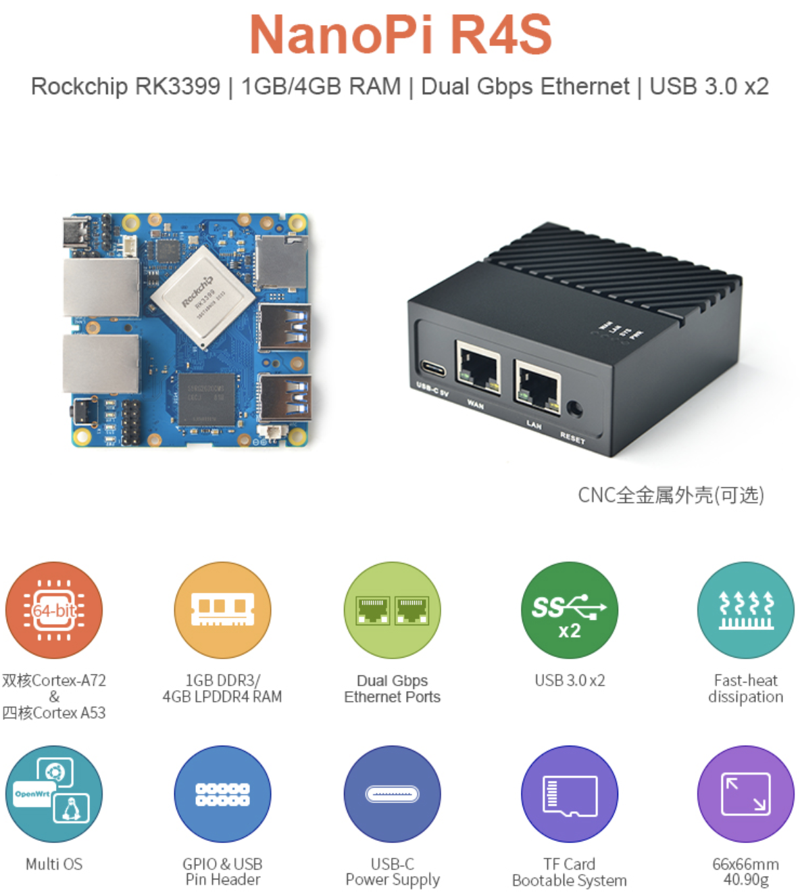
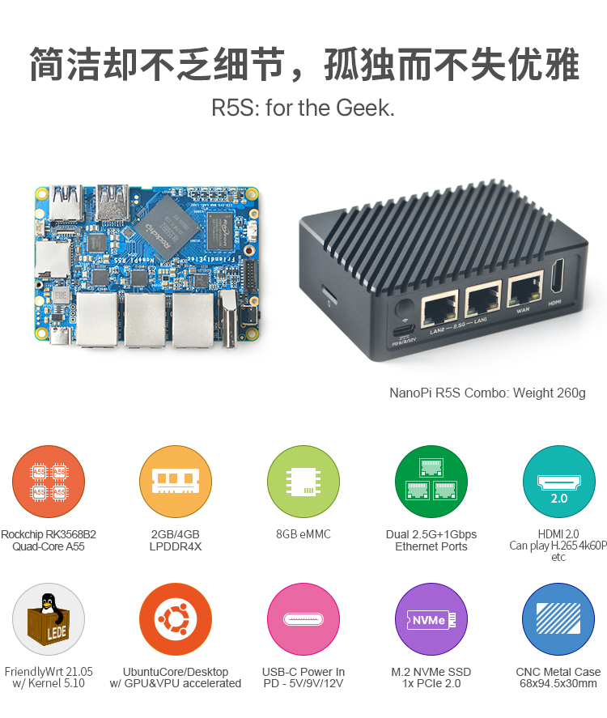

.. _nanopi_hardware:

===================
NanoPi硬件解析
===================

.. note::

   本文目前仅是我的构想: 由于囊中羞涩，并且已经投入大量的金钱在各种计算机设备上(还没有吃透)，所以暂时按耐住购买的冲动。我会充分使用好 :ref:`raspberry_pi` 以及 :ref:`hpe_dl360_gen9` 来构建我的云计算平台。

   不过，如果你没有太多的沉没成本，或许以NanoPi作为ARM平台起步，是一个不错的ARM服务器选择。

NanoPi R2S
===========

硬件规格:

- Rockchip RK3328(4核Contrex-A53 1.2GHz)
- 双千兆网卡
- 1GB DDR4内存

.. figure:: ../../_static/arm/nanopi/nanopi_r2s.png
    :scale: 60

NanoPi R4S
===========

硬件规格:

- Rockchip RK3328(双Cortex-A72 1.8GHz + 4核Contrex-A53 1.2GHz)
- 双千兆网卡
- 4GB DDR4内存

``NanoPi R4S`` 相对 R2S 有两个非常关键的改进:

- 处理器性能大幅提升，采用了手机处理器常用的大小核架构
- 内存提升到4G，也就是大型应用运行的入门级别

NanoPi R5S
===========

硬件规格:

- Rockchip RK3568B2(4核Contrex-A55 2GHz)
- 双2.5Gb网卡+千兆网卡(3个网口)
- 4GB DDR4内存

``NanoPi R5S`` 相对 R4S的改进有:

- 双千兆网口升级到双2.5Gb网口，并且附加一个千兆网口(共3个网口)
- 支持NVMe存储(非常关键)

硬件价格对比
=============

.. csv-table:: NanoPi各型号对比
   :file: nanopi_hardware/nanopi_compare.csv
   :widths: 33, 33, 33
   :header-rows: 1

从硬件均衡性(无短板)来看，R5S无疑是最佳选择，可以构建:

- 基于NVMe存储的计算系统: 3台设备可以构建 :ref:`k3s` + :ref:`ceph`
- 3台设备通过 2.5Gb 高速交换接口互联，构建Linux Switch，实现高速通讯集群
- 3台设备互联后依然有2个2.5Gb网口可以增加作为两台特定设备的高速互联(配置不同IP层用于第二层数据交换)，同时还有3个千兆网口可对外提供服务(最好采用DNS RR负载均衡)

费用预估:

- 3台NanoPi R5S: 579x3
- 3块 :ref:`samsung_pm9a1` 512GB: 400元x3

可以看到单台设备1000元，构建一个完整集群(3台)需要成本3000元

方案比较
==========

- 和 :ref:`hpe_dl360_gen9` 单服务器纯虚拟化集群方案比较:

  - 优点:

    - 极其节电，无噪音
    - 方便携带
    - 具备了虚拟化、存储(虽然性能较弱)
    - 不需要持续投入硬件(扩展性较弱)

  - 缺点:

    - 性能差距太大了，无法比拟Intel服务器的高性能，只能作为一种演示模拟
    - 无法构建大规模集群模拟
    - 无法扩展构建GPU的 :ref:`machine_learning` 平台

- 和 :ref:`pi_cluster` ARM架构集群比较

  - 优点:

    - 综合硬件特性优于树莓派(提供NVM存储，多网卡省却交换机互联)
    - 价格具有优势

  - 缺点:

    - 社区支持较弱，不像树莓派有各种不同的发行版支持并且几乎所有问题都在社区得到讨论
    - 驱动可能需要厂商支持(厂商定制发行版)

