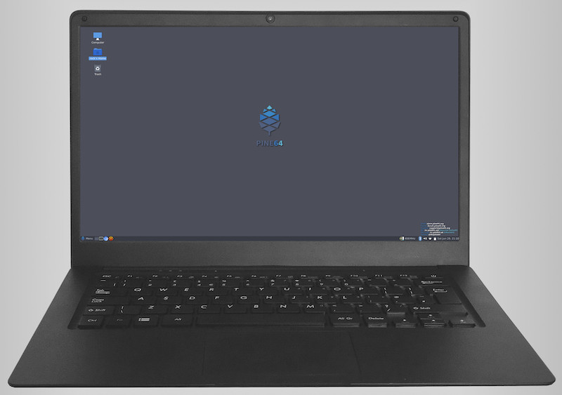

.. _pinebook_pro:

=================
Pinebook Pro
=================

.. note::

   我很想尝试一下ARM硬件平台的笔记本电脑。不过，ARM笔记本市场上非常少见，以前曾经看到所三星出过ARM芯片的笔记本，但是价格过于昂贵，对于囊中羞涩的我来说，未免性价比太低了。

   `Pine64 <https://www.pine64.org>`_ 推出了基于ARM的廉价笔记本设备，我准备了解这款产品，并尽可能尝试一下。 

技术规格
==========

::

   CPU: 64-Bit Dual-Core ARM 1.8GHz Cortex A72 and Quad-Core ARM 1.4GHz Cortex A53
   GPU: Quad-Core MALI T-860
   RAM: 4 GB LPDDR4 Dual Channel System DRAM Memory
   Flash: 64 GB eMMC 5.0
   Wireless: WiFi 802.11AC + Bluetooth 5.0
   One USB 3.0 and one USB 2.0 Type-A Host Ports
   USB 3.0 Type-C ports with alt-mode display out (DP 1.2) and 15W 5V 3A charge.
   MicroSD Card Slot: 1
   Headphone Jack: 1
   Microphone: Built-in
   Keyboard: Full Size ANSI(US) type Keyboard
   Touch-pad: Large Multi-Touch Touchpad
   Power: Input: 100~240V, Output: 5V3A
   Battery: Lithium Polymer Battery (10000mAH)
   Display: 14.1″ IPS LCD (1920 x 1080)
   Front Camera: 2.0 Megapixels
   Power Supply included
   Dimension: 329mm x 220mm x 12mm (WxDxH)
   Weight: 1.26 kg (2.78 lbs)
   Warranty: 30 days

.. note::

   官方预定从2020年2月开始。

   请注意，有两种键盘规格，ANSI和ISO，官方订购网站有键盘图示。也可参考 `Freewrite's physical keyboard layouts: ANSI vs ISO <https://support.getfreewrite.com/article/44-freewrites-physical-keyboard-layouts-ansi-vs-iso>`_ :

   .. figure:: ../../../_static/arm/pine/pinebook/ansi_iso_keyboard.png

   我们现在国内使用的MacBook或者TinkPad，都是ANSI keyboard。
