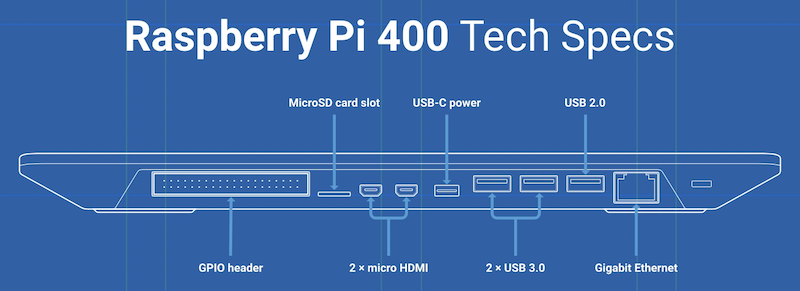

.. _pi_400:

========================
树莓派Raspberry Pi 400
========================

强烈安利 ``树莓派400`` - 一款集成了主机键盘的一体化ARM设备。仅仅500+RMB，你就可以得到一个完整的适合桌面使用、性能可观的微型电脑，且通过优化和调整，可以运行Android应用，实现一个完全融合的移动解决方案。

.. figure:: ../../../_static/arm/raspberry_pi/hardware/pi400.png
   :scale: 70

透视树莓派400，可以看到在简单的键盘下，隐藏着完整功能的 :ref:`pi_4` :

.. figure:: ../../../_static/arm/raspberry_pi/hardware/pi400_keyboard.png
   :scale: 70

树莓派400几乎完整移植了 :ref:`pi_4` 的主要接口，并针对桌面使用做了优化:

 

参考
=====

- `Raspberry Pi 400官网资料 <https://www.raspberrypi.org/products/raspberry-pi-400/>`_
