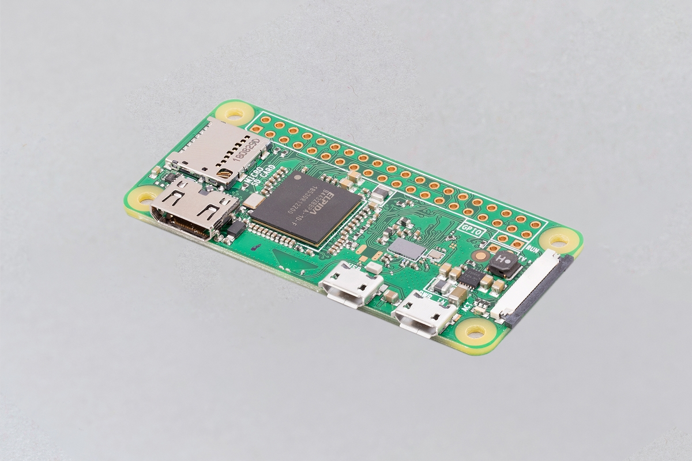

.. _pi_zero:

========================
树莓派Raspberry Pi Zero
========================

树莓派Raspberry Pi Zero是价格更为低廉但是也更为小巧的树莓派设备，只有一个普通口香糖大小，分为两个版本:

- Pi Zero W: 支持无线网络和蓝牙
- Pi Zero: 去除无线支持版本

我使用的是 Pi Zero W ，具有以下硬件配置:

- 802.11 b/g/n 无线网络
- Bluetooth 4.1
- 1GHz单核处理器
- 512MB RAM
- Mini HDMI
- micro USB On-The-Go(OTG)端口
- 兼容HAT的40针
- 提供CSI照相机连接器

使用体验
==========

- :ref:`kali_linux` 可以运行在这个非常小巧的Pi Zero W设备上，通过无线网络实现一些渗透测试
- 支持 802.11 b/g/n 无线网络，可以很好兼容我的 :ref:`airport_express` 的高速 802.11 n网络
- 通过 :ref:`pi_zero_net_gadget` 连接主机

Pi Zero 2 W
===============

2021年树莓派推出了Zero的升级版本 `Raspberry Pi Zero 2 W <https://www.raspberrypi.com/products/raspberry-pi-zero-2-w/>`_ 主要改进:

- 处理器升级: 4核 64位 ARM Cortex-A53处理器，主频1GHz (速度大约是最初版本Pi Zero的5倍)
- 512MB SDRAM (无变化)
- 2.4GHz 802.11 b/g/n 无线网络
- 蓝牙4.2, 蓝牙低功耗(BLE), 板载无线
- Mini HDMI
- micro USB On-The-Go(OTG)端口
- 兼容HAT的40针
- CSI-2照相机连接器
- H.264, MPEG-4 decode (1080p30); H.264 encode (1080p30)
- OpenGL ES 1.1, 2.0 graphics

树莓派Zero 2 W的主要改进有3点:

- 多核处理器，计算性能提升
- 内置硬件视频编码和解码
- OpenGL图形支持

所以如果使用Zero来做边缘视频计算(图像捕捉处理)，则建议使用 Zero 2 W。不过，这款设备内存很小，可能还是会捉襟见肘。

参考
======

- `树莓派官方产品介绍 Raspberry Pi Zero W <https://www.raspberrypi.org/products/raspberry-pi-zero-w/>`_
