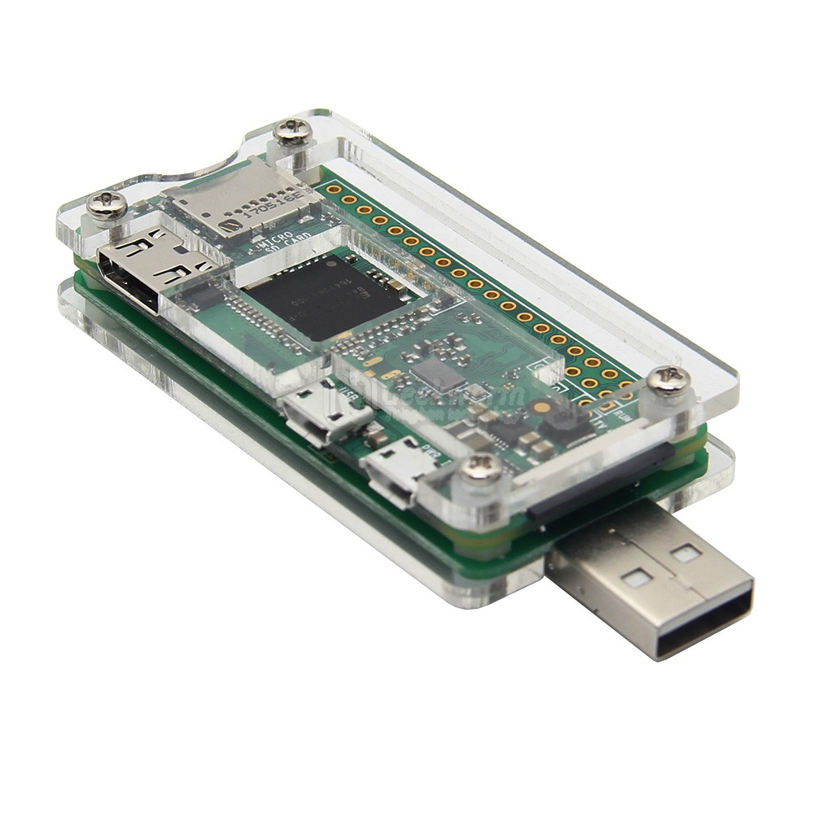

.. _pi_zero_net_gadget:

==========================================
树莓派Zero设置USB网络通讯(Ethernet Gadget)
==========================================

树莓派Zero专用的USB扩展板
==========================

``Ethernet Gadget`` 是一个可以用于树莓派通过USB micro-B线连接到主机的方法，可以实现网络，VNC，ssh以及scp等操作。

虽然名为 ``Ethernet Gadget`` ，实际上并不使用以太网线，而只需要使用USB micro-B连线连接主机和Raspberry Pi Zero。此时 ``Pi`` 就像一个以太网设备。

淘宝上有一种Raspberry pi zero专用的USB扩展板，可以直接将Zero转换成通过标准USB接口取电和同时通讯，方便了使用和携带：

.. figure:: ../../../_static/linux/kali_linux/zero_usb_1.jpg

加上一个透明的亚克力保护壳，非常美观：

配置Ethernet Gadget
====================

当网络连接后，可以通过USB线将主机的网络共享给 ``Pi`` 

- 首先 :ref:`pi_quick_start` 将系统安装好

- 编辑 ``config.txt`` ，在最后添加一行::

   dtoverlay=dwc2

- 编辑 ``cmdline.txt`` 在 ``rootwait`` 之后加上一个空格，以及 ``modules-load=dwc2,g_ether`` 。完整配置如下::

   dwc_otg.lpm_enable=0 console=serial0,115200 console=tty1 root=PARTUUID=5e878358-02 rootfstype=ext4 elevator=deadline fsck.repair=yes rootwait modules-load=dwc2,g_ether

- 激活树莓派的SSH登陆功能:

只要在 ``/boot`` 分区中有一个空白的 ``ssh`` 文件存在，树莓派 ``Raspbian`` 系统启动时候就会启动SSH服务。

- 将TF卡插入Raspberry Pi Zero设备，然后通过USB连接到主机上

此时Pi Zero会被识别成一个以太网设备。例如，在Mac已经支持了Bonjour（对于Linux系统，需要添加Bonjour支持），则立即看到网络设备。对于Windows主机，则需要添加Bonjour支持 `添加bonour zoneconf网络 <https://learn.adafruit.com/bonjour-zeroconf-networking-for-windows-and-linux/>`_ 

.. note::

   此时Raspberry Pi是动态IP地址，所以除非能够在你的Bonjour网络设备上启动DHCP服务，否则无法和对端通讯。

设置树莓派Zero静态IP
========================

将树莓派的TF卡通过转接套转成U盘，插入到可以识别EXT4文件系统的Linux主机上。然后在Linux主机上挂载TF卡的 ``/dev/sdX2`` 分区（这里 ``X`` 是指动态识别的磁盘设备编号，通常可能是 ``/dev/sdb2`` ） 

- 挂载树莓派分区::

   mount /dev/sdb2 /mnt

- 编辑挂载的TF卡分区 ``/dev/sdb2`` 上的Raspbian的配置文件。

编辑 ``/mnt/etc/network/interfaces`` 配置如下::

   allow-hotplug usb0
   iface usb0 inet static
           address 192.168.7.10
           netmask 255.255.255.0
           network 192.168.7.0
           broadcast 192.168.7.255
           gateway 192.168.7.1

- 另一种方式是编辑 ``/mnt/etc/dhcpcd.conf`` （这是当前推荐的方法） ::

   interface usb0
   static ip_address=192.168.7.10/24
   static routers=192.168.7.1
   static domain_name_servers=192.168.7.1

这样启动Raspberry Pi Zero就会自动将USB网卡配置固定IP地址。也就是可以在对应的主机上，将网卡IP配置成 ``192.168.7.1`` ，就可以和Pi Zero的IP ``192.168.7.10`` 互相通讯了。

参考
=======

- `Ethernet Gadget <https://learn.adafruit.com/turning-your-raspberry-pi-zero-into-a-usb-gadget/ethernet-gadget>`_
