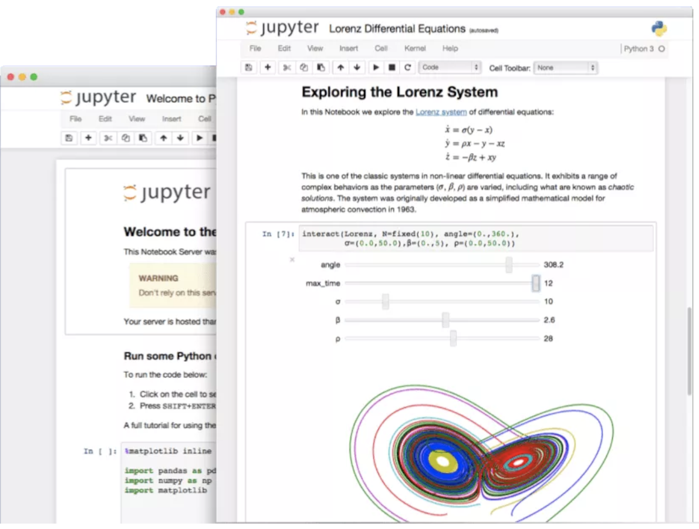
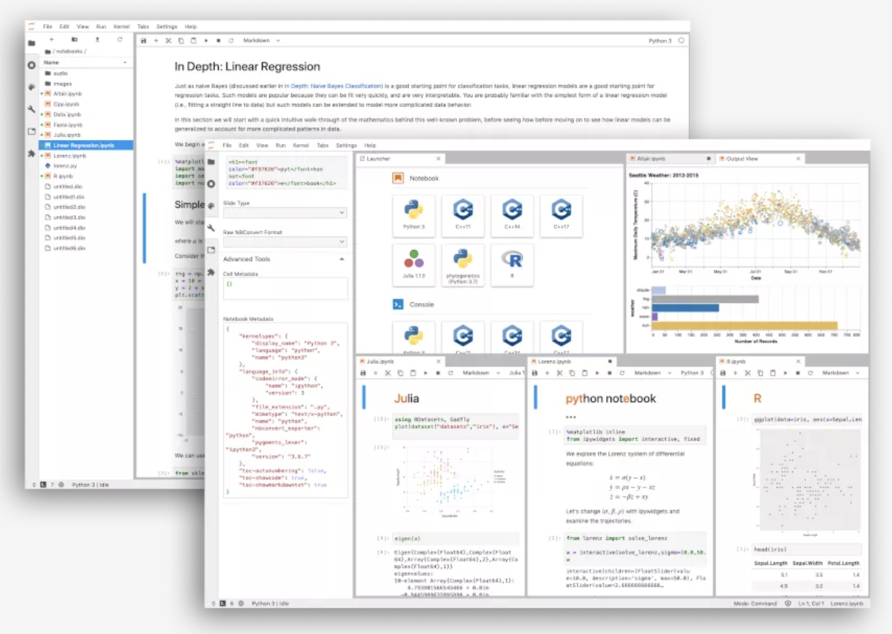

.. _intro_jupyter:

================
Jupyter简介
================

`Jupyter 大数据工具 <https://jupyter.org>`_ 是一个开源的web应用，用于创建和共享文档，支持交互编码，公式，可视化以及描述文本。Jupyter Notebook 已迅成为速数据分析，机器学习的必备工具。因为它可以让数据分析师集中精力向用户解释整个分析过程。

Jupyter这个名字是它要服务的三种语言的缩写：Julia，PYThon和R，这个名字与“木星（jupiter）”谐音。

.. image:: ../../_static/big_data/jupyter/jupyter.png
   :scale: 75

Jupyter Note
================

经典(传统)的Jupyter工具集称为 ``Jupyter Note`` :

- Jupyter的迅速发展，已经支持超过40种编程语言: Python, R, Julia, Scala
- Jupyter Notebooks可以通过email, Dropbox, GitHub 以及 Jupyter Notebook Viewer分享给他人。
- Jupyter代码可以输出为 HTML, images, videos, LaTeX, 和自定义 MIME 类型
- 可以集成多种大数据: 例如通过Python, R,和Scala使用Apache Spark, 并且可以使用 pandas, scikit-learn, ggplot2, 和 TensorFlow 来探索同一数据集

Jupyter Lab
===============

Jupyter Lab是下一代Notebook界面，提供了最新的基于web的交互开发环境，用于notebooks, 代码和数据。它的灵活的界面允许用户配置和编排数据科学工作流，科学计算，计算报导(computational journalism)以及 :ref:`machine_learning` 。模块化设计提供了扩展和丰富功能。

参考
=========

- `Jupyter Notebook 有哪些奇技淫巧？ <https://www.zhihu.com/question/266988943>`_
- `jupyter notebook 可以做哪些事情？ <https://www.zhihu.com/question/46309360>`_
- `Jupyter Notebook介绍、安装及使用教程 <https://www.jianshu.com/p/91365f343585>`_
- `Jupyter Notebook 快速入门 <https://www.cnblogs.com/nxld/p/6566380.html>`_
