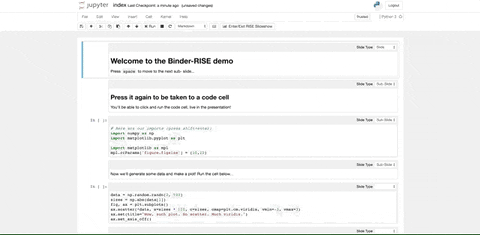

.. _jupyter_slideshow:

==================
Jupyter幻灯展示
==================

slideshow
============

`RISE <https://github.com/damianavila/RISE>`_ 可以将Jupyter Notebook转换成slideshow，并且能耦在浏览器
中执行代码加护演示。以下是一个演示gif:

安装
------

- 使用pip安装::

   pip install RISE

- 在文档目录安装JS和CSS::

   jupyter-nbextension install rise --py --sys-prefix

- 切换到根目录再次执行启动jupyter notebook::

   jupyter notebook

.. note::

   PegasussWang有一个 `案例notebook <https://github.com/PegasusWang/notebooks>`_ 可以参考。
