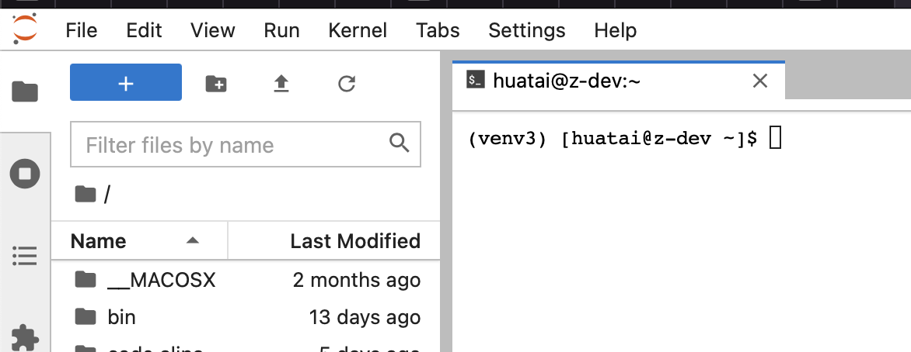
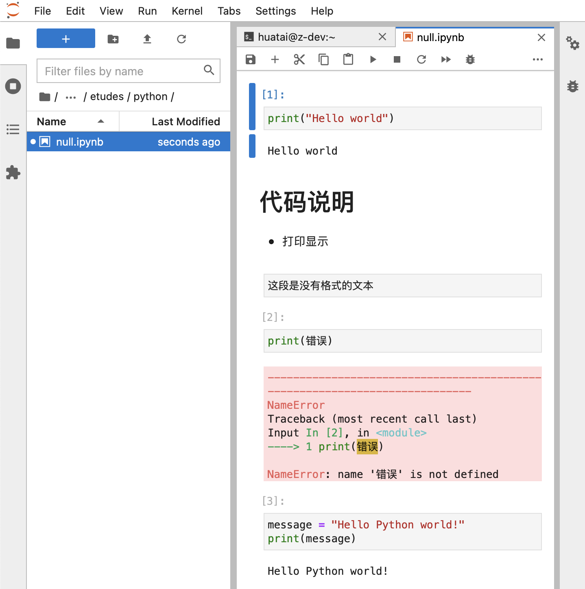
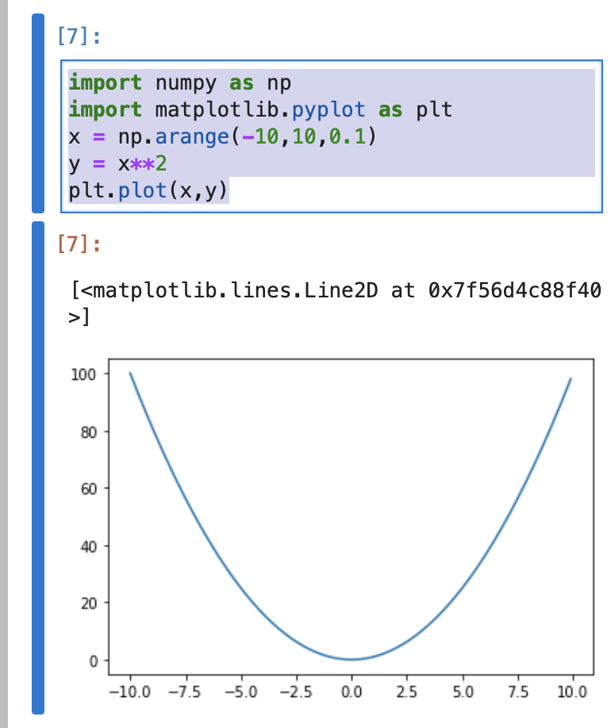

.. _jupyter_startup:

=================
Jupyter快速起步
=================

界面
========

JupyterLab的初始界面类似一个开发IDE:

- 可以打开远程服务器的终端(就好像ssh登陆到服务器上)
- 左方导航栏提供了远程服务器上文件系统目录浏览，方便打开进行编辑

- 点击 ``+`` 按钮启动一个 ``Launcher`` 界面，可以选择常见的功能，例如:

  - ``Notebook`` 可以启动一个混合 Python 代码 / Markdown文档 / 普通文本文档 的记事本

    - 此时在当前目录下生成一个 ``.ipynb`` 文件，所有在 ``Notebook`` 中输入的代码、markdown以及文本都会混合记录在这个文件中
    - 随手编写一段代码，点击 ``Run`` 按钮可以立即看到输出结果
    - 手写一段Markdown代码，点击 ``Run`` 按钮可以立即看到渲染以后的html页面效果

非常适合测试一些代码片段

代码和绘图
==============

.. note::

   以下案例是为了体验 Python 和 Jupyter 的强大功能，你不理解原理(就像我)也没有关系

- 输入以下代码，绘制抛物线::

   import numpy as np
   import matplotlib.pyplot as plt
   x = np.arange(-10,10,0.1)
   y = x**2
   plt.plot(x,y)

点击 ``Run`` 按钮可以看到绘制出抛物线:

.. note::

   如果Python代码提示缺少对应 ``numpy`` 模块，则在 :ref:`virtualenv` 中使用 ``pip`` 安装，例如::

      pip install numpy

   其他以此类推...

