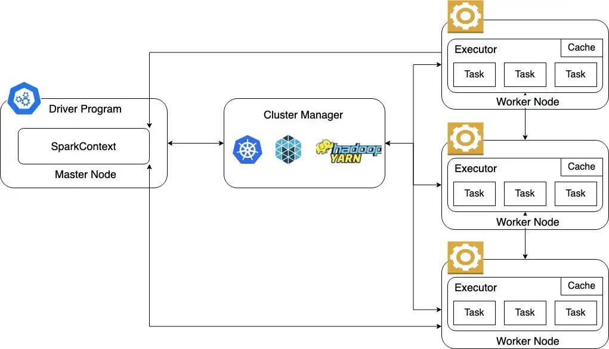
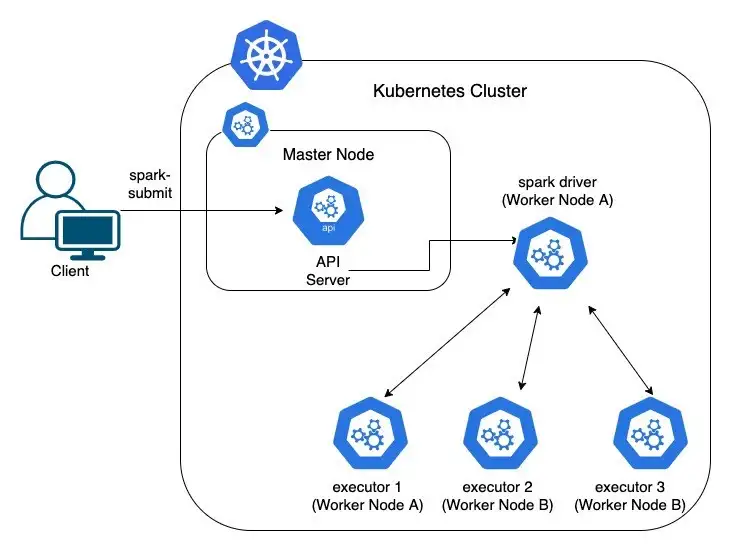

.. _spark_k8s_ceph_arch:

=====================================
基于Kubernetes和Ceph运行Spark的架构
=====================================

传统上Hadoop/Spark都是采用HDFS存储共享数据，随着 :ref:`ceph` 的广泛使用，以及 :ref:`kubernetes` 容器化运行分布式负载的崛起，对于企业用户，采用更为精简的统一架构成为可能的选择。

.. note::

   实践部署待后续完成

Spark on Kubernetes
=====================

:ref:`kubernetes` 作为当前最主流的集群资源管理器，很多用户会结合Kubernetes来运行Spark这样的大数据(流批一体)和 :ref:`machine_learning` 。

Apache Spark支持以下4种资源管理器:

- Standalone
- YARN(Yet Another Resource Negotiator)
- Apache Mesos
- Kubernetes

作为最后进入Spark生态的资源管理器，Spark on Kubernetes还在迅速发展中，但是Kubernetes作为容器调度资源管理的事实标准，有着较为 `光明的未来 <https://www.zhihu.com/question/446575763>`_ (玩个梗)。

Spark是类似Apache Hadoop的通用分布式集群计算框架，使用主从结构:

- 主节点(高可用性集群中通常有3个主节点)和一对多工作节点(one to many Worker Nodes)
- 主节点在集群管理器的帮助下管理工作节点
- 工作节点运行执行程序以任务形式处理所有数据

Spark提供了两种不同的模式来运行应用程序:

- 集群模式
- 客户端模式

通常可以通过三种方式在Kubernetes上运行Spark应用程序:

- Spark 提交CLI(本地开发/测试)
- 适用于Apache Airflow的 ``KubernetesPodOperator`` (推荐用于生产)
- ``SparkK8sOperator``

Spark架构
-----------

   Spark架构

kubernetes作为集群管理器时Spark架构
------------------------------------

   Spark工作在Kubernetes集群的架构

性能和成本平衡
=================

Red Hat 和 Intel共同推进 :ref:`ceph` 在大数据计算上的应用，结合 Spark , Hadoop 和 Ceph做了相关测试，总结参考大致有如下观点:

- HDFS采用3副本存储模式，Ceph如果采用3副本存储模式，则两者性能基本相同
- Ceph支持校验存储模式(类似于RAID)可以减少存储投资成本(最多可减少50%)，但是也相应降低了存储性能

.. note::

   由于厂商的立场，实际方案对比可能存在偏颇。本文摘录是为了能够提供一种方案思路，只有实践并结合自己的业务才能真正评估方案。

.. note::
   我感觉如果性能没有极致要求(非生产环境)可以采用Ceph的校验存储模式来节约投资，此外，由于Ceph的通用性，在不同架构下可以统一采用Ceph存储池满足不同的部署需求，降低运维成本，所以采用Ceph来取代HDFS是有一定价值的。

   由于 :ref:`k8s_volumes` 和 :ref:`k8s_persistent_volumes` 都对 :ref:`ceph` 有原生支持，并且属于长期支持的存储技术，所以在Spark迁移到Kubernetes集群运行方案，采用 :ref:`ceph` 可能是一种比较合适的选择。

参考
=======

- `Why Spark on Ceph? <https://www.redhat.com/ja/blog/why-spark-ceph-part-1-3>`_
- `Apache Spark on Kubernetes — On-Premise (Ceph) and AWS (S3) <https://medium.com/@prateek.dubey/apache-spark-on-kubernetes-on-premise-ceph-and-aws-s3-d02b79760cc4>`_
- `Run your Spark data processing workloads using OpenDataHub, OCS, and an external Ceph cluster <https://towardsdatascience.com/run-your-spark-data-processing-workloads-using-opendatahub-ocs-and-an-external-ceph-cluster-8922f166f884>`_
