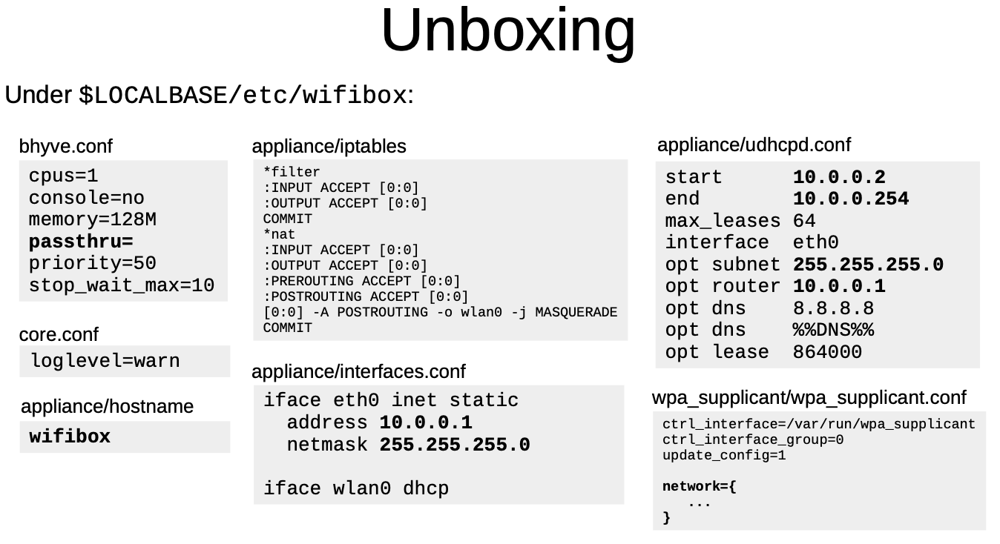
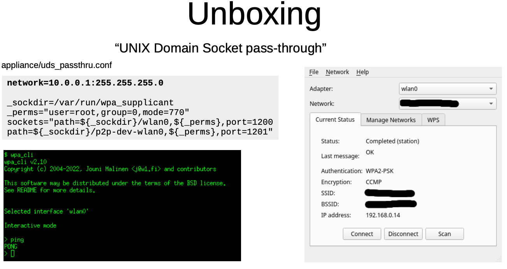

.. _freebsd_wifi_bcm43602:

==========================
FreeBSD无线网络BCM43602
==========================

.. note::

   本文实践在 :ref:`mbp15_late_2013` 进行，最初该笔记本原装无线网卡芯片是 Broadcom BCM4360 。这个无线芯片可以在Linux上工作(其实也很难支持)，但是FreeBSD目前无法支持。

   我在最近一次部署 :ref:`gentoo_mbp_wifi` 将 :ref:`mbp15_late_2013` 无线网卡模块换成了 :ref:`bcm943602cs` 来避免折腾NVIDIA私有驱动，所以现在我在 :ref:`mbp15_late_2013` 部署FreeBSD时候，将针对 :ref:`bcm943602cs` 配置无线网络。理论上 ``BCM43602`` 无线模块对开源驱动较为友好，可能可以在FreeBSD中驱动。

检查硬件
=========

- 执行 ``pciconf`` (类似Linux平台的 ``lspci`` )命令检查硬件:

.. literalinclude:: freebsd_wifi_bcm43602/pciconf
   :caption: ``pciconf`` 检查硬件

显示:

.. literalinclude:: freebsd_wifi_bcm43602/pciconf_output
   :caption: ``pciconf`` 检查硬件显示 BCM43602
   :emphasize-lines: 3

博通（broadcom）网卡驱动
==========================

`FreeBSD Broadcom Wi-Fi Improvements <https://www.landonf.org/code/freebsd/Broadcom_WiFi_Improvements.20180122.html>`_ 提供了Broadcom无线网卡支持列表，但是没有 BCM43602

我在 `reddit帖子: Support for BCM4360 (2014 Mac Mini) Trying to move from Linux/windows. <https://www.reddit.com/r/freebsd/comments/1ekuffr/support_for_bcm4360_2014_mac_mini_trying_to_move/>`_ 看到有提到虽然FreeBSD列表中没有支持，但是OpenBSD显示支持 ``BCM43602`` 但不支持BCM4360。看起来我的 ``BCM43602`` 还是有希望的...

.. _freebsd-wifibox:

FreeBSD Wifibox
-----------------

非常幸运， `Project FreeBSD Wifibox <https://github.com/pgj/freebsd-wifibox>`_ 项目在FreeBSD上通过使用Linux来驱动无线网卡(神奇啊!!!)

.. note::

   FreeBSD不支持 ``BCM43602`` 的原因是License和技术原因(这块Broadcom无线网卡需要闭源驱动)，所以FreeBSD官方是永远不会支持该网卡的。

`Project FreeBSD Wifibox <https://github.com/pgj/freebsd-wifibox>`_ 通过在FreeBSD的 :ref:`bhyve` 运行 :ref:`alpine_linux` 虚拟机，将物理主机的无线网卡从FreeBSD主机中直接透传给guest虚拟机，来实现在Linux VM中使用wifi驱动。

``freebsd-wifibox`` 的最简单安装方法是通过 :ref:`freebsd_ports` : 也就是 `FreeBSD Wifibox Port <https://github.com/pgj/freebsd-wifibox-port>`_

- 首先完成 :ref:`freebsd_ports` 安装

.. literalinclude:: ../admin/freebsd_packages_ports/git_checkout_ports
   :caption: ``check out`` ports 的HEAD分支

.. literalinclude:: ../admin/freebsd_packages_ports/git_pull_ports
   :caption: ``git`` 更新 ``/usr/ports``

- 安装 `FreeBSD Wifibox Port <https://github.com/pgj/freebsd-wifibox-port>`_ 前的准备工作:

.. literalinclude:: freebsd_wifi_bcm43602/pkg_before
   :caption: 安装 ``wifibox`` 前先安装必要的工具

- 激活 :ref:`linuxulator` :

.. literalinclude:: freebsd_wifi_bcm43602/linux
   :caption: 激活 :ref:`linuxulator`

为了能够启动操作系统时持久化启动 :ref:`linuxulator` 支持，应该配置 修改 ``/etc/rc.conf`` 添加:

.. literalinclude:: ../virtual/linuxulator/rc.conf
   :caption: 配置 ``/etc/rc.conf`` 持久化激活 ``Linuxulator``

- 创建 ``/compat/linux`` 目录:

.. literalinclude:: freebsd_wifi_bcm43602/compat
   :caption: 创建 ``/compat/linux`` 目录

有时候 build 可能会出现 ``Abort trap`` 消息，从而导致 ``make`` 出现错误 ``134`` 。当尝试在FreeBSD上运行Linux二进制文件(例如用于安装组件的apk包管理起)时会发生这种情况。通常可能发生在没有使用过 :ref:`linuxulator` 的系统上，并且可能时没有创建 ``/compat/linux`` 目录

- 安装 ``net/wifibox-core`` 依赖，其中 :ref:`socat` 软件包仅在 Unix Domain Socket pass-through 需要激活时要求:

.. literalinclude:: freebsd_wifi_bcm43602/wifibox-core_depend
   :caption: 安装 ``wifibox-core`` 运行依赖

安装 ``wifibox-alpine``
~~~~~~~~~~~~~~~~~~~~~~~~~

- 安装 ``wifibox-alpine``

.. literalinclude:: freebsd_wifi_bcm43602/install_wifibox-alpine
   :caption: 安装 ``wifibox-alpine``

安装 ``wifibox-alpine`` 时会编译内核模块，我的 :ref:`bcm943602cs` 内核驱动是 ``brcmfmac``

默认配置选项中有  ``FW_BRCM`` (Broadcom 802.11n) ，参考 `gentoo linux wiki: Apple MacBook Pro 15-inch (2016, Intel, Four Thunderbolt 3 Ports) <https://wiki.gentoo.org/wiki/Apple_MacBook_Pro_15-inch_(2016,_Intel,_Four_Thunderbolt_3_Ports)>`_ Boradcom BCM43602 802.11ac 无线网卡驱动是 ``brcmfmac`` ，只支持 2.4GHz 网络

.. literalinclude:: freebsd_wifi_bcm43602/kernel
   :caption: 编译 ``wifibox-alpine`` 时内核选项支持(仅选择 ``FM_BRCM`` )

.. note::

   参考 `Linux Wireless documentation > Broadcom brcmsmac(PCIe) and brcmfmac(SDIO/USB) drivers <https://wireless.docs.kernel.org/en/latest/en/users/drivers/brcm80211.html?s%5B%5D=bcm43602>`_

   由于是使用Linux驱动， 如果你使用不同网卡，完整列表参考 `Linux Wireless documentation > Existing Linux Wireless drivers <https://wireless.docs.kernel.org/en/latest/en/users/drivers.html>`_

   `gentoo linux wiki: Apple MacBook Pro 15-inch (2016, Intel, Four Thunderbolt 3 Ports) <https://wiki.gentoo.org/wiki/Apple_MacBook_Pro_15-inch_(2016,_Intel,_Four_Thunderbolt_3_Ports)>`_ 也介绍了 :ref:`bcm943602cs`

- 当选择了 ``FW_BRCM`` 选项之后，bcm43602的firmware(属于 ``linux-firmware`` 分发的一部分)将被加入镜像，Make.file中包含了 ``brcmfmac43602-pcie.FreeBSD-BHYVE.bin`` 软链接到 ``brcmfmac43602-pcie.bin``
- 虚拟机内部 ``/lib/firmware/brcm`` 目录下有一个 ``brcmfmac43602-pcie.txt`` 修改内容是设备mac地址
- 编译配置方法参考 `Can't get working with Broadcom BCM43602 (Macbook Pro 2015) #65 <https://github.com/pgj/freebsd-wifibox/issues/65>`_ 讨论中有人提供了编译选项

安装 ``wifibox-core``
~~~~~~~~~~~~~~~~~~~~~~~

- 安装 ``wifibox-core``

.. literalinclude:: freebsd_wifi_bcm43602/install_wifibox-core
   :caption: 安装 ``wifibox-core``

编译选项

.. literalinclude:: freebsd_wifi_bcm43602/core
   :caption: 编译 ``wifibox-core`` 时选项支持

安装 ``wifibox``
~~~~~~~~~~~~~~~~~~~

``net/wifibox`` 只是一个metaport，仅仅时为了容易安装另外两个port

使用 ``wifibox``
====================

`Project FreeBSD Wifibox <https://github.com/pgj/freebsd-wifibox>`_ 提供了一个 `Wifibox EuroBSDcon 2024 <https://github.com/pgj/freebsd-wifibox/releases/download/eurobsdcon-2024/wifibox_ebsdc2024.pdf>`_ 演示PPT，介绍了工作原理和配置方法

- 首先要把FreeBSD中的无线网卡passthrough给wifibox虚拟机内部，所以编辑 ``/usr/local/etc/wifibox/bhyve.conf`` :

.. literalinclude:: freebsd_wifi_bcm43602/bhyve.conf
   :caption: ``/usr/local/etc/wifibox/bhyve.conf``
   :emphasize-lines: 24

- ``wifibox`` 的无线配置是从 ``/usr/local/etc/wifibox/wpa_supplicant/wpa_supplicant.conf`` 映射进虚拟机的，所以需要修订这个配置以便让虚拟机中的无线网络能够连接:

.. literalinclude:: freebsd_wifi_bcm43602/wpa_supplicant.conf
   :caption: 配置 ``/usr/local/etc/wifibox/wpa_supplicant/wpa_supplicant.conf`` 无线网络

.. note::

   其他按照默认配置就可以工作，不过后面还有一些配置解释

- 启动wifibox

.. literalinclude:: freebsd_wifi_bcm43602/wifibox_start
   :caption: 启动 ``wifibox``

此时FreeBSD系统会增加一个 ``wifibox0`` 虚拟网卡，就是和 ``wifibox-alipine`` 虚拟机连接的网络接口，这个网络接口在虚拟机内部已经启动了一个 ``dhcpd`` 的IP分配服务，所以只要在物理服务器上启动一个 ``dhclient`` 连接这个虚拟网卡就能够让FreeBSD通过虚拟机的无线网络访问外部:

.. literalinclude:: freebsd_wifi_bcm43602/dhclient_wifibox0
   :caption: 在物理FreeBSD主机上启动dhcp客户端

.. note::

   如果一切正常，此时FreeBSD物理主机已经通过NAT方式从虚拟机的无线网络访问外部网络了

- 配置FreeBSD系统启动时自动启动 ``wifibox`` 并恢复连接，修订FreeBSD物理主机 ``/etc/rc.conf`` :

.. literalinclude:: freebsd_wifi_bcm43602/rc.conf
   :caption: 物理主机FreeBSD配置自动运行 ``wifibox`` 的 ``/etc/rc.conf``

- 连接控制台(debug)

.. literalinclude:: freebsd_wifi_bcm43602/wifibox_console
   :caption: 连接wifibox控制台

如果有如下错误提示，是因为默认 ``/usr/local/etc/wifibox/bhyve.conf`` 配置 ``console=no`` 需要改成 ``console=yes`` 然后重启wifibox

.. literalinclude:: freebsd_wifi_bcm43602/wifibox_console_error
   :caption: 连接wifibox控制台错误

wifibox架构解析
=================

.. figure:: ../../../_static/bsd/freebsd/network/wifibox.png

``wifibox`` 使用原生的 :ref:`alpine_linux` 软件包来构建一个 SquashFS VM磁盘镜像:

- 混合了定制和标准软件包
- 在Alpine Linux中使用 ``aports`` 只读root文件系统，并使用 ``9P`` 挂载物理主机和 ``/tmp`` 目录来写入变量和可选的组件(mDNSResponder, tcpdump 等)
- 包含了无线配置和诊断工具(iw, rfkill, iptables)

.. figure:: ../../../_static/bsd/freebsd/network/wifibox-2.png

.. figure:: ../../../_static/bsd/freebsd/network/wifibox-3.png

wifibox完善配置
=================

.. note::

   我主要修订:

   - 配置 ``wifibox0`` 使用固定IP地址(不使用dhcp可以加快配置生效)
   - 增加 ``wifibox`` 虚拟机内部 :ref:`iptables` 规则，将访问 ``22`` 端口定向到FreeBSD物理主机的虚拟 ``wifibox0`` 这样可以直接通过ssh访问FreeBSD(其他对外端口也可以通过这种方式)

- 物理主机 ``/etc/rc.conf``

.. literalinclude:: freebsd_wifi_bcm43602/rc_static_ip.conf
   :caption: 配置 ``wifibox0`` 接口静态IP地址
   :emphasize-lines: 11,12

- 物理主机 ``/usr/local/etc/wifibox/bhyve.conf`` (配置无线网卡直通进虚拟机):

.. literalinclude:: freebsd_wifi_bcm43602/bhyve.conf
   :caption: ``/usr/local/etc/wifibox/bhyve.conf``
   :emphasize-lines: 24

- (无需修改) ``/etc/local/etc/wifibox/core.conf`` 配置日志级别:

.. literalinclude:: freebsd_wifi_bcm43602/core.conf
   :caption: ``/etc/local/etc/wifibox/core.conf`` 配置日志级别

- (无需修改) ``/etc/local/etc/wifibox/applicance/hostname`` 配置虚拟机主机名:

.. literalinclude:: freebsd_wifi_bcm43602/hostname
   :caption: ``/etc/local/etc/wifibox/applicance/hostname`` 配置虚拟机主机名

- (无需修改) ``/etc/local/etc/wifibox/applicance/interfaces.conf`` 配置虚拟机内部IP地址:

.. literalinclude:: freebsd_wifi_bcm43602/interfaces.conf
   :caption: ``/etc/local/etc/wifibox/applicance/interfaces.conf`` 配置虚拟机内部IP

- (可修改) ``/etc/local/etc/wifibox/applicance/udhcpd.conf`` 配置虚拟机内部提供的DHCP所使用IP范围:

.. literalinclude:: freebsd_wifi_bcm43602/udhcpd.conf
   :caption: ``/etc/local/etc/wifibox/applicance/udhcpd.conf`` 配置虚拟机内部提供的DHCP所使用IP范围
   :emphasize-lines: 1

- 无线配置 ``/usr/local/etc/wifibox/wpa_supplicant/wpa_supplicant.conf`` 按照实际WiFi配置修订

.. literalinclude:: freebsd_wifi_bcm43602/wpa_supplicant.conf
   :caption: 配置 ``/usr/local/etc/wifibox/wpa_supplicant/wpa_supplicant.conf`` 无线网络

- 物理主机 ``/usr/local/etc/wifibox/appliance/iptables`` 添加一条映射22端口

.. literalinclude:: freebsd_wifi_bcm43602/iptables
   :caption: 虚拟机iptables增加22端口映射
   :emphasize-lines: 18

.. note::

   今后所有需要访问FreeBSD物理主机服务端口的外网进入流量，都需要在这个 ``iptables`` 中添加 ``PREROUTING``

- 附加: 如果要支持 ``AMD-Vi/IOMMU`` ，则因为 ``AMD-Vi passthrough`` 默认是 ``disabled`` 的，还需要在 ``/boot/loader.conf`` 中添加:

.. literalinclude:: freebsd_wifi_bcm43602/loader.conf
   :caption: 如果要支持 ``AMD-Vi/IOMMU`` 配置 ``/boot/loader.conf``

参考
======

- `FreeBSD中文社区 「FreeBSD从入门到跑路」:第 14.2 节 WiFi <https://book.bsdcn.org/di-14-zhang-wang-luo-guan-li/di-14.2-jie-wifi>`_ 提供了概要，但是具体到BCM43602芯片依然需要其他支持
- `Project FreeBSD Wifibox <https://github.com/pgj/freebsd-wifibox>`_ 巧妙地将Linux驱动用于FreeBSD，终于能够在FreeBSD上使用Broadcom无线网卡了(毕竟很多厂商为Linux提供了驱动但是无法顾及BSD系统)
- 其他一些参考资料:

  - `A Full Guide: FreeBSD 13.3 on a MacBook Pro 11.4 (Mid 2015) (A1398) <https://joshua.hu/FreeBSD-on-MacbookPro-114-A1398>`_ 虽然我的笔记本 :ref:`mbp15_late_2013` 是2013年版本，比博客中使用的2015年版本旧，但是我在二手市场上购买了 ``BCM43602`` 无线网卡模块就是 ``MacBook Pro 2015`` 所使用的，所以经验可以借鉴
  - `Can't get working with Broadcom BCM43602 (Macbook Pro 2015) #65 <https://github.com/pgj/freebsd-wifibox/issues/65>`_ freebsd-wifibox项目issue中讨论了如何使用BCM43602
  - `Hardware for BSD网站: Device 'Broadcom BCM43602 802.11ac Wireless LAN SoC' <https://bsd-hardware.info/?id=pci:14e4-43ba-106b-0133&dev_class=02-80&dev_type=net%2Fwireless&dev_vendor=Broadcom&dev_name=BCM43602+802.11ac+Wireless+LAN+SoC&dev_ident=602f5>`_ 提供信息指出 ``BCM43602`` 在 OpenBSD 7.2 和 7.4 都得到了支持，但是FreeBSD 13/14 都没有支持这块网卡

- `Fast & Stable WiFi with wifibox on FreeBSD <https://xyinn.org/md/freebsd/wifibox>`_ 一篇有关wifibox的博客
