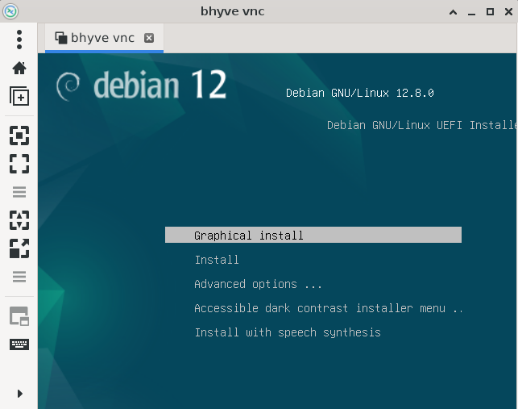
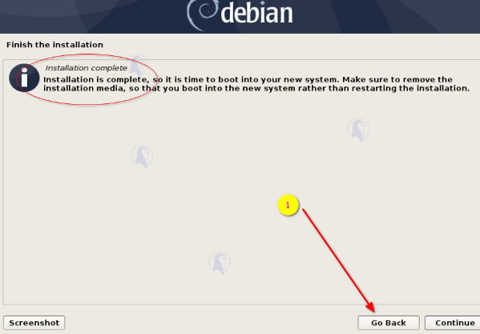
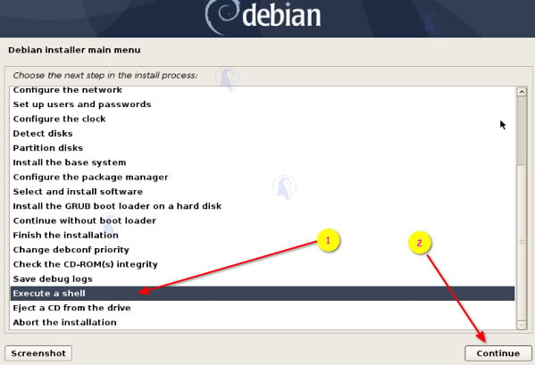

.. _bhyve_startup:

======================
bhyve快速起步
======================

.. note::

   由于我在 :ref:`freebsd_wifi_bcm43602` 使用了 ``wifibox`` ，实际上已经启动了 ``tap`` 设备以及虚拟化，并且也具备了 ``bridge`` 网桥，所以这里网络部分我是跳过的。这里仅记录备用

设置tap设备启动
====================

- 在 ``/etc/sysctl.conf`` 中配置tap设备在操作系统启动时启动:

.. literalinclude:: bhyve_startup/sysctl.conf
   :caption: 配置tap设备启动

内核vmm
==========

加载FreeBSD内核模块:

.. literalinclude:: bhyve_startup/kldload
   :caption: 加载内核模块

并且确保启动时加载内核模块:

.. literalinclude:: bhyve_startup/loader.conf
   :caption: 配置启动时加载模块

创建网桥和tap
==============

- 创建网桥并连接网卡( ``em0`` )

.. literalinclude:: bhyve_startup/bridge
   :caption: 创建网桥并连接网卡

- 确保启动时激活:

.. literalinclude:: bhyve_startup/rc.conf
   :caption: 在 ``/etc/rc.conf`` 中配置

.. warning::

   以上网络准备部分由于我在 :ref:`freebsd_wifi_bcm43602` 使用 ``wifibox`` 已经具备，但是需要创建一个 ``tap1`` 设备( ``tap0`` 设备已经在之前由wifibox创建过了)，并连接到 ``wifibox0`` 网桥:

   .. literalinclude:: bhyve_startup/bridge_wifibox0
      :caption: 定义 ``tap1`` 连接 ``wifibox0`` 网桥

   设置启动时添加tap1:

   .. literalinclude:: bhyve_startup/rc.conf_tap1
      :caption: 启动时添加tap1

创建ZFS数据集
================

- 创建 ``zroot/vms/debian`` :

.. literalinclude:: bhyve_startup/zfs_vms
   :caption: 创建vms数据集

下载Debian安装iso
====================

从debian官网下载安装镜像:

.. literalinclude:: bhyve_startup/debian_iso
   :caption: 下载debian安装镜像

安装bhyve的Grub支持
======================

``grub`` 启动管理器是Linux guests启动建议的加载器，这样就能够运行 ``grub-bhyve`` 执行程序，也就是允许我们启动非FreeBSD guest操作系统:

.. literalinclude:: bhyve_startup/grub
   :caption: 安装grub相关软件包

安装虚拟机
============

- 执行以下命令开始启动虚拟机安装:

.. literalinclude:: bhyve_startup/vm
   :caption: 安装虚拟机

命令参数:

- ``-c`` 设置虚拟机vcpu数量
- ``-H`` 输出给加载器的host文件系统
- ``-l`` 使用OS loader(对于非FreeBSD需要使用uefi)
- ``-m`` 设置虚拟机内存
- ``-w`` 忽略没有实现的MSRs
- ``-s`` 配置一个虚拟PCI slot 以及其他功能如硬盘，cdrom和其他设备

VNC客户端连接
===============

启动安装以后就可以使用 ``remmina`` 这样的VNC客户端俩皆 ``127.0.0.1:5900`` 来访问(如果是远程服务器，则使用服务器IP)

安装要点
=========

安装结束前，最后一步需要返回并选择 ``Execute a shell`` 加载一个终端，然后需要将debian的efi文件复制出来给FreeBSD加载:

.. literalinclude:: bhyve_startup/efi
   :caption: 复制debian的efi

启动
=======

最后重启虚拟机，需要强制退出，然后再启动

- 强制虚拟机关机:

.. literalinclude:: bhyve_startup/stop_vm
   :caption: 停止虚拟机

- 启动虚拟机:

.. literalinclude:: bhyve_startup/start_vm
   :caption: 启动虚拟机

- 简单的启动脚本:

.. literalinclude:: bhyve_startup/start_vm.sh
   :caption: 启动虚拟机的简单脚本

可以设置在系统重启后执行的crontab::

   @reboot /path/to/startdebianvm

参考
======

- `How to install Linux VM on FreeBSD using bhyve and ZFS <https://www.cyberciti.biz/faq/how-to-install-linux-vm-on-freebsd-using-bhyve-and-zfs/#google_vignette>`_
