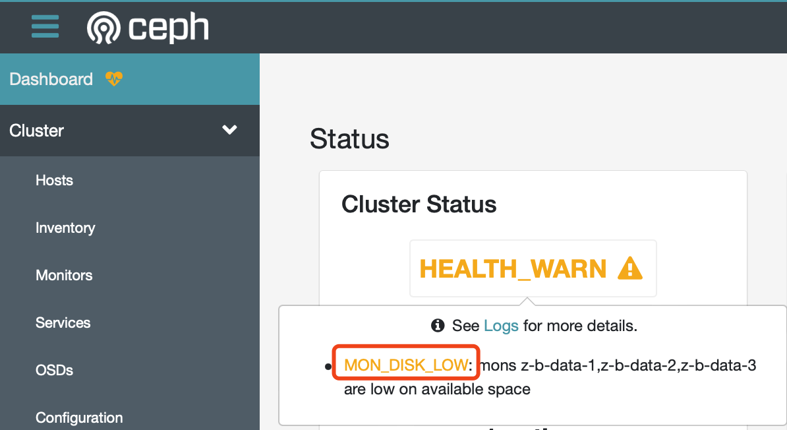

.. _warn_mon_disk_low:

==========================
Ceph告警: MON_DISK_LOW
==========================

Ceph的Cluster Status提供了基本的集群状态监控，其中有一个比较常规的监控是服务器磁盘可用空间监控。例如， ``MON_DISK_LOW`` :

上述提示报错在 ``Logs`` 页面可以清晰看到::

   5/18/22 12:00:00 AM [WRN] overall HEALTH_WARN mons z-b-data-1,z-b-data-2,z-b-data-3 are low on available space
   5/17/22 11:50:00 PM [WRN] overall HEALTH_WARN mons z-b-data-1,z-b-data-2,z-b-data-3 are low on available space
   ...

执行检测命令::

   ceph status

可以看到::

   cluster:
     id:     0e6c8b6f-0d32-4cdb-a45d-85f8c7997c17
     health: HEALTH_WARN
             mons z-b-data-1,z-b-data-2,z-b-data-3 are low on available space

详细的健康状态信息检查::

   ceph health detail

可以看到::

   HEALTH_WARN mons z-b-data-1,z-b-data-2,z-b-data-3 are low on available space
   [WRN] MON_DISK_LOW: mons z-b-data-1,z-b-data-2,z-b-data-3 are low on available space
       mon.z-b-data-1 has 22% avail
       mon.z-b-data-2 has 22% avail
       mon.z-b-data-3 has 23% avail

我在 :ref:`priv_cloud_infra` 部署架构中，为3个 ``z-b-data-X`` 虚拟机分配了很小的磁盘空间(只有6G)，实际上对长期运行的服务器，根目录空间太小了::

   /dev/vda2       5.8G  4.5G  1.3G  78% /

你看可以看到使用根目录目前就是 ``78%`` ，剩余可用 ``22%`` ，和 ``ceph health detail`` 完全对应

可能的解决方法如下:

- :ref:`journalctl` 调整系统日志存储空间
- 清理主机缓存，例如 ``apt`` 或 ``dnf`` 安装升级系统时会遗留大量缓存文件
- 调整虚拟机磁盘(LVM卷) 扩容根目录

.. note::

   经过排查，最终发现 ``apt`` 安装过程，特别是内核升级，本地会保留很多不再需要的软件包和文件。通过 ``apt autoremove`` 我实际清理了 1.5G 空间。清理后本地根目录空闲 2.x G空间，已经能够满足运行要求。

不过，需要注意，实际上 ``ceph`` 监控的是 ``/var/lib/ceph`` 目录地盘空间，不过默认情况下，这个目录没有采用独立磁盘维护，则会重叠在根目录上::

   Filesystem      Size  Used Avail Use% Mounted on
   udev            7.8G     0  7.8G   0% /dev
   tmpfs           1.6G  744K  1.6G   1% /run
   /dev/vda2       5.8G  4.5G  1.3G  78% /
   tmpfs           7.9G     0  7.9G   0% /dev/shm
   tmpfs           5.0M     0  5.0M   0% /run/lock
   tmpfs           7.9G     0  7.9G   0% /sys/fs/cgroup
   /dev/vda1       240M  5.2M  235M   3% /boot/efi
   tmpfs           7.9G   28K  7.9G   1% /var/lib/ceph/osd/ceph-0
   tmpfs           1.6G     0  1.6G   0% /run/user/1000

对于性能考量，ceph运行目录 ``/var/lib/ceph`` 应该采用独立大容量高性能磁盘，解决容量不足问题，可以通过为虚拟机创建独立磁盘并挂载到 ``/var/lib/ceph`` 来解决:

- ``/var/lib/ceph/mon/ceph-`hostname`/store.db/`` 目录会存储大量的监控日志以及状态 ，如果占用大量空间，我们需要 :ref:`ceph_compact_mon_store`
- 将 ``/var/lib/ceph`` 迁移到独立的虚拟机磁盘，确保该目录保留足够空间: 我最终采用 :ref:`ceph_var_disk`

参考
=======

- `Ceph: monitor store taking up a lot of space <https://ceph.io/en/news/blog/2014/ceph-monitor-store-taking-up-a-lot-of-space/>`_
