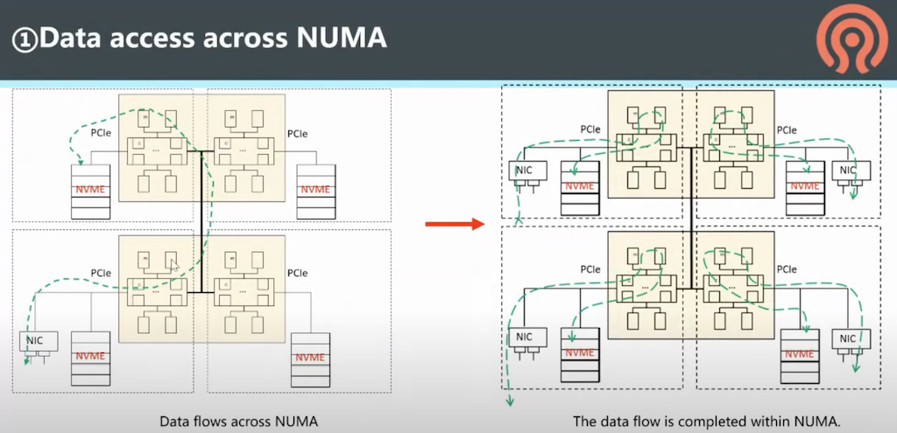
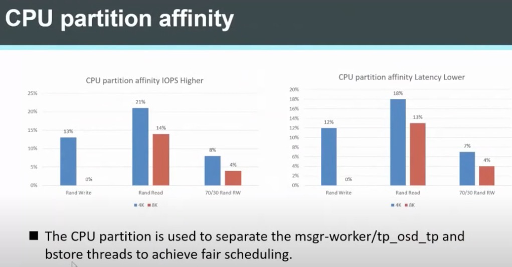

.. _optimize_ceph_arm:

===============
ARM架构Ceph优化
===============

.. note::

   汇总ARM架构Ceph优化思路，然后逐步实践。目前以资料整理为主，待实践

.. note::

   杉岩数据是和华为合作的Ceph存储厂商，在华为开发者大会上做了 `基于鲲鹏平台的 Ceph 深度性能调优 <https://www.infoq.cn/article/slhxsdjaykaza3tgkyqc>`_ 分享，索然没有具体实现步骤，但是思路可以作为研究方向。可以和本文华为工程师的分享进行对比分析，并参考作为后续性能调优方向。

   待实践

ARM架构的Ceph优化主要思路是基于ARM架构的特性，充分利用硬件加速、缓存以及库优化，实现性能加速。

Ceph共享库优化
=================

ARM共享库的优化思路是采用ARM CPU特性来优化Ceph共享库:

- 优化UTF8字符串处理 

  - 可以获得8倍的字符串验证性能突破
  - 可以获得字符串编码的50%性能提升

- 通过ARM CRC32加速可以获得3倍的突发性能提升

Ceph ISA-L卸载
================

ISA-L卸载可以加速Ceph的压缩、加密等性能:

- CRC, IGZIP, RAID, AES-GCM 多字节MD5/SHA1/SHA256/SM3/SHA256...

需要充分使用ARM架构的硬件加密和压缩加速，来实现对Ceph性能的提升。

`isa-l/isa-l_crypto <https://github.com/isa-l/isa-l_crypto>`_ 提供了详细信息

64K内核页
============

ARM支持64K内核大页，内核大页可以提升Ceph的以下性能:

- 提高了TLB命中率和降低页表查询影响
- 较小的页表可以使用较少的内存空间
- 页表级别降低以后，可以提供更好的 VA->PA 转换速度

测试案例使用了:

- Ceph集群

  - Ceph 15.2.11, SPDK
  - 1 MON, 1 MGR, 3 OSD
  - 每个OSD使用一个 P4610 NVMe
  - Linux 5.8.0 内核

- 客户端: 2.8GHz多核处理器，Linux 5.8.0内核

- 测试工具: Fio v3.16

- 测试案例:

  - 顺序 读/写 和 随机 读/写 ，分别使用 4/16/64/256/4096K 块大小， 4KB / 64KB 内核页

测试结果:

- 顺序读: 性能提高 3.39% ~ 11.11%
- 顺序写: 性能提高 8.35% ~ 21.91%
- 随机读: 性能提高 6.24% ~ 9.99%
- 随机写: 性能提高 5.93% ~ 15.4%

Ceph在ARM架构的SSD环境优化
============================

CPU优化
-----------

- 开关 :ref:`cpu_prefetch` 进行对比

- 优化相应的线程数量

- :ref:`numa` 优化

数据通过NUMA访问: 精心设置数据访问通道，确保所有数据访问，包括内存、网络、存储都是NUMA就近访问

上述架构启示我在 :ref:`priv_cloud_infra` 可以采用NUMA来运行直接访问存储的第一层虚拟化，这样可以确保每次读写存储、网络、内存都是就近访问，加速性能。

这点需要重点剖析我所使用 :ref:`hpe_dl360_gen9` 的 :ref:`xeon_e5-2670_v3` 实际的物理处理器核心该如何划分NUMA(不出现伪NUMA)， 是如何访问周边内存、网络和存储，所以要确保硬件上这些设备是均匀分布在不同的NUMA节点上，避免跨NUMA访问，特别是存储密集和网络密集，绝对不能忽视跨NUMA导致的性能损失。我觉得应该有一个完整的性能测试，用数据来验证理论。

根据华为工程师性能测试介绍(待验证)，Ceph OSD 合理部署NUMA可以获得 4%~11% 的IOPS提升以及 3%~10%的延迟降低：

.. figure:: ../../_static/ceph/arm/ceph_osd_numa.png
   :scale: 60

- CPU partition affinity

通过CPU partition affinity 来隔离 ``msgr-worker`` 、 ``tp_osd_tp`` 和 ``bstore`` 线程实现公平调度，可以提高IOPS以及降低延迟:

在实时Linux系统中，会采用一种 :ref:`system_partitioning` 优化实时程序性能。Linux发行版也提供了 :ref:`tuned` 工具提供系统CPU分区隔离和保留用于延迟敏感应用。

- 内核 4K/64K pagesize

  - 和默认的4K内存页相比，64K内存页可以降低TLB miss并提高10%性能
  - 在 ``bufferlist::reserve`` 中使用小内存页对齐来降低内存浪费
  - 使用 ``CEPH_PAGE_SHIFT`` 来兼容不同的内存页大小

使用64K页带来的问题:

  - 写入放大 (Write amplification) 问题: 

  当 ``bluefs_buffered_io`` 设置为 ``true`` 的时候，metadata是使用buffer I/O写入的，并且 ``sync_file_range`` 是通过内核页来调用来写入数据到磁盘。这时对于4K页写入放大系数是2.46，而对于64K页写入放大系数是5.46

  当 ``bluefs_buffered_io`` 设置为 ``false`` ，则 metadata 是采用direct I/O写入，不调用 ``sync_file_range`` ，此时写入放大系数是 2.29。

  由于写入放大会影响SSD使用寿命，所以建议 ``bluefs_buffered_io`` 设置为 ``false``

  - tcmalloc和内核页大小问题(这个问题提出非常有意思，需要研究):

  当 ``tcmalloc`` 页大小 ``小于`` 内核页大小，则内存会持续增长直到达到 ``osd_memory_target`` ，然后性能会明显退化。所以要确保 ``tcmalloc`` 的页大小 ``大于`` 内核页大小。这个问题是在 :ref:`redhat_linux` 7.6 版本上发现的，原因是默认7.6版本默认tcmalloc是8K，比调整的64K内核页小(启动操作系统时候可以修改内核的内核页大小设置)，这会导致适配问题。所以一定要注意调整pagesize，以适配操作系统内置的 ``tcmalloc`` 页大小(这个值不可变)。不过CentOS 8.1 调整了默认tcmalloc为64K(目前就发现是CentOS 8调整了，其他发行版Ubuntu/SUSE都默认4K)，就解决了这个问题。

.. note::

   写入放大 是flash内存和SSD的一种特有不良现象，也就是对已经存在数据的介质进行重写需要先擦除然后才能写入，但是擦除操作的粒度比写入操作的粒度要低很多，就会导致多次移动(或改写)用户数据和元数据。

   闪存工作原理是以4K页(page)为单元写入，但擦除只能以块(block, 64个page)为单位。如果一个块上部分page是有效数据部分page是标记删除数据，则在这个块上重新写入数据，必须擦除整个数据块。这时需要首先把有效数据搬迁到一个有空位置的block块。这就是GC垃圾回收技术。这也就为何重写会导致写入放大。

   此外还有一个和SSD相关的TRIM技术，也就是trim指令可以告知GC垃圾回收时只搬迁有效数据而不必搬迁已经标记删除的数据，可以降低写入量。这个trim对于SSD磁盘非常重要，可以延长SSD使用寿命。trim技术需要文件系统支持。

   保持SSD存储的空闲空间(需要TRIM)以及开启数据要锁可以降低写入放大。

   详细实践请参考 :ref:`linux_ssd`

- DDR多通道部署 (这个应该和服务器硬件优化相关，注意 :ref:`hpe_dl360_gen9` 每个内存DDR通道是和CPU相关联的，所以部署进程访问不同的DDR通道结合NUMA应该有所优化)

根据华为工程师介绍，16通道DDR比12通道DDR在4KB读写和读读测试中，性能分别提高 7% 和 11%

网络性能优化
-------------

- 中断CPU core绑定

默认时，多个NIC网卡中断会集中到NUMA0上(通常是CPU0)，通过将中断打散到不同NUMA节点来分担。这里需要注意，NUMA节点绑定的OSD进程，访问的网卡应该是同一个NUMA节点的，避免跨NUMA引发性能下降。同时要确保NIC和OSD收发数据包都是在同一个NUMA上。

后续我在部署嵌套虚拟化的第一层虚拟化，把每个虚拟机部署到NUMA节点上进行对比测试来验证

.. figure:: ../../_static/ceph/arm/ceph_nic_interrupt_numa.png
   :scale: 60

- MTU调整
- TCP参数调整
- 多端口NIC部署

I/O性能优化
--------------

- rocksdb的 ``crc32_arm64`` 优化

ceph参数
------------

- `osd_client_message_cap`

参考
=====

- `Ceph Month 2021: Optimizing Ceph on Arm64 <https://www.youtube.com/watch?v=IzYYOdm2nuE&list=WL&index=8>`_
- `Ceph Month 2021: Performance Optimization for All Flash based on aarch64 <https://www.youtube.com/watch?v=SLOfsUC71J8&list=WL&index=12>`_
- `写入放大 <https://zh.wikipedia.org/wiki/%E5%86%99%E5%85%A5%E6%94%BE%E5%A4%A7>`_
- `如何理解SSD的写放大? <https://www.zhihu.com/question/31024021>`_
