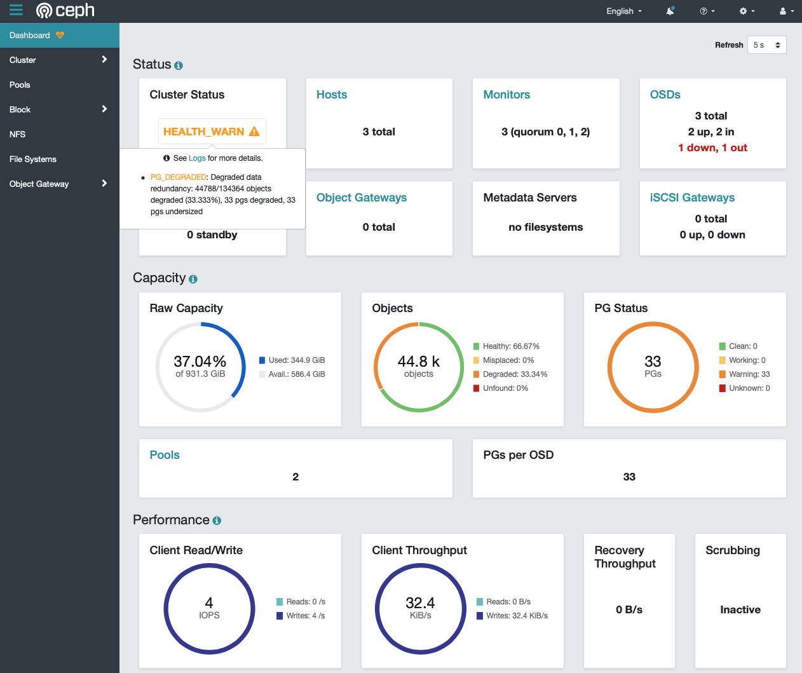
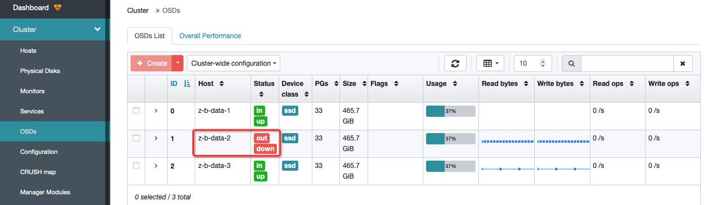

.. _osd_slow_ops_warning_after_ceph_down:

=======================================
Ceph硬关机重启后OSD出现"slow ops"报错
=======================================

异常
=======

我的 :ref:`priv_cloud_infra` 中部署的 :ref:`zdata_ceph` 采用了3台 :ref:`ovmf` 虚拟机，但是我在一次物理服务器重启前，快速执行了 ``virsh shutdown XXX`` 连续关闭了3台虚拟机。这次 ``virsh shutdown`` 命令执行间隔极短，也就是说3台Ceph虚拟机几乎同时关闭。由于没有在虚拟机内部的操作系统执行shutdown，这种虚拟机 shutdown 可能不是干净的关机方法，我发现重启服务器之后，3个虚拟机虽然正常启动，但是使用ceph存储的其他虚拟机启动会 ``paused`` 住::

    Id   Name         State
   ----------------------------
    1    z-b-data-2   running
    2    z-b-data-3   running
    3    z-b-data-1   running
    4    z-k8s-m-1    paused

在Ceph虚拟机集群中检查 ``ceph -s`` 可以看到告警::

     cluster:
       id:     0e6c8b6f-0d32-4cdb-a45d-85f8c7997c17
       health: HEALTH_WARN
               Reduced data availability: 33 pgs inactive, 33 pgs peering
               5 slow ops, oldest one blocked for 1925 sec, daemons [osd.1,osd.2] have slow ops.
   
     services:
       mon: 3 daemons, quorum z-b-data-1,z-b-data-2,z-b-data-3 (age 11m)
       mgr: z-b-data-1(active, since 32m)
       osd: 3 osds: 3 up (since 31m), 3 in (since 4w)
   
     data:
       pools:   2 pools, 33 pgs
       objects: 44.79k objects, 174 GiB
       usage:   517 GiB used, 880 GiB / 1.4 TiB avail
       pgs:     100.000% pgs not active
                33 peering

这显示OSD存在异常

检查 ``dmesg -T`` 输出也有一个提示信息::

   [Tue Jan 10 00:41:47 2023] systemd[1]: /lib/systemd/system/ceph-volume@.service:8: Unit configured to use KillMode=none. This is unsafe, as it disables systemd's process lifecycle management for the service. Please update your service to use a safer KillMode=, such as 'mixed' or 'control-group'. Support for KillMode=none is deprecated and will eventually be removed.

看来ceph进程关闭需要改进?

排查
=======

因为是晚上，我一时没有解决方法，所以在第二天开始排查，此时发现原先 ``paused`` 住的虚拟机已经进入了 ``runing`` 状态了:

.. literalinclude:: osd_slow_ops_warning_after_ceph_down/virsh_list_running
   :language: bash
   :caption: paused的虚拟机进入了running状态
   :emphasize-lines: 7

此时观察 ``ceph -s`` 集群状态出现更为严重的告警( ``objects degraded`` ):

.. literalinclude:: osd_slow_ops_warning_after_ceph_down/ceph_objects_degraded
   :language: bash
   :caption: ceph集群降级(objects degraded)
   :emphasize-lines: 7

可以看到已经有一个osd出现宕机:

检查ceph日志，可以看到:

.. literalinclude:: osd_slow_ops_warning_after_ceph_down/ceph_log
   :language: bash
   :caption: ceph集群日志显示"33 pgs: 33 active+undersized+degraded"
   :emphasize-lines: 4-6

- 首先我们要找到是哪个osd节点宕机:

.. literalinclude:: osd_slow_ops_warning_after_ceph_down/ceph_osd_tree
   :language: bash
   :caption: ceph osd tree命令检查osd状态
   :emphasize-lines: 6,7

可以看到节点2上 ``osd.1`` 出现宕机

- 然后检查服务器上空间:

.. literalinclude:: osd_slow_ops_warning_after_ceph_down/ceph_osd_df
   :language: bash
   :caption: ceph osd df命令检查osd存储空间
   :emphasize-lines: 4

可以看到节点2的存储已经无法访问

- 在节点2上检查服务，可以看到 ``osd`` 服务是运行状态:

.. literalinclude:: osd_slow_ops_warning_after_ceph_down/systemctl_status_osd
   :language: bash
   :caption: systemctl检查osd处于运行状态

- 检查节点2上 ``/var/log/ceph/osd.log`` :

.. literalinclude:: osd_slow_ops_warning_after_ceph_down/osd_log
   :language: bash
   :caption: systemctl检查osd处于运行状态
   :emphasize-lines: 10

从日志没有看到非常多异常，但是从dashboard可以看到 OSDs 页面侠士，节点2状态是 ``out down`` :

- 我检查了节点2的系统日志，但是没有看到异常，物理服务器的dmesg日志没有看到硬件异常

恢复
======

由于没有找到明显报错，但是可以看到节点2出现down机，数据延迟了4小时，所以我先shutdown了节点2操作系统，然后再次启动该虚拟机。

启动节点2可以看到Ceph立即开始进行数据修复同步:

.. literalinclude:: osd_slow_ops_warning_after_ceph_down/ceph_node_reboot_fix
   :language: bash
   :caption: 重启ceph节点2，可以看到数据同步修复
   :emphasize-lines: 10

然后Ceph集群恢复健康状态:

.. literalinclude:: osd_slow_ops_warning_after_ceph_down/ceph_health
   :language: bash
   :caption: 重启ceph节点2,Ceph恢复健康

小结
=======

我初步推测是虚拟化 :ref:`ovmf_gpu_nvme` 可能在快速重启时出现passthcough存储访问问题，影响了ceph的数据节点。这个排查比较粗糙:

- 目前还缺乏对Ceph底层系统级原理的深入理解，需要补齐这块短板
- 需要模拟不同的破坏场景进行演练

参考
======

- `ceph active+undersized warning <https://stackoverflow.com/questions/65694211/ceph-activeundersized-warning>`_
