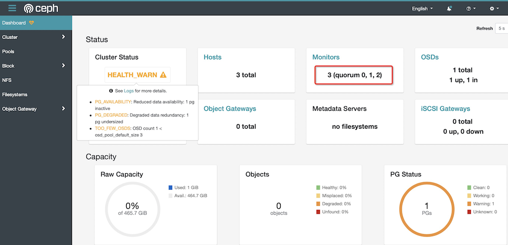

.. _mobile_cloud_ceph_add_ceph_mons:

===============================
移动云计算Ceph集群添加ceph-mon
===============================

在 :ref:`install_ceph_mon` 我们已经安装部署了1个 ``ceph-mon`` 。虽然这样也能工作，Ceph monitor可以使用Pasos算法来建立一致性映射以及集群的其他关键信息。但是，对应稳定的集群，需要一个奇数数量的monitor，所以，推荐至少3个 ``ceph-mon`` ，为了在出现更多失效能够继续服务，可以部署更多 monitor ，如5个 ``ceph-mon`` 。

.. note::

   虽然 ``ceph-mon`` 是非常轻量级的监控服务，可以运行在OSD相同的服务器上。但是，对于生产集群，特别是高负载集群，建议将 ``ceph-mon`` 和 ``ceph-osd`` 分开服务器运行。这是因为高负载下，有可能 ``ceph-osd`` 压力过大影响 ``ceph-mon`` 的稳定性(响应延迟)，从而导致系统误判而出现雪崩。

- 在每个服务器节点上准备环境变量:

.. literalinclude:: ceph_env
   :language: bash
   :caption: 在每个服务器节点上准备环境变量

部署monitor
================

- 登陆需要部署monitor的服务器，例如，我这里部署到 ``a-b-data-2`` 服务器上，执行以下命令创建mon默认目录:

.. literalinclude:: mobile_cloud_ceph_add_ceph_mons/create_mon_dir
   :language: bash
   :caption: 添加 mon 默认目录

- 将 ``$HOST_1`` 上 ( ``a-b-data-1`` ) 管理密钥复制到需要部署 ``ceph-mon`` 的配置目录下:

.. literalinclude:: mobile_cloud_ceph_add_ceph_mons/copy_admin_keyring_and_conf
   :language: bash
   :caption: 复制admin.keyring和配置文件

- 在 ``ceph-mon`` 的主机 ``$HOST_1`` ( ``a-b-data-1`` )上执行以下命令获取monitors的keyring(需要读取本机的 ``/etc/ceph/ceph.client.admin.keyring`` 认证来获取 ``ceph-mon`` 的keyring):

.. literalinclude:: mobile_cloud_ceph_add_ceph_mons/get_ceph.mon.keyring
   :language: bash
   :caption: 在第一个ceph-mon服务器节点获取monitor的keyring保存到/tmp/ceph.mon.keyring

显示输出::

   exported keyring for mon.

此时获取到的monitor key存储在 ``/tmp/ceph.mon.keyring`` ，这个key文件实际上就是初始服务器   ``$HOST_1`` ( ``a-b-data-1`` ) 在 ``/var/lib/ceph/mon/${CLUSTER}-${HOST}/keyring`` ( ``/var/lib/ceph/mon/ceph-a-b-data-1/keyring`` )内容。

- 获取monitor map:

.. literalinclude:: mobile_cloud_ceph_add_ceph_mons/get_monmap
   :language: bash
   :caption: 在第一个ceph-mon服务器节点获取monitor的monitor map保存到/tmp/monmap

提示信息::

   got monmap epoch 2

但是需要注意，这里从集群中获得的 ``monmap`` 只包含了第一台服务器   ``$HOST_1`` ( ``a-b-data-1`` ) ，我们还需要添加增加的  ``$HOST_2`` ( ``a-b-data-2`` ) 和  ``$HOST_3`` ( ``a-b-data-3`` ):

.. literalinclude:: mobile_cloud_ceph_add_ceph_mons/monmaptool_add_host
   :language: bash
   :caption: 在第一个ceph-mon服务器节点将另外2个节点的主机配置加入到monitor map中

现在我们第一台主机 ``$HOST_1`` ( ``a-b-data-1``  ) 的 ``/tmp/monmap`` 是最新最全的monmap，但是我们在  ``$HOST_1`` ( ``a-b-data-1`` ) 上没有添加过节点2和节点3的 monmap ，我们需要把这个 ``/tmp/monmap`` 插入到 ``$HOST_1`` ( ``a-b-data-1``  ) 的监控目录中。所以在第一台主机 ``$HOST_1`` ( ``a-b-data-1`` ) 将最新 ``/tmp/monmap`` 更新到监控目录:

.. literalinclude:: mobile_cloud_ceph_add_ceph_mons/ceph-mon_inject-monmap
   :language: bash
   :caption: 在第一个ceph-mon服务器节点更新过的monitor map加载到mon目录

.. note::

   注意，在更新 ``a-b-data-1`` 的 ``monmap`` 之前，需要先停止 ``ceph-mon`` ::

      sudo systemctl stop ceph-mon@a-b-data-1

   否则会报错无法拿到db的锁::

      2021-12-02T22:37:23.236+0800 7f8227f17540 -1 rocksdb: IO error: While lock file: /var/lib/ceph/mon/ceph-a-b-data-1/store.db/LOCK: Resource temporarily unavailable
      2021-12-02T22:37:23.236+0800 7f8227f17540 -1 error opening mon data directory at '/var/lib/ceph/mon/ceph-a-b-data-1': (22) Invalid argument

   停止 ``ceph-mon`` 之后再执行::

      sudo -u ceph ceph-mon -i a-b-data-1 --inject-monmap /tmp/monmap

   我发现导入命令应该使用 ``ceph`` 用户身份执行，否则会把文件属主设置成root，需要执行 ``chown -R ceph:ceph /var/lib/ceph/mon/ceph-a-b-data-1`` 来修复。
      
   就不再报错。等导入更新了 ``monmap`` 之后，再次启动服务::

      sudo systemctl start ceph-mon@a-b-data-1

.. warning::

   当配置了3个 ``ceph-mon`` 的 ``monmap`` ，如果只启动 ``a-b-data-1`` 而没有启动其他节点的 ``ceph-mon`` ，则会发现虽然 ``a-b-data-1`` 的 ``ceph-mon`` 启动 ( ``systemctl status ceph-mon@a-b-data-1`` 正常 )，但是 ``/var/log/ceph/ceph-mon.a-b-data-1.log`` 日志报错::

      2021-12-02T23:02:15.980+0800 7f16d5c02700  1 mon.a-b-data-1@0(probing) e3 handle_auth_request failed to assign global_id
      2021-12-02T23:02:16.184+0800 7f16d5c02700  1 mon.a-b-data-1@0(probing) e3 handle_auth_request failed to assign global_id

   此时::

      ceph -s

   无响应

   不过，只要再启动 ``a-b-data-2`` 上的 ``ceph-mon@a-b-data-2`` ，则立即恢复正常响应。

- 准备monitor的数据目录，这里必须指定monitor map路径，这样才能够获取监控的quorum信息以及 ``fsid`` ，而且还需要提供 monitor keyring的路径，以及从第一个节点复制过来的 ``monmap`` 和 ``ceph.mon.keyring`` 文件:

.. literalinclude:: mobile_cloud_ceph_add_ceph_mons/ceph-mon_mkfs
   :language: bash
   :caption: 在第二个ceph-mon服务器节点为该节点创建monitor数据目录

.. note::

   仔细对比一下，就可以看出第二个以及今后节点的 ``ceph-mon`` 部署方法和 :ref:`mobile_cloud_ceph_mon` 差不多，只是证书是从第一台服务器导入过来不需要重新生成。

- 在第二个节点 ``$HOST_2`` ( ``a-b-data-2`` ) 上执行以下命令启动服务:

.. literalinclude:: mobile_cloud_ceph_add_ceph_mons/systemctl_start_ceph-mon
   :language: bash
   :caption: 在第二个ceph-mon服务器节点启动ceph-mon服务

.. note::

   如果启动失败，可以尝试通过终端执行命令 ``ceph-mon -f --cluster ceph --id a-b-data-2 --setuser ceph --setgroup ceph`` 查看终端输出信息。我遇到失败的原因是 ``/var/lib/ceph/mon/a-b-data-2`` 目录权限错误，可以根据提示信息检查

部署第三个 ``ceph-mon`` 节点
=============================

有了上述部署 ``$HOST_2`` ( ``a-b-data-2`` ) 的 ``ceph-mon`` 的经验，我们现在来快速完成第三个节点  ``$HOST_3`` ( ``a-b-data-3`` ) 的 ``ceph-mon`` 部署

- 将 ``$HOST_1`` ( ``a-b-data-1``  ) 管理密钥复制到 ``$HOST_3`` ( ``a-b-data-3`` ) 部署 ceph-mon 的配置目录下:

.. literalinclude:: mobile_cloud_ceph_add_ceph_mons/copy_admin_keyring_and_conf
   :language: bash
   :caption: 复制admin.keyring和配置文件

- 在  ``$HOST_3`` ( ``a-b-data-3`` ) 上执行以下命令获取 ``ceph-mon`` 的keyring/monmap，并创建mon目录:

.. literalinclude:: mobile_cloud_ceph_add_ceph_mons/ceph-mon_mkfs
   :language: bash
   :caption: 在第三个ceph-mon服务器节点为该节点创建monitor数据目录(需要准备集群的keyring和monmap文件)

- 在第三个节点 ``$HOST_3`` ( ``a-b-data-3`` ) 上执行以下命令启动服务:

.. literalinclude:: mobile_cloud_ceph_add_ceph_mons/systemctl_start_ceph-mon
   :language: bash
   :caption: 在第三个ceph-mon服务器节点启动ceph-mon服务

异常排查
==============

这次部署我遇到问题是虽然能启动第二和第三节点上的 ``ceph-mon`` ，但是服务显示错误::

   Dec 11 00:11:00 a-b-data-3.dev.cloud-atlas.io systemd[1]: Started ceph-mon@a-b-data-3.service - Ceph cluster monitor daemon.
   Dec 11 00:11:00 a-b-data-3.dev.cloud-atlas.io ceph-mon[885]: 2022-12-11T00:11:00.291+0800 ffff8eacb040 -1 WARNING: 'mon addr' config option v1:192.168.8.206:6789/0 does not match monmap file
   Dec 11 00:11:00 a-b-data-3.dev.cloud-atlas.io ceph-mon[885]:          continuing with monmap configuration

此时执行 ``sudo ceph -s`` 都会卡住，待排查

最小化配置 ``ceph-mon``
==========================

参考 `Ceph Monitor Config Reference#Minimum Configuration <https://docs.ceph.com/en/pacific/rados/configuration/mon-config-ref/#minimum-configuration>`_ 修订 ``/etc/ceph/ceph.conf`` :

.. literalinclude:: mobile_cloud_ceph_mon/ceph.conf
   :language: bash
   :caption: /etc/ceph/ceph.conf
   :emphasize-lines: 16-18,20-22,24-26

检查
=======

- 完成部署 ``ceph-mon`` 到 ``a-b-data-1`` / ``a-b-data-2`` / ``a-b-data-3`` 之后，集群就具备了3个监控

- 观察 :ref:`ceph_dashboard` 可以看到启动了3个 mon :

参考
========

- `ADDING/REMOVING MONITORS <https://docs.ceph.com/en/latest/rados/operations/add-or-rm-mons/>`_
- `CEPH by hand <http://www.hep.ph.ic.ac.uk/~dbauer/cloud/iris/ceph.html>`_
