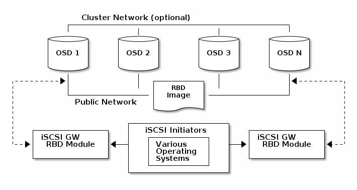

.. _mobile_cloud_ceph_iscsi_libvirt:

================================
移动云计算Libvirt集成Ceph iSCSI
================================

由于 :ref:`arch_linux` ARM的软件仓库对 ``libvirt-storage-ceph`` 缺失，所以我在部署 :ref:`mobile_cloud_ceph_rbd_libvirt` 遇到较大困难暂时放弃。我调整方案，改为采用 :ref:`ceph_iscsi` 为 :ref:`kvm` 虚拟化服务器集群提供分布式存储。

:ref:`ceph_iscsi` 可以解决客户端(libvirt)无法原生支持Ceph的缺憾，通过输出 :ref:`rados` 块设备(RBD)镜像作为SCSI磁盘来提供了一个高可用(Highly Available, HA) iSCSI target:

   通过Ceph iSCSI网关将RBD镜像映射为iSCSI target

准备工作
=========

- 为减少iSCSI initiator超时的可能性，调整OSD监控检测的心跳间隔，即修订 ``/etc/ceph/ceph.conf`` 配置:

.. literalinclude:: ../../rbd/ceph_iscsi/prepare_ceph_iscsi/ceph.conf
   :language: bash
   :caption: /etc/ceph/ceph.conf 修订OSD心跳参数，降低间隔值减少iSCSI initiator启动超时可能性

- 从一个Ceph Monitor (ceph-mon)节点更新运行状态:

.. literalinclude:: ../../rbd/ceph_iscsi/prepare_ceph_iscsi/ceph_update_osd_heartbeat_config
   :language: bash
   :caption: 选择一个ceph-mon节点发起更新监控OSD心跳运行配置的状态，降低间隔值减少iSCSI initiator启动超时可能性

- 在每个OSD节点 上更新运行状态:

.. literalinclude:: ../../rbd/ceph_iscsi/prepare_ceph_iscsi/ceph_update_osd_daemon_heartbeat_running_state
   :language: bash
   :caption: 在每个ceph-osd节点发起更新OSD服务进程心跳运行状态，降低间隔值减少iSCSI initiator启动超时可能性
