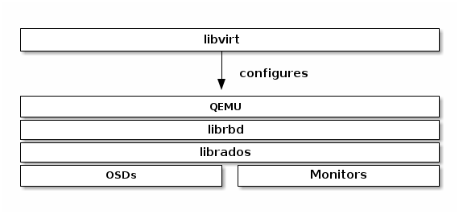
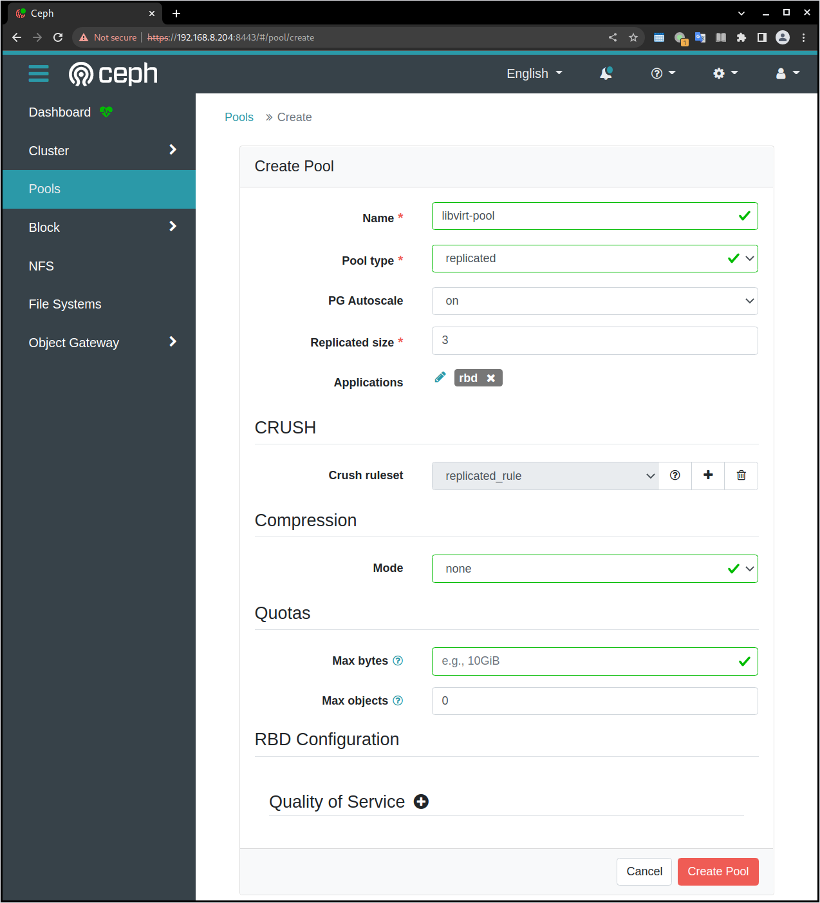

.. _mobile_cloud_ceph_rbd_libvirt:

==============================
移动云计算Libvirt集成Ceph RBD
==============================

:ref:`libvirt` 在hypervisor接口和应用程序之间提供虚拟机抽象层方便我们管理和使用虚拟化技术。通过 ``libvirt`` 开发者和系统管理员可以专注于一个通用管理框架，通用API以及通用shell接口( ``virsh`` )来完成很多hypervisor工作:

- QEMU/KVM
- XEN
- LXC
- VirtualBox
- 等等

Ceph块设备支持QEMU/KVM，通过 ``libvirt`` 可以使用Ceph块设备:

``libvirt`` 通用架构也提供了云计算解决方案的Ceph块设备，例如 :ref:`openstack` 或 CloudStack都通过libvirt使用Ceph块设备。这个云计算解决方案使用 ``libvirt`` 和 QEMU/KVM 交互，然后 QEMU/KVM 再通过 ``librbd`` 和Ceph块设备交互。

也可以使用 :ref:`libvirt` , :ref:`virsh_manage_vm` 以及 ``libvirt API`` 来使用Ceph块设备。

配置Ceph
==========

- 创建存储池:

.. literalinclude:: mobile_cloud_ceph_rbd_libvirt/ceph_osd_pool_create
   :language: bash
   :caption: Ceph OSD存储池创建

.. note::

   这里创建存储池命名为 ``libvirt-pool`` ，实际可根据需要命令

这里我的 :ref:`mobile_cloud_ceph_mon` 配置 ``/etc/ceph/ceph.conf`` ::

   osd pool default size = 3
   osd pool default min size = 2
   osd pool default pg num = 128
   osd pool default pgp num = 128
   osd crush chooseleaf type = 1

.. note::

   这里参考 `ceph PG数量调整/PG的状态说明 <https://www.cnblogs.com/kuku0223/p/8214412.html>`_ 计算PG数量::

      Total PGs = (Total_number_of_OSD * 100) / max_replication_count

   结算的结果往上取靠近2的N次方的值。我这里有3个osd，所以计算结果是 100 ，接近的 2的7 次方取 128

   经验见 :ref:`ceph_rbd_libvirt`

但是这次还是报错::

   Error ERANGE: 'pgp_num' must be greater than 0 and lower or equal than 'pg_num', which in this case is 1

奇怪，看起来符合规则。

改为在管理界面创建:

   Ceph管理节点创建RBD存储池

.. note::

   提供 ``Quotas`` 限制磁盘使用

   提供 ``QoS`` 限制网盘的网络速度

创建成功则提示::

   pool 'libvirt-pool' created

- 验证资源池::

   sudo ceph osd lspools

输出显示::

   1 .mgr
   2 libvirt-pool

- 检查这个创建资源池的pg数量::

   sudo ceph osd pool get libvirt-pool pg_num

显示::

   pg_num: 32

.. note::

   ``ceph-mgr`` 管理平台提供了自动计算出的 ``pg_num = 32`` ，所以我调整 ``/etc/ceph/ceph.conf`` 配置::

      osd pool default pg num = 32
      osd pool default pgp num = 32

- 使用 ``rbd`` 工具初始化资源池用于RBD:

.. literalinclude:: mobile_cloud_ceph_rbd_libvirt/rbd_pool_init
   :language: bash
   :caption: 使用rbd工具对Ceph RBD存储池初始化

- 创建一个Ceph用户:

.. literalinclude:: mobile_cloud_ceph_rbd_libvirt/ceph_auth_create_libvirt_account
   :language: bash
   :caption: 使用ceph auth创建libvirt访问用户账号

此时终端会显示keyring内容，可以存储为客户端用户的 ``rbd`` 访问使用的key ``/etc/ceph/${CLUSTER}.client.<username>.keyring`` 。不过，标准方法是执行以下命令生成 ``keyring`` :

.. literalinclude:: mobile_cloud_ceph_rbd_libvirt/ceph_auth_get_libvirt_account_key
   :language: bash
   :caption: 使用ceph auth获取libvirt访问用户账号密钥保存为文件

提示::

   exported keyring for client.libvirt

上述命令会创建一个 ``/etc/ceph/ceph.client.libvirt.keyring`` ，内容类似如下::

   [client.libvirt]
           key = XXXXXXXXXX
           caps mon = "profile rbd"
           caps osd = "profile rbd pool=libvirt-pool"   

- 然后验证用户存在::

   sudo ceph auth ls

.. note::

   ``libvirt`` 访问Ceph是使用ID ``libvirt`` 而不是 Ceph名字 ``client.libvirt``

客户端(使用Ceph)
===================

- 在运行 :ref:`kvm` 和 :ref:`libvirt` 的虚拟化服务器上，需要安装 ``ceph-common`` 这样的客户端软件包

:ref:`ubuntu_linux` 安装::

   sudo apt install ceph-common

:ref:`arch_linux` 需要使用 :ref:`archlinux_aur` 方式安装 ``ceph`` ::

   yay -S ceph

另外一个 ``ceph-bin`` 软件包版本虽然更新(17.2.5-4)，但是只提供X86版本无法使用

.. note::

   我发现 :ref:`arch_linux` 安装ceph依赖安装大量的软件包，有JDK runtime和python库，让我很是诧异。不过实在没有时间和精力 :ref:`build_ceph` ，所以我还是采用 :ref:`archlinux_aur` 安装，安装版本比 :ref:`fedora` 提供的 ``17.2.5`` 低一些，为 ``15.2.17`` (arch linux ARM似乎跟进较慢，X86版本已经同步到 ``v17.2.5-4`` 了)

   这里有一个安装依赖问题，执行 ``rbd`` 命令会提示缺少依赖库文件::

      rbd: error while loading shared libraries: libboost_program_options.so.1.79.0: cannot open shared object file: No such file or directory

   这是因为系统已经升级到 ``libboost_program_options.so.1.80.0`` ( ``bootst-libs`` ) ，且arch Linux ARM网站没有提供旧版安装包，所以 :strike:`下载源代码编译` :

   .. literalinclude:: mobile_cloud_ceph_rbd_libvirt/build_boost
      :language: bash
      :caption: 编译boost

   不过，实际验证 ``boost-1.80`` 和 ``boost-1.79`` 兼容，可以通过以下命令简单处理链接后就能正常运行 ``rbd`` :

   .. literalinclude:: mobile_cloud_ceph_rbd_libvirt/link_boost
      :language: bash
      :caption: 软连接boost解决rbd运行依赖

.. note::

   对于使用Ceph的客户端(运行 :ref:`kvm` 和 :ref:`libvirt` 的虚拟化服务器) ，我采用复制 ``/etc/ceph/ceph.client.admin.keyring`` ，所以后续步骤具备了全面的权限可以直接操作::

      sudo rbd -p libvirt-pool ls

- 将Ceph服务器(前文创建)的 ``/etc/ceph/ceph.conf`` 和 ``/etc/ceph/client.libvirt.keyring`` 复制到本地，( :ref:`kvm` 和 :ref:`libvirt` 的虚拟化服务器) ，然后指定 ``keyring`` 和 ``id`` 就可以检查和处理rbd::

   rbd --keyring /etc/ceph/ceph.client.libvirt.keyring --id libvirt -p libvirt-pool ls

可以看到，这里只使用了限定使用 ``RBD`` 的 keyring，没有使用超级 ``keyring`` ，也可以同样完成维护操作

``CEPH_ARGS`` 环境变量
-----------------------

Ceph提供了一个避免每次输入参数的方法::

   export CEPH_ARGS="--keyring /etc/ceph/ceph.client.libvirt.keyring --id libvirt -p libvirt-pool"

设置了上述环境变量之后，就可以直接使用简化的操作::

   rbd ls

WOW!!! 我突然发现，这个方法可能是解决 :ref:`install_ceph_manual_zdata` 解决自定义Ceph集群名的方法，传递 ``--ceph zdata`` 参数

RBD镜像
------------

- 创建RBD镜像::

   sudo qemu-img create -f rbd rbd:libvirt-pool/new-libvirt-image 2G

提示信息::

   Formatting 'rbd:libvirt-pool/new-libvirt-image', fmt=rbd size=2147483648

然后就可以验证::

   export CEPH_ARGS="--keyring /etc/ceph/client.libvirt.keyring --id libvirt -p libvirt-pool"
   rbd ls

可以看到输出::

   new-libvirt-image

也可以查看详细信息::

   rbd ls -l

输出会显示::

   NAME               SIZE   PARENT  FMT  PROT  LOCK
   new-libvirt-image  2 GiB            2

配置libvirt RBD存储池
------------------------

- ``libvirt`` 需要定义RBD存储池，需要首先配置访问Ceph存储的secret:

.. literalinclude:: mobile_cloud_ceph_rbd_libvirt/create_libvirt_secret
   :language: bash
   :caption: 配置Ceph存储secret

.. note::

   注意，需要在本地复制好服务器上的 ``/etc/ceph/ceph.client.admin.keyring`` 才有权限向Ceph服务器发起 ``ceph auth get-key client.libvirt``

- 设置 ``libvirt-pool`` 存储池:

.. literalinclude:: mobile_cloud_ceph_rbd_libvirt/define_libvirt_rbd_pool
   :language: bash
   :caption: 定义libvirt的Ceph存储池

.. warning::

   这里在执行 ``virsh pool-define pool.xml`` 出现报错，待解决::

      error: Failed to define pool from pool.xml
      error: internal error: missing backend for pool type 9 (rbd)

参考 `FS#58375 - [libvirt] Creating pool for disk sd* fails <https://bugs.archlinux.org/task/58375>`_ 其中提到需要安装 ``qemu-block-rbd`` 软件包，但是我使用 ``pacman -Ss qemu`` 没有找到这个包

参考 `Re: libvirt-storage-rbd removed from repos <https://www.spinics.net/lists/arch-general/msg49683.html>`_ 提到 ``libvirt-storage-rbd`` 软件包已经被移除出仓库，原因是 ``ceph-libs`` 已经被迁移到 :ref:`archlinux_aur` 。

参考 `Liibvirtd service won’t start <https://forum.manjaro.org/t/liibvirtd-service-wont-start/49576>`_ libvirtd 的存储后端驱动都保存在 ``/usr/lib/libvirt/storage-backend`` 目录下，可以看到该目录下有::

   libvirt_storage_backend_disk.so
   libvirt_storage_backend_fs.so
   libvirt_storage_backend_iscsi.so
   libvirt_storage_backend_logical.so
   libvirt_storage_backend_mpath.so
   libvirt_storage_backend_scsi.so
   libvirt_storage_backend_zfs.so

果然没有 ``rbd`` 驱动。这里提到:

libvirt_storage_backend_rbd.so links to both librbd.so.1 and librados.so.2 which both link to libceph-common.so.2 which links to libfmt.so.7
fmt is only listed in ceph-libs makedepends. Add fmt to depends of ceph-libs?

I installed fmt and it seem to start working right away and after a reboot too.

这里的 libvirt_storage_backend_rbd.so 链接是怎么搞?

尝试软连接::

   ln -s /usr/lib/librbd.so /usr/lib/libvirt/storage-backend/libvirt_storage_backend_rbd.so

然后再次执行::

   virsh pool-define pool.xml

问题未解决，看来还要寻找方法: 能否找到 ``libvirt-storage-rbd`` 呢? 难道要自己编译 ``libvirt`` 么

.. note::

   我忽然想到，既然 ``libvirt`` 内置支持了 ``iscsi`` 和 ``NFS`` ，实际上我可以将 Ceph 转换成 iSCSI (注意, Ceph从2022年11月不再活跃开发iSCSI gateway了，所以不建议采用iSCSI) 或者而直接输出NFS来实现(比较倾向，并且可以用来构建NAS存储)，虽然性能会差些，但是至少能够运行起来。毕竟我花费了大量的时间来构建分布式存储，再回头沉没成本实在太高了。

   需要考虑 :ref:`vm_nfs_vs_iscsi` 性能(待调研)

   当然，如果放弃ARM架构，转为X86架构，这些问题应该都不复存在。谁让我挑战Apple Silicon的 :ref:`mobile_cloud_infra` 呢?

.. note::

   我发现 ``systemctl status libvirtd`` 显示有错误::

      libvirtd[46965]: internal error: Child process (dmidecode -q -t 0,1,2,3,4,11,17) unexpected exit status 1: /sys/firmware/efi/systab: SMBIOS entry point missing
      libvirtd[46965]: operation failed: Cannot find CPU model with PVR 0x025

   这个错误应该和ARM对 ``dmidecode`` 支持有关，先忽略

.. warning::

   关于在 :ref:`apple_silicon_m1_pro` :ref:`arm` 架构的 :ref:`ceph_rbd_libvirt` 实践我 **暂时做到这里** :

   - 由于 :ref:`arch_linux` ARM软件仓库无法提供 ``libvirt-storage-ceph`` ，所以无法直接部署 ( 或许采用 :ref:`fedora` ARM版本可以比较容易实现，毕竟Fedora已经集成了 :ref:`asahi_linux` 工具，也已经可以在ARM架构的苹果Macbook上运行 )
   - 我在X86架构的 MacBook Pro 2013 later笔记本上将重新构建Ceph虚拟化集群，预计可以比较方便实现 :ref:`ceph_rbd_libvirt`

   以下文档部分请暂时忽略，还未作。目前我将调整方案，改为:

   - :ref:`mobile_cloud_ceph_iscsi_libvirt`
   - :ref:`mobile_cloud_ceph_nfs` 提供给 :ref:`k8s_nfs` 

.. note::

   以下部分未执行，仅保留参考，方案已转为 :ref:`mobile_cloud_ceph_iscsi_libvirt`

- 然后验证检查是否能够看到之前创建的RBD磁盘文件::

   virsh vol-list images_rbd

如果一切正常，可以看到::

   Name                Path
   -----------------------------------------------------
   libvirt-image   libvirt-pool/libvirt-image

virsh存储池激活问题
---------------------

为了在物理服务器重启自动启动3个提供ceph存储的虚拟机，通过 :ref:`virsh_manage_vm` 配置了存储虚拟机 ``autostart`` 。同时也配置了自动启动存储池 ``autostart`` 。但是看起来底层ceph启动速度比较慢，尚未就就绪的时候libvirt存储池 ``images_rbd`` 就会激活失败。此时::

   virsh pool-list --all

显示该libvirt存储池没有激活::

    Name           State      Autostart
   --------------------------------------
    boot-scratch   active     yes
    images         active     yes
    images_lvm     active     yes
    images_rbd     inactive   yes
    nvram          active     yes 

不过，不影响使用这个存储池的虚拟机使用存储，所有使用 ``images_rbd`` 的虚拟机都能正常运行。只是，无法使用 ``virsh vol-list images_rbd`` ，会提示错误::

   error: Failed to list volumes
   error: Requested operation is not valid: storage pool 'images_rbd' is not active

解决方法可以通过再次激活存储卷(这个命令可以添加到启动脚本中自动激活一次)::

   virsh pool-start images_rbd

创建虚拟机
------------

CentOS 9 Stream
~~~~~~~~~~~~~~~~~

- 创建RBD磁盘::

   # virsh vol-create-as "${LIBVIRT_POOL}" "${VM_VOLUME}" --capacity "${VM_SZ}" --format raw
   virsh vol-create-as images_rbd z-centos9 --capacity 6GB --format raw

提示信息::

   Vol z-centos9 created

- 检查磁盘::

   virsh vol-list images_rbd

信息如下::

   Name                Path
   -----------------------------------------------------
   new-libvirt-image   libvirt-pool/new-libvirt-image
   z-centos9           libvirt-pool/z-centos9

- 使用 ``virsh vol-create-as`` 创建的 ``RBD`` 镜像不能直接用 ``rbd`` 命令删除(即使已经 ``virsh undefine z-centos9 --nvram`` 删除了虚拟机定义)，会提示错误::

   $ sudo rbd -p libvirt-pool rm z-centos9
   2021-12-09T17:15:40.727+0800 7fe7c1ffb700 -1 librbd::image::PreRemoveRequest: 0x55caaa6e6ea0 check_image_watchers: image has watchers - not removing
   Removing image: 0% complete...failed.
   rbd: error: image still has watchers
   This means the image is still open or the client using it crashed. Try again after closing/unmapping it or waiting 30s for the crashed client to timeout.

尝试执行删除::

   virsh vol-delete z-centos9 --pool images_rbd

不过还是报错::

   error: Failed to delete vol z-centos9
   error: failed to remove volume 'libvirt-pool/z-centos9': No such file or directory

参考 `ceph can not remove image - watchers <https://forum.proxmox.com/threads/ceph-can-not-remove-image-watchers.49168/>`_ ，检查watcher::

   sudo rbd status -p libvirt-pool z-centos9

可以看到::

   Watchers:
       watcher=192.168.6.200:0/1289276469 client.164826 cookie=140044924882800

检查磁盘信息::

   sudo rbd info -p libvirt-pool z-centos9

输出信息::

   rbd image 'z-centos9':
   	size 5.6 GiB in 1431 objects
   	order 22 (4 MiB objects)
   	snapshot_count: 0
   	id: 281f7561e072c
   	block_name_prefix: rbd_data.281f7561e072c
   	format: 2
   	features: layering, exclusive-lock, object-map, fast-diff, deep-flatten
   	op_features:
   	flags:
   	create_timestamp: Tue Dec  7 21:10:56 2021
   	access_timestamp: Tue Dec  7 23:20:30 2021
   	modify_timestamp: Tue Dec  7 21:10:56 2021 

检查watcher::

   sudo rados -p libvirt-pool listwatchers rbd_header.281f7561e072c

可以看到::

   watcher=192.168.6.200:0/1289276469 client.164826 cookie=140044924882800

但是 ``没有 mapped`` ::

   sudo rbd showmapped

输出是空的。

我错了，我突然发现我忘记停止 ``z-centos9`` 虚拟机，所以导致上述清理失败，通过以下方式清理完成::

   sudo virsh destroy z-centos9
   sudo rbd -p libvirt-pool rm z-centos9

- 安装虚拟机::

   virt-install \
     --network bridge:br0 \
     --name z-centos9 \
     --ram=2048 \
     --vcpus=1 \
     --os-type=Linux --os-variant=rhl9 \
     --boot uefi --cpu host-passthrough \
     --disk vol=images_rbd/z-centos9,sparse=false,format=raw,bus=virtio,cache=none,io=native \
     --graphics none \
     --location=http://mirror.stream.centos.org/9-stream/BaseOS/x86_64/os/ \
     --extra-args="console=tty0 console=ttyS0,115200"

.. note::

   不过我安装CentOS 9 Stream尚未成功，具体实践见 :ref:`create_vm`

Ubuntu 20
~~~~~~~~~~~~~~~~~

- 创建RBD磁盘::

   # virsh vol-create-as "${LIBVIRT_POOL}" "${VM_VOLUME}" --capacity "${VM_SZ}" --format raw
   virsh vol-create-as --pool images_rbd --name z-ubuntu20-rbd --capacity 7GB --allocation 7GB --format raw

.. note::

   ``virsh vol-create-as`` 使用方法参考 `Red Hat Enterprise Linux7 > Virtualization Deployment and Administration Guide > 20.30. Storage Volume Commands <https://access.redhat.com/documentation/en-us/red_hat_enterprise_linux/7/html/virtualization_deployment_and_administration_guide/sect-managing_guest_virtual_machines_with_virsh-storage_volume_commands>`_

   不过，似乎对于RBD ``--capacity 7GB --allocation 7GB`` 也不是立即完全分配存储空间？

- 安装虚拟机::

   virt-install \
     --network bridge:br0 \
     --name z-ubuntu20-rbd \
     --ram=2048 \
     --vcpus=1 \
     --os-type=Linux --os-variant=ubuntu20.04 \
     --boot uefi --cpu host-passthrough \
     --disk vol=images_rbd/z-ubuntu20-rbd,sparse=false,format=raw,bus=virtio,cache=none,io=native \
     --graphics none \
     --location=http://mirrors.163.com/ubuntu/dists/focal/main/installer-amd64/ \
     --extra-args="console=tty0 console=ttyS0,115200"

安装完成后按照 :ref:`priv_kvm` 中订正

- 修订NTP::

   echo "NTP=192.168.6.200" >> /etc/systemd/timesyncd.conf

- 修订控制台输出
   
默认安装 ``/etc/default/grub`` 内容::

   GRUB_TERMINAL=serial
   GRUB_SERIAL_COMMAND="serial --unit=0 --speed=115200 --stop=1"

修改成::

   GRUB_CMDLINE_LINUX="console=ttyS0,115200"
   GRUB_TERMINAL="serial console"
   GRUB_SERIAL_COMMAND="serial --speed=115200"

然后执行::

   sudo update-grub

- 修订虚拟机 ``/etc/sudoers`` 并添加主机登陆ssh key

磁盘转换
===================

.. note::

   以下实践是将 :ref:`libvirt_lvm_pool` 上VM转换成基于 Ceph RBD的VM，无需重新安装虚拟机

- qemu-img 转换::

   virsh shutdown z-ubuntu20  #关闭虚拟机之后再做转换
   time sudo qemu-img convert /dev/vg-libvirt/z-ubuntu20 -O raw rbd:libvirt-pool/z-ubuntu20 -p #计算一下转换时间

耗时约1分半钟转换了6G数据::

   real1m25.619s
   user0m4.428s
   sys0m11.003s

注意，此时通过 ``qemu-img`` 或者 ``rbd`` 命令创建的RBD磁盘，在 ``images_rbd`` 存储池查看不到::

   virsh vol-list images_rbd

查看不到刚才转换的磁盘

而::

   sudo rbd ls --pool libvirt-pool

则可以看到::

   new-libvirt-image
   z-centos9
   z-ubuntu20

解决的方法是刷新libvirt存储池::

   virsh pool-refresh images_rbd

提示::

   Pool images_rbd refreshed

完成刷新后就可以看到新生成的镜像文件::

   virsh vol-list images_rbd

此时可以看到::

   Name                Path
   -----------------------------------------------------
   new-libvirt-image   libvirt-pool/new-libvirt-image
   z-centos9           libvirt-pool/z-centos9
   z-ubuntu20          libvirt-pool/z-ubuntu20

接下来我们就可以参考现有的 ``z-ubuntu20`` 虚拟机的 XML 配置来构建基于RBD的虚拟机

修订磁盘使用RBD
------------------

- 可以直接 ``virsh edit z-ubuntu20`` 将原先使用 :ref:`libvirt_lvm_pool` 的虚拟机 ``z-ubuntu20`` 的虚拟磁盘修订成刚才创建的 RBD 磁盘。不过，我这里为了对比两种环境 (运行在SSD本地磁盘上 :ref:`libvirt_lvm_pool` 和运行在 基于NVMe硬件的Ceph分布式存储上 性能差异)，所以将 ``z-ubuntu20`` 配置dump出来修订创建 ``z-ubuntu20-rbd`` 虚拟机::

   virsh dumpxml z-ubuntu20 > z-ubuntu20-rbd.xml

- 修改 ``z-ubuntu20-rbd.xml`` 

修订 ``name`` 和 ``uuid`` ，并调整 ``vcpu`` 和 ``memory`` ::

   ...
   <name>z-ubuntu20-rbd</name>
   <uuid>89df14f3-a51c-4c62-a91d-584e4058961c</uuid>
   ...
   <memory unit='KiB'>8388608</memory>
   <currentMemory unit='KiB'>8388608</currentMemory>
   <vcpu placement='static'>4</vcpu>
   ...

修订磁盘部分，将::

   <devices>
     <emulator>/usr/bin/qemu-system-x86_64</emulator>
     <disk type='block' device='disk'>
       <driver name='qemu' type='raw' cache='none' io='native'/>
       <source dev='/dev/vg-libvirt/z-ubuntu20'/>
       <target dev='vda' bus='virtio'/>
       <address type='pci' domain='0x0000' bus='0x03' slot='0x00' function='0x0'/>
     </disk>

修订成::

   <devices>
     <emulator>/usr/bin/qemu-system-x86_64</emulator>
     <disk type='network' device='disk'>
       <driver name='qemu' type='raw' cache='none' io='native'/>
       <auth username='libvirt'>
         <secret type='ceph' uuid='3f203352-fcfc-4329-b870-34783e13493a'/>
       </auth>
       <source protocol='rbd' name='libvirt-pool/z-ubuntu20'>
         <host name='192.168.6.204'/>
       </source>
       <target dev='vda' bus='virtio'/>
       <address type='pci' domain='0x0000' bus='0x00' slot='0x07' function='0x0'/>
     </disk>

修订虚拟网卡MAC地址::

     <interface type='bridge'>
       <mac address='52:54:00:85:7c:09'/>

.. note::

   这里RBD配置参考前述 ``virt-install`` 安装 ``z-centos9`` 生成配置，注意其中提供了了 ``<secret type='ceph' uuid='3f203352-fcfc-4329-b870-34783e13493a'/>`` 是引用libvirt认证，否则无法读取Ceph存储

- 创建 ``z-ubuntu20-rbd`` ::

   virsh define z-ubuntu20-rbd.xml

- 修改 ``z-ubuntu20`` 调整 vcpu 和 memory ，虚拟机硬件和 ``z-ubuntu20-rbd`` 一致::

   <memory unit='KiB'>8388608</memory>
   <currentMemory unit='KiB'>8388608</currentMemory>
   <vcpu placement='static'>4</vcpu>

- 启动 ``z-ubuntu20-rbd`` ::

   virsh start z-ubuntu20-rbd

然后执行 ``virsh console z-ubuntu20-rbd`` 登陆系统，然后订正主机名和IP地址( :ref:`priv_kvm` )::

   hostnamectl set-hostname z-ubuntu-rbd
   sed -i 's/192.168.6.246/192.168.6.247/g' /etc/netplan/01-netcfg.yaml
   netplan generate
   netplan apply
   sed -i '/192.168.6.246/d' /etc/hosts
   echo "192.168.6.247    z-ubuntu-rbd" >> /etc/hosts

性能测试
==============

我非常好奇我部署的分布式Ceph存储性能能够达到本地SSD磁盘的多少比例，所以进行 :ref:`compare_local_ssd_ceph_rbd`

性能优化
============

要进一步提高Ceph RBD性能，可以采用 :ref:`ceph_spdk` 实现。我将在后续完成这个性能优化实践。

参考
=======

- `Using libvirt with Ceph RBD <https://docs.ceph.com/en/latest/rbd/libvirt/>`_
- `Ceph-Jewel RBD libvirt storage pool <https://pmhahn.github.io/ceph-jewel-libvirt/>`_
- `virt-install工具安装基于rbd磁盘的虚拟机 <https://opengers.github.io/ceph/virt-install-create-vm-use-rbd-pool/>`_
- `Add Ceph RBD Storage Pool to KVM/QEMU/Libvirt <https://blog.modest-destiny.com/posts/kvm-libvirt-add-ceph-rbd-pool/>`_
