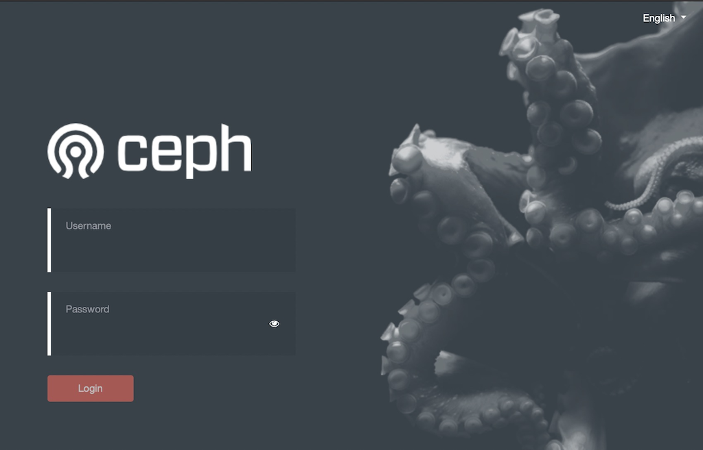
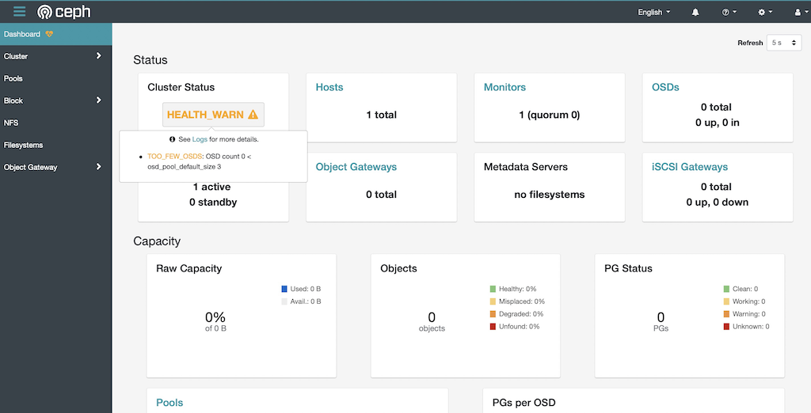

.. _ceph_dashboard:

==========================
Ceph Dashboard 管控面板
==========================

激活
=========

在 :ref:`install_ceph_mgr` 过程中可以激活 ``Dashboard`` ，不过，对于发行版安装，一般需要先安装对应软件包::

   sudo apt install ceph-mgr-dashboard

激活模块::

   sudo ceph mgr module enable dashboard -c /etc/ceph/zdata.conf

配置
========

dashboard的HTTP连接默认通过 SSL/TLS 加密。

- 快速设置和启动dashboard，可以通过安装自签名证书::

   sudo ceph dashboard create-self-signed-cert -c /etc/ceph/zdata.conf

提示::

   Self-signed certificate created

大多数浏览器都会警告自签名证书并且要求更多确认。

- 为了安全部署和移除警告，需要通过一个签名证书(certificate authority, CA)来实现::

   openssl req -new -nodes -x509 \
     -subj "/O=IT/CN=ceph-mgr-dashboard" -days 3650 \
     -keyout dashboard.key -out dashboard.crt -extensions v3_ca

然后通过这个CA来签名 ``dashboard.crt`` ::

   sudo ceph dashboard set-ssl-certificate -i dashboard.crt -c /etc/ceph/zdata.conf
   # 提示: SSL certificate updated

   sudo ceph dashboard set-ssl-certificate-key -i dashboard.key -c /etc/ceph/zdata.conf
   # 提示: SSL certificate key updated

如果通过 ``ceph-mgr`` 会话来命名(主机名，我的案例是 ``z-b-data-1`` )，则执行::

   sudo ceph dashboard set-ssl-certificate z-b-data-1 -i dashboard.crt -c /etc/ceph/zdata.conf
   sudo ceph dashboard set-ssl-certificate-key z-b-data-1 -i dashboard.key -c /etc/ceph/zdata.conf
   
此外，也可以关闭掉https的支持(虽然不推荐，不过如果在proxy后面有可能是通过proxy来实现SSL，就不需要在dashboard上使用SSL)::

   sudo ceph config set mgr mgr/dashboard/ssl false -c /etc/ceph/zdata.conf

- 配置完成后可以看到服务::

   sudo ceph mgr services -c /etc/ceph/zdata.conf

输出显示::

   {
       "dashboard": "https://z-b-data-1:8443/"
       
   }

- 现在我们使用浏览器访问 https://z-b-data-1:8443/ 就可以看到Ceph的管理界面:

   
主机名和端口
----------------

``ceph-mgr`` 服务提供了dashboard默认绑定TCP端口8443，如果SSL关闭则绑定8080。如果没有指定IP地址，则web服务绑定 ``::`` ，也就是监听所有网卡接口。

可以修订绑定端口和IP::

   ceph config set mgr mgr/dashboard/$name/server_addr $IP
   ceph config set mgr mgr/dashboard/$name/server_port $PORT
   ceph config set mgr mgr/dashboard/$name/ssl_server_port $PORT

这里 ``$name`` 请替换成主机名，例如我这里是 ``z-b-data-1``

用户名和密码
--------------

Ceph提供了一系列管理角色，通常可以通过以下命令创建一个管理员角色(密码存放在一个文件中)::

   ceph dashboard ac-user-create <username> -i <file-containing-password> administrator

创建好密码账号就可以通过web登陆，看到

结合Grafana
=============

Ceph Dashboard提供了集成 :ref:`grafana` 的功能，可以直接从 :ref:`prometheus` 作为数据源，通过 ``Ceph Prometheus Module`` 输出数据到Prometheus，然后通过Node exporter采集到Prometheus。

待实践...

监控RBD镜像
================

默认关闭了RBD镜像监控，后续我会尝试此项实践(通过Prometheus集成rbd io监控)

激活Single Sign-On(SSO)
=========================

支持 SAML 2.0协议的扩展认证，待实践

激活Prometheus告警
===================

代理配置(反向代理)
=====================

待实践通过 :ref:`haproxy` 实现反向代理负载均衡，实现高可用

参考
=======

- `Ceph Manager Daemon » Ceph Dashboard <https://docs.ceph.com/en/latest/mgr/dashboard/>`_
