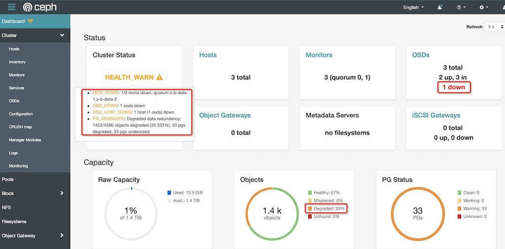
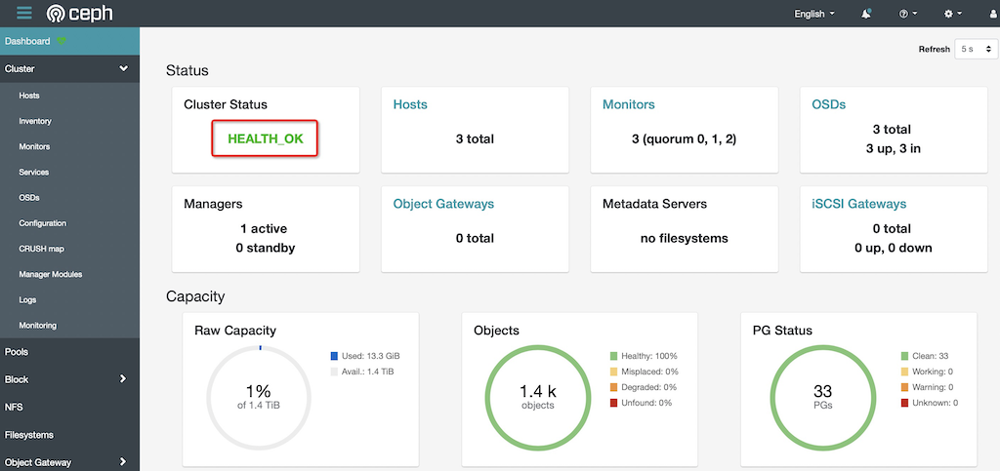

.. _down_1_of_3_ceph_vm_rbd:

==================================
1/3 Ceph节点宕机演练: VM RBD测试
==================================

Ceph提供了分布式多副本存储，可以承受部分节点故障而不影响整体服务。在我的 :ref:`install_ceph_manual` 集群，采用了3副本模式，只要保证 2/3 的节点工作正常，就可以继续提供读写服务。例如，我需要升级 ``z-b-data-3`` 服务节点的操作系统内核，停机维护。这里我们来验证部署的集群冗灾性。

模拟1/3 Ceph节点宕机
=========================

- 登陆 ``z-b-data-3`` 节点， ``sudo apt upgrade`` 完成升级后，执行 ``shutdown -h now`` 关闭节点，模拟 1/3 Ceph节点宕机

- 检查集群状态::

   sudo ceph -s

输出显示::

   cluster:
     id:     0e6c8b6f-0d32-4cdb-a45d-85f8c7997c17
     health: HEALTH_WARN
             1/3 mons down, quorum z-b-data-1,z-b-data-2
             Degraded data redundancy: 1422/4266 objects degraded (33.333%), 33 pgs degraded, 33 pgs undersized
    
   services:
     mon: 3 daemons, quorum z-b-data-1,z-b-data-2 (age 14m), out of quorum: z-b-data-3
     mgr: z-b-data-1(active, since 3d)
     mds:  2 up:standby
     osd: 3 osds: 2 up (since 14m), 2 in (since 4m)
    
   data:
     pools:   2 pools, 33 pgs
     objects: 1.42k objects, 5.5 GiB
     usage:   8.9 GiB used, 922 GiB / 931 GiB avail
     pgs:     1422/4266 objects degraded (33.333%)
              33 active+undersized+degraded

并且从 :ref:`ceph_dashboard` 可以清楚看到 1/3 节点故障:

测试虚拟机运行
==================

在 :ref:`ceph_rbd_libvirt` 中我部署了 ``z-ubuntu-rbd`` 虚拟机是运行在 :ref:`ceph_rbd` 上的虚拟机，理论上 2/3 节点正常工作依然可以保持虚拟化系统正常工作。

- 在 ``zcloud`` 上检查虚拟机::

   virsh list

可以看到 ``z-ubuntu-rbd`` 运行状态::

   ...
   33   z-ubuntu20-rbd   running

- 现在我们来检查虚拟机内部运行情况::

   ssh z-ubuntu20-rbd

SSH登陆正常

- 检查磁盘::

   $ df -h
   Filesystem      Size  Used Avail Use% Mounted on
   udev            3.9G     0  3.9G   0% /dev
   tmpfs           796M  692K  796M   1% /run
   /dev/vda2       5.8G  4.8G  1.1G  83% /
   tmpfs           3.9G     0  3.9G   0% /dev/shm
   tmpfs           5.0M     0  5.0M   0% /run/lock
   tmpfs           3.9G     0  3.9G   0% /sys/fs/cgroup
   /dev/vda1       240M  5.2M  235M   3% /boot/efi
   tmpfs           796M     0  796M   0% /run/user/1000

写入文件::

   huatai@z-ubuntu-rbd:~$ touch test

   huatai@z-ubuntu-rbd:~$ ls
   fio  test

   huatai@z-ubuntu-rbd:~$ ls -lh
   total 2.1G
   -rw-r--r-- 1 huatai huatai 2.0G Dec  8 16:46 fio
   -rw-rw-r-- 1 huatai huatai    0 Dec  8 23:11 test

   huatai@z-ubuntu-rbd:~$ rm -f fio
   huatai@z-ubuntu-rbd:~$ ls -lh
   total 0
   -rw-rw-r-- 1 huatai huatai 0 Dec  8 23:11 test
   huatai@z-ubuntu-rbd:~$ echo "write somethin in test" >> test
   huatai@z-ubuntu-rbd:~$ cat test
   write somethin in test

可以验证读写正常

- 复制一些文件::

   cp /etc/resolv.conf ./
   cp /etc/hosts ./

- 检查系统日志::

   dmesg -T

没有看到任何有关磁盘读写错误，证明在虚拟机内部未受底层Ceph分布式存储1/3节点宕机影响

恢复模拟宕机的1/3 Ceph节点
==============================

- 恢复 ``z-b-data-3`` 服务器启动，重复上述检查，未见异常

- 此时检查Ceph集群状态，可以看到集群恢复Health::

   cluster:
     id:     0e6c8b6f-0d32-4cdb-a45d-85f8c7997c17
     health: HEALTH_OK
    
   services:
     mon: 3 daemons, quorum z-b-data-1,z-b-data-2,z-b-data-3 (age 39s)
     mgr: z-b-data-1(active, since 3d)
     mds:  3 up:standby
     osd: 3 osds: 3 up (since 33s), 3 in (since 33s)
    
   data:
     pools:   2 pools, 33 pgs
     objects: 1.42k objects, 5.5 GiB
     usage:   13 GiB used, 1.4 TiB / 1.4 TiB avail
     pgs:     33 active+clean

.. note::

   同样对升级内核 ``z-b-data-2`` 进行重启
