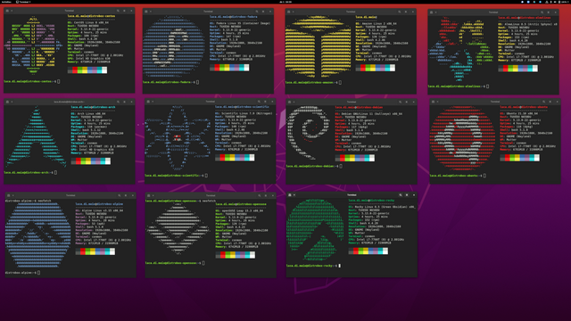

.. _intro_distrobox:

=======================
distrobox简介
=======================

``Distrobox`` 在终端中提供了不同的Linux发行版，底层原理是容器化运行(使用 :ref:`podman` , :ref:`docker` 或 `lilipod <https://github.com/89luca89/lilipod>`_ )任何Linux发行版。

OSTree vs. Toolbox
===================

:ref:`toolbox` 是另一个基于 :ref:`podman` 实现类似 ``Distrobox`` 功能的开源项目，其开发采用了混合Shell和Go，但其区别在于:

- ``Toolbx`` 基于 :ref:`ostree` 系统构建，底层操作系统是 Fedora , CoreOS 和 Silverblue 主机( :ref:`redhat_linux` 生态系统)

  - ``OSTree`` 目标是构建类似Git管理方式实现混合镜像/包系统，具有 **不可变性** (immutability), **原子更新** (atomic updates) 和 **版本控制** (Versioning and Rollback)
  - toolbx为OSTree的不可变系统提供了 **可变的、隔离的容器环境** ，用户可以在容器中自由安装和使用传统的开发工具和软件包，绕过宿主机操作系统不可变限制
  - toolbox 容器被设计为可以访问宿主机的用户家目录、PulseAudio 插槽、X11 套接字（用于 GUI 应用）等，提供了一种接近原生体验的开发环境，而不是一个完全隔离的虚拟机

参考
======

- `GitHub: 89luca89/distrobox <https://github.com/89luca89/distrobox>`_
