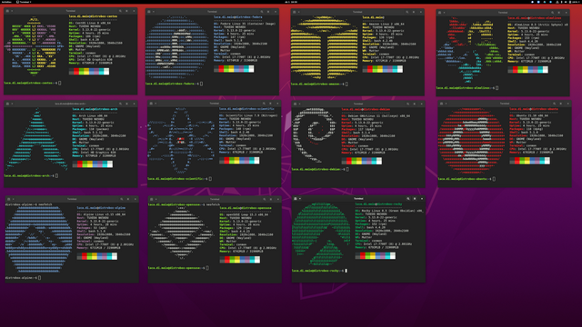

.. _intro_distrobox:

=======================
Distrobox简介
=======================

``Distrobox`` 在终端中提供了不同的Linux发行版，底层原理是容器化运行(使用 :ref:`podman` , :ref:`docker` 或 `lilipod <https://github.com/89luca89/lilipod>`_ )任何Linux发行版。

``Distrobox`` 完全采用shell编写，是 :ref:`podman` , :ref:`docker` 或 lilipod 的一个fancy wrapper(高级封装)，用于创建和启动 **与主机高度集成的容器** 。

为什么要用Distrobox
======================

我在 :ref:`alpine_install_mba11_late_2010` 思考一个问题: 如何轻量化地运行系统，尽可能充分发挥 :ref:`mba11_late_2010` 的硬件性能。

我之所以选择 :ref:`alpine_linux` 就是看重系统的轻量化，但是如果每次安装部署都重复安装应用软件，特别是各种应用软件，不仅浪费精力，而且难以迁移(例如我有时候想把应用迁移到服务器上运行，本地仅做页面渲染)。那么我觉得Distrobox是一个解决方案:

- 容器化运行桌面应用，在完善调试之后，可以将容器推送到registry中保存，随时部署到任何已经安装好podman系统
- Host主机系统最小化，只保留 Base 系统和 :ref:`sway` ，应用既可以通过Distrobox部署在本地容器环境，也可以通过 :ref:`distrobox_waypipe` (服务器承担主要压力)

快速起步
=============

- :ref:`alpine_distrobox`

Distrobox vs. Toolbox
========================

:ref:`toolbox` 是另一个基于 :ref:`podman` 实现类似 ``Distrobox`` 功能的开源项目，其开发采用了混合Shell和Go，但其区别在于:

- ``Toolbox`` 基于 :ref:`ostree` 系统构建，专注与 **不可变性** (immutability)，主要目标是为Kubernetes这类基础设施提供底层不可变操作系统(OSTree)之上构建可变部分
- ``Distrobox`` 灵活适用不同操作系统，目标是提供操作系统无缝集成容器，使得容器成为具备隔离运行不同操作系统嫁接到Host主机上，成为一个融合整体

参考
======

- `GitHub: 89luca89/distrobox <https://github.com/89luca89/distrobox>`_
