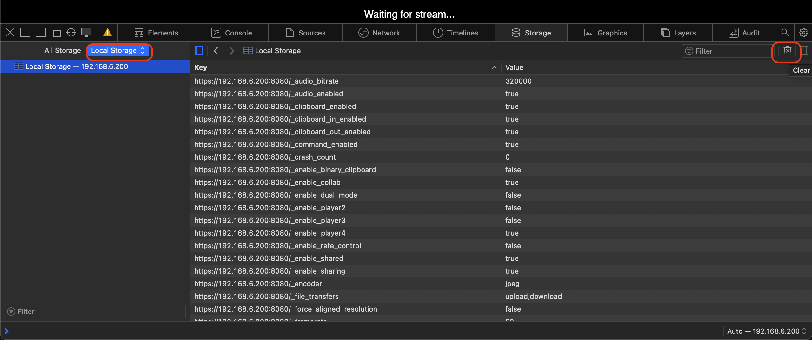

.. _linuxserver_docker-calibre_http2_safari_cache:

=========================================================================
一次异常排查:HTTP2多路复用(Multiplexig)/长连接和本地Safari浏览器缓存冲突
=========================================================================

服务端突然crash就再也无法访问
===============================

我在完成了 :ref:`linuxserver_docker-calibre` 和 :ref:`linuxserver_docker-calibre-web` 部署之后，虽然使用没有太大问题，但是在一次偶然删除Calibre中大约1.6k本书籍时，突然触发了Calibre的crash。而且诡异的是，重启 ``calibre-backend`` 容器，甚至清理了所有配置(原本想从头开始)也无法正常访问Calibre桌面。在 :ref:`selkies` 的web页面中看到 ``Waiting for stream...`` 提示，我检查了 ``calibre-backend`` 日志如下:

.. literalinclude:: linuxserver_docker-calibre_gpu/calibre-backend.log
   :caption: 日志显示CPU软解压(未使用GPU)且出现Segmentation fault

可以看到上述日志中有以下异常:

- **纯 CPU 软解压与极高编码负荷** : 日志第 4 行显示 ``Decision: No GPU Encoder available -> Using CPU Software Encoding.`` ，且渲染分辨率高达 ``2560x1256 @ 60 FPS``
- 执行“大量删除书籍”时，Calibre 会在底层高频触发对旧书籍物理文件的删除（Disk I/O），同时对 ``metadata.db`` 数据库密集写入，以及图书封面清理(内存变动)
- 由于没有 GPU 硬件加速，所有的图形界面重绘全部由 CPU 强行计算，在巨大的物理分辨率（2560x1256）和磁盘 I/O 阻塞影响下， ``libwc`` 窗口管理器在多线程上下文切换时出现内存非法访问 ``Segmentation fault`` 崩溃

我尝试重新启动容器:

.. literalinclude:: linuxserver_docker-calibre_gpu/restart
   :caption: 尝试重启容器

但是发现 selkies 的web界面一直显示 ``Waiting for stream...`` ，而后台 ``ps aux | grep calibre`` 显示:

.. literalinclude:: linuxserver_docker-calibre_gpu/ps
   :caption: 显示进程
   :emphasize-lines: 1

这里可以看到 ``calibre`` 进程处于 ``Sl`` 状态( ``S`` 是可中断睡眠状态, Interruptible Sleep； ``l`` 是多线程)，另外有 ``7.9%`` 的CPU战用，这表明Calibre主进程还或者，并且在后台运算。但是  ``calibre-parallel`` (并行工作进程)是子进程，正在等待数据管道的输入。

我检查了 ``/library`` 目录，发现在该目录下有2个隐藏目录，其中 ``.caltrash/`` 目录占用空间非常巨大:

.. literalinclude:: linuxserver_docker-calibre_gpu/caltrash
   :caption: ``.caltrash/`` 目录占用空间巨大
   :emphasize-lines: 7

``.caltrash`` 是 **安全回收站** ，当“大量删除书籍”时，Calibre 并没有直接从磁盘上物理抹除它们。为了防止用户误删，Calibre会将数千本书籍的物理文件、封面、元数据全部搬运到 ``.caltrash`` 隐藏目录。

由于前面触发了 ``libwc`` 图形层crash，导致SQLite数据库事务中断，所以重启后，Calibre会扫面 ``.caltrash`` 目录进程回收站重置，并强行重放 ``metadata.db`` 的WAL事务日志。

我回想了一下自己的操作过程，当时做了一些GUI界面删除掉误导入数据的插件文件(因为我将插件放到了 ``/import`` 目录下会自动作为图书导入数据，但实际上是插件二进制文件)，又批量删除数千本图书。这个过程触发了图形界面crash后，应该中断了SQLite数据库操作。整个过程应该留下了垃圾数据导致系统重启后忙于恢复。

奇怪的是，我完全抹掉了 ``.caltrash/`` 目录之后，甚至完全清理掉 ``/library`` 目录和 ``/config`` 目录，重新启动容器，还是同样的报错，并且selkies还是无法连接后端。

gemini分析了一下我的 ``docker-compose.yml`` 提出了一个我之前在 :ref:`linuxserver_docker-calibre_usb_kobo` 引入的 ``privileged: true`` (特权模式)配置存疑，当时为了能够将kobo设备透传给 ``calibre-backend`` 容器添加了这个设置:

.. literalinclude:: linuxserver_docker-calibre_gpu/docker-compose_https.yml
   :caption: 透传 ``/dev/sda`` 设备到容器内部
   :lines: 21-40
   :emphasize-lines: 5-7

(这个解释是错的)gemini提到: 虽然开启 ``privileged: true`` ，但是在较新的 Linux 内核或 Docker 运行时（Runtime）中，仅凭这个参数有时无法完全继承宿主机的 **虚拟终端控制台（TTY）和共享内存（/dev/shm）** 。所以当容器内Wayland尝试在内存中开辟 ``2560x1256`` 虚拟画布是，由于没有得到足够的内核硬通道支持，会在后台挂起，导致画面一片漆黑，只显示一个鼠标。gemini建议修订明确的权限

但是，实际上我完全删除了 ``/config`` 和 ``/library`` 目录内容(也就是彻底清除了Calibre配置和书库)，依然还是无法正常访问。这就无法解释了，因为容器已经完全重建了，配置也已经恢复到初始状态。

偶然发现: 换了浏览器就OK
==========================

我在反复尝试无果之后，偶然发现，换了chrome浏览器就能够正常访问Calibre桌面了!!!

Why?

之前使用Safari不是都正常吗，我的macOS也没有做任何升级，怎么突然间就无法访问了呢?

原因就在于，为了提高 :ref:`selkies` 性能，我在 :ref:`linuxserver_docker-calibre` 配置的 NGINX 反向代理中引入了 HTTP/2 配置:

把 Nginx 的配置升级为 2026 年最新标准的 ``http2 on;`` 之后，Nginx 与浏览器（Safari）之间的网络交互发生了一个质的飞跃:

- 传统模式下，浏览器每请求一个文件（比如 Calibre 的主页、一个 JS 脚本、一张图标），都需要并发建立一个独立的 TCP 连接。请求完了，连接就关闭
- HTTP/2 引入了 **二进制分帧层（Binary Framing Layer）** ，这样浏览器和 Nginx 之间有且仅需要建立一条持久的 TCP 物理长连接（在 HTTPS 下即为一条 TLS 隧道）。这个唯一的物理通道里，所有的 HTML、JS、CSS、以及 Selkies 的控制流 Websocket，全部分解为带 ID 的“流（Streams）”，在通道里高并发地传输。

- 物理长连接“假活”（TCP Half-Open）: 当容器内的 ``labwc`` 和应用突发崩溃时，由于外部NGINX容器依然健康，在浏览器看来，它和Nginx 之间的那条 **TTP/2 TLS 物理长连接依然完美存活着（连接并没有断开）**
- 由于物理通道没断，Safari 的 WebKit 内核在突发崩溃的那一瞬间，某个负责渲染 WebRTC 画面流的 JS 帧请求被无限期挂起（Hang）: 客户端判断连接通道是健康的，可能知识服务器繁忙暂时没有响应，所以会一直保持着这个流的内部状态机
- 当服务器端执行 ``docker compose down && docker compose up -d`` 彻底重建系统后，服务器端的所有内存、WebRTC 协商密钥、会话 ID 已经全部物理清空，等待全新握手
- 客户端（Safari）WebKit 极力想要复用那条已经建立好的 HTTP/2 TCP 长连接，以节省网络开销: 使用旧的会话标识、旧的 Service Worker 路由缓存，试图顺着原先的 HTTP/2 帧 ID 去找后端
- 最后的死循环: Safari 陷入了“等待服务器回应旧流”，而服务器在“等待 Safari 发起新握手” - 终极死锁

解决方法
===========

临时解决方法:清理浏览器缓存
-----------------------------

既然Safari错误缓存了TLS隧道长连接的内部状态机，那么最简单的方法就是清除缓存：

- 按下 ``option+command+i`` 组合键，启动 ``Show Web Inspector`` (或者菜单访问 ``Develop => Show Web Inspector`` )
- 选择 ``Storage`` 面板，然后点击选择 ``Local Storage`` ，再点击 ``Clear Local Storage`` 按钮

- 然后再次刷新页面就能够正常看到Calibre桌面应用了

彻底解决方法:Nginx/Ingress反向代理层存活探测与动态重置
---------------------------------------------------------

显然上述方法在企业应用环境中是不现实的，如果每次服务端应用crash都要去手工清理浏览器缓存，那么HelpDesk会疯掉的。

真正的解决方法是，NGINX不能只做单纯的流量转发，还必须具备在后端崩溃时主动向客户端浏览器发送连接重置并清理通道的能力:

.. literalinclude:: linuxserver_docker-calibre-web/calibre_https.conf
   :caption: 反向代理nginx配置 nginx/conf.d/calibre.conf 中增加在后端crash时主动向浏览器发送连接重置
   :lines: 21-54
   :emphasize-lines: 2,8-10,13,30-34

这样当 Calibre 后端 Crash 时，Nginx 只要探测到 upstream 挂了，就会在向 Safari 返回 ``502`` 的同时，在 HTTP 头部强权注入 ``Connection: close`` 。Safari 接收到该头部后，会强制物理销毁当前整条 ``HTTP/2 TLS`` 隧道，下次刷新必须重新握手，从而彻底规避通道错位。

其他解决方法
---------------

.. note::

   本段仅根据gemini进行记录整理，作为后续学习参考

方法一
~~~~~~~~~

除了上述在NGINX层做的主动侦测，在企业级 PWA（渐进式 Web 应用）开发中，Service Worker 绝对不允许做“睁眼瞎”，必须在代码层面引入主动探活与版本热刷新（Hot Reload）。

前端的 sw.js（Service Worker 核心脚本）中，优雅的工程写法是：

.. literalinclude:: linuxserver_docker-calibre_http2_safari_cache/sw.js
   :caption: 前端sw.js
   :language: javascript

方法二
~~~~~~~~~~~

针对 Selkies 这种重度依赖 WebRTC 的流媒体桌面，前端 JavaScript 必须对连接状态进行全生命周期监听: 当后端容器崩溃时，WebRTC 的底层信道其实已经断裂。优雅的前端逻辑应该拦截这个断裂信号，并在界面上弹出“服务器已重置，正在重新建立安全隧道...”的提示，而不是卡在 ``waiting for stream...``

.. literalinclude:: linuxserver_docker-calibre_http2_safari_cache/selkies.js
   :caption: Selkies 客户端JS伪代码
   :language: javascript

方法三 ``最底层的优雅设计``
~~~~~~~~~~~~~~~~~~~~~~~~~~~~~

在 HTTP/2 的原生协议设计中，其实专门预留了一个用来优雅处理服务器重启/崩溃的二进制控制帧 ``GOAWAY`` 帧。

在企业级负载均衡器（如 F5、Envoy 或高级 Nginx 模块）中:

- 当网关感知到容器正在重启，或者收到容器崩溃信号时，网关会立刻向所有当前在线的浏览器广播一个 HTTP/2 ``GOAWAY`` 二进制帧。
- ``GOAWAY`` 的物理作用：它会明确告诉 Safari/Chrome 的内核：“我已经收到了你之前发送的到 X 号为止的所有数据帧，但这条 HTTP/2 隧道即将关闭，我不再接受任何新帧。请你立刻在后台无感建立一条全新的 TCP 链路来传输后续数据。”

通过这种协议层面的广播，浏览器就会在万分之一秒内优雅地放弃旧通道，切换到新通道，用户在前端甚至完全感知不到后端曾经发生过 Crash 物理重置。
