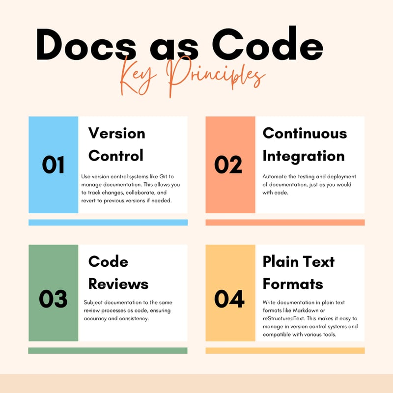

.. _docs_as_code:

==================
Docs-as-Code
==================

2025年1月，我在准备下一个文档项目 `「云图 -- 云计算图志: 构建」 Cloud Atlas: Arch <https://docs.cloud-atlas.io/arch/>`_ ，调查选型撰写工具:

- 想要选择一个比现在所使用的 :ref:`sphinx_doc` 更为现代化美观，并且能够整体融合到一个网站中的静态网站生成器
- 主流技术，有非常活跃和前途的社区支持
- 能够促使自己更好学习前端构建技术的平台

虽然我已经撰写 ``「云图 -- 云计算图纸: 探索」`` 好些年了，但是很少关注和调研整个文档工具生态。搜集和整理一些资料以后，对于最近几年涌现出大量文档工具以及 ``Docs-as-Code`` 理念，有了一些了解和想法，也为后续自己选择工具规划网站做了一些准备。

概念
=======

所谓 ``docs-as-code`` 就是采用代码开发的方式:

- 使用 :ref:`git` 版本控制来维护每一次文档修改
- 代码review控制文档质量以及多人写作完成文档
- 使用 :ref:`gitlab` 这样的的CI/CD工具管理整个撰写、编译、发布流程: :ref:`docs_as_code_at_gitlab`
- 使用Issue跟踪项目bug

  - 分支策略: 不同章节的工作可以多人协作完成
  - Pull Requests: 引入代码review过程
  - 持续集成: 可以自动完成文档测试和部署
  
并且现在Netlify和GitHub提供了托管平台，可以为文档最后发布提供稳定的支持。

格式和工具
===============

围绕以下格式流派:

- Markdown: 很多大型组织用来构建文档库

  - ``Docusaurus`` Facebook开源的基于 React+Node.js 静态网站生成器，基于MDX框架
  - :ref:`nextra` 是 :ref:`nextjs` 开发的同样基于MDX的静态网站
  - ``Astro`` 支持多种前端框架的文档工具 - `Astro integrations <https://docs.astro.build/en/guides/integrations-guide/#official-integrations>`_
  - :ref:`mkdocs`
  - :ref:`hugo`
  - :ref:`jekyll`

.. note::

   从GitHub的星来看， ``Docusaurus`` (5.76w star) 和 ``Astro`` (4.8w star)是最流行的内容网站框架，特别是 ``Astro`` 号称集成不同的主流前端框架，可能比较适合某类熟悉React或Vue框架的开发。 

   ``Nextra`` (1.21w start)则由 :ref:`nextjs` 开发

- Asciidoc: 很多开源项目使用的文档系统，适合电子书输出，例如 FreeBSD doc

  - ``docToolchain``
  - ``Asciidoctor`` GitHub开发的Asciidoc生成器
  - ``Antora`` 

- reStructuredText: Python社区主要使用的文档系统，也是偏重技术文档内容但不care外观的选择，例如 kernel.org

  - :ref:`sphinx_doc`

对比和思考
------------

从电子书角度来看， ``Asciidoc`` 和 ``reStructuredText`` 是主要的文档格式，被很多严肃、核心的开源项目，例如FreeBSD和Kernel选为文档基础。我感觉主要原因是这些开源团队更侧重于后台技术，需要严谨的文档格式，同时不希望太过花哨的展示形式冲淡了作为核心技术的稳健风格。

从市场工具来看， ``Markdown`` 显然是更为流行的网站工具，并不局限于电子书，而是通过WEB对外展示公司和组织的技术。围绕 ``Markdown`` 的工具更是层出不穷，构建了大量美轮美奂的文档网站。

从核心技术角度来看， ``Markdown`` 工具技术都是 :ref:`javascript` 流派的，最流行的文档工具其实核心技术都是基于 ``DMX`` + :ref:`nodejs` + :ref:`typescript` + :ref:`react` (或者还有支持 ``vue`` 等前端框架)。所以我感觉区别不是很大，主要是掌握核心技术，也就是底层的 :ref:`javascript` 系列前端技术，切换工具也应该不难。

``Asciidoc`` 和 ``reStructuredText`` 更适合后端技术领域。

目前我想学习一些前端技术，所以我在选型时会选择 ``Markdown`` 流派，同时我会结合自己近期的学习路线来最终选择一个平台。可能选择基于 :ref:`nextjs` 的 :ref:`nextra` 。

设计图表
==========

除了文字撰写，在技术文档中，往往需要一些系统图表( ``diagram`` )来表示页面设计、系统架构等。我准备采用以下开源工具来完成架构图和网站设计:

- :ref:`fossflow`
- :ref:`excalidraw`
- :ref:`tldraw`
- :ref:`diagrams`
- :ref:`mermaid`

CI/CD
=========

``Docs-as-Code`` 的重要核心是持续集成，我采用 :ref;`docs_as_code_at_gitlab`

参考
======

- `Write The DOCS: Docs as Code <https://www.writethedocs.org/guide/docs-as-code/>`_
- `Markdown, Asciidoc, or reStructuredText - a tale of docs-as-code <https://www.dewanahmed.com/markdown-asciidoc-restructuredtext/>`_ docs-as-code 有众多选择，实在有些吃惊
- `Docs-as-code: A Brief Introduction <https://medium.com/@ezinneanne/docs-as-code-a-brief-introduction-4fe15b7f0b4c>`_
- `Five fast facts about docs as code at GitLab <https://about.gitlab.com/blog/2022/10/12/five-fast-facts-about-docs-as-code-at-gitlab/>`_
- `4 个推荐的开源系统设计图表工具 <https://www.explainthis.io/zh-hans/pinthis/blog/system-design-tools>`_
