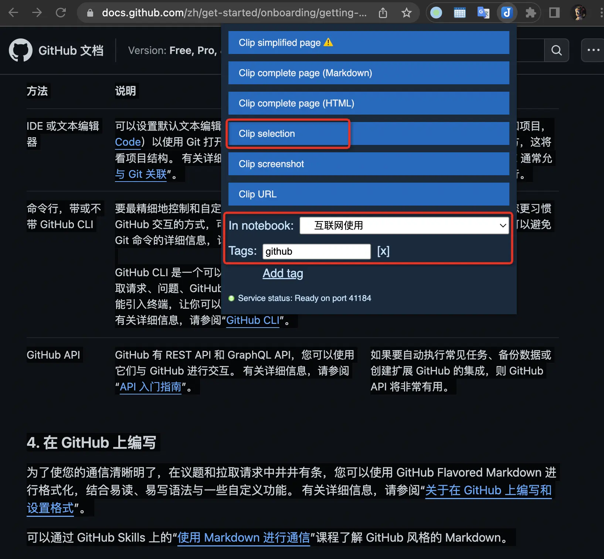
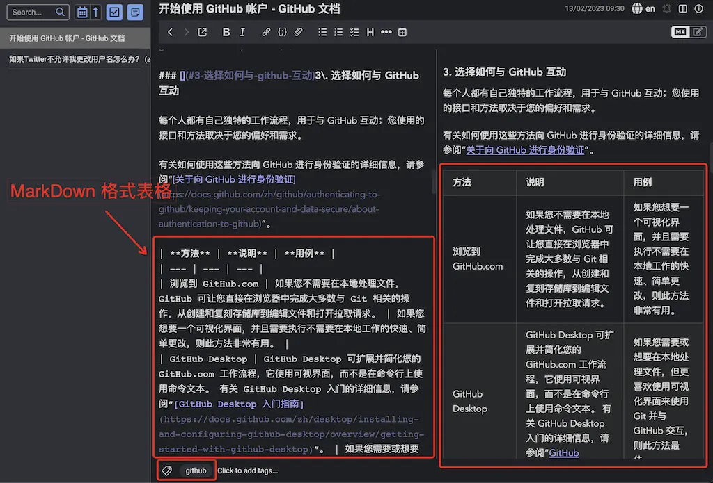

.. _joplin_clipper:

===================
Joplin Web Clipper
===================

`Joplin Web Clipper <https://joplinapp.org/clipper/>`_ 可以说是Joplin最有价值的工具之一。

一直以来，我依赖Evernote来搜集网络参考资料，并且可以说极度依赖Evernote Clipper功能，也就是WEB页面直接保存到Evernote中以备后续参考。不过，Evernote固步自封，不支持Markdown也不支持Linux，所以最终我放弃了Evernote。

没有想到，开源的的Joplin提供了比Evernote Clipper更为完美的解决方案 `Joplin Web Clipper <https://joplinapp.org/clipper/>`_ :

- 支持WEB页面的完整抓取、精简抓取和选择抓取
- **WEB页面抓取保存时自动转换成MarkDown格式** ，方便后续修订编辑(太完美了)

由于我在后续资料再加工时会不断修订，MarkDown格式保存的Joplin Web Clipper资料确实非常完美:

``Clip selction``
===================

- 选择WEB页面需要抓取的内容，然后点击 ``Joplin Web Clipper`` 插件按钮，选择 ``Clip selction`` ，并且可以选择保存到哪个笔记本以及添加 ``Tags`` :

   Joplin Web Clipper 抓取WEB页面选择部分

- 保存后文档可以看到是MarkDown格式，并且HTML的表格也被转换成MarkDown表格:

   Joplin Web Clipper 抓取WEB页面保存为MarkDown格式，包括表格也转换成MarkDown

``Clip simplified page``
==========================

另一种非常有用的抓取方式是 ``Clip simplified page`` ，这种简化页面也是抓取为 Markdown 格式，方便后续编辑修改。我实践使用发现，特别类似于Safari浏览器的 **阅读模式** ，对于页面中嵌入众多广告的网站，可以直接提取出主要文档内容(含多媒体)，保存为非常简洁的Markdown文档:

- 知乎的回答文章，在Chrome中展开阅读后，就可以通过 ``Clip simplified page`` 完整保存

参考
=======

- `Joplin Web Clipper <https://joplinapp.org/clipper/>`_
