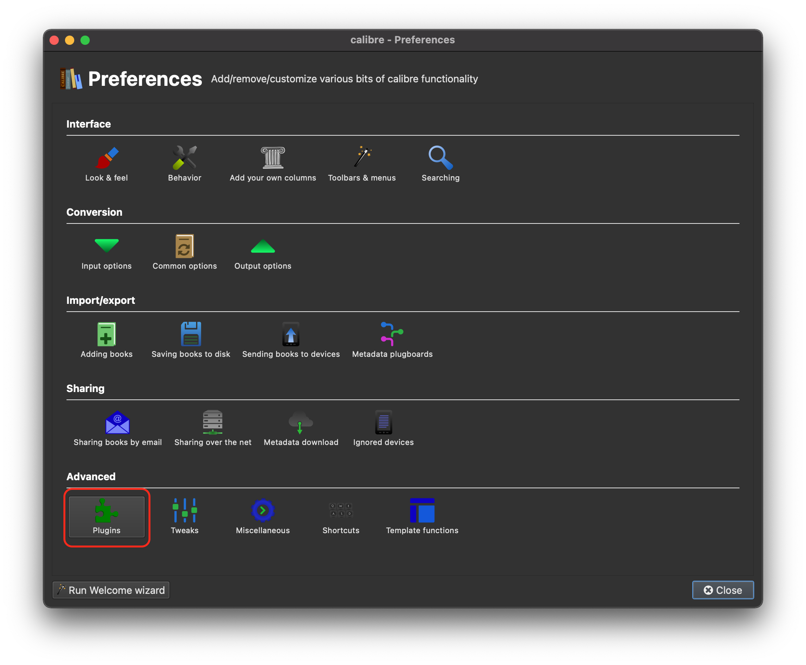
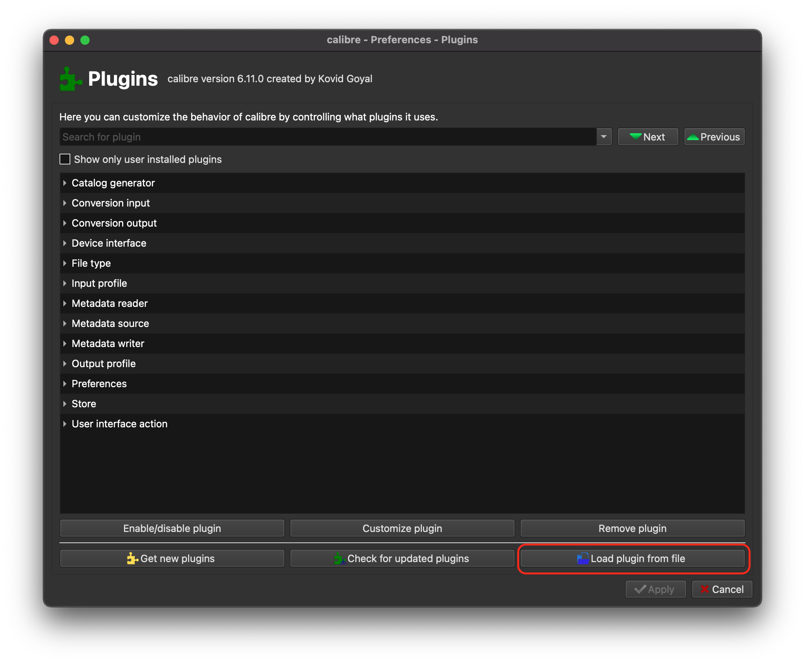
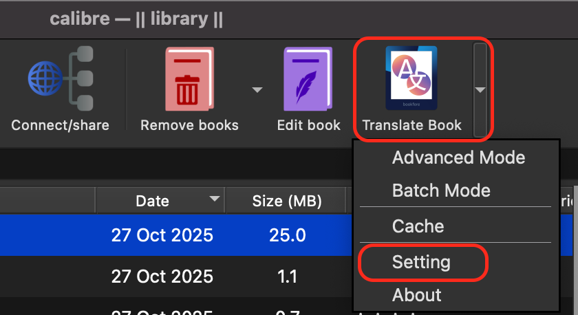
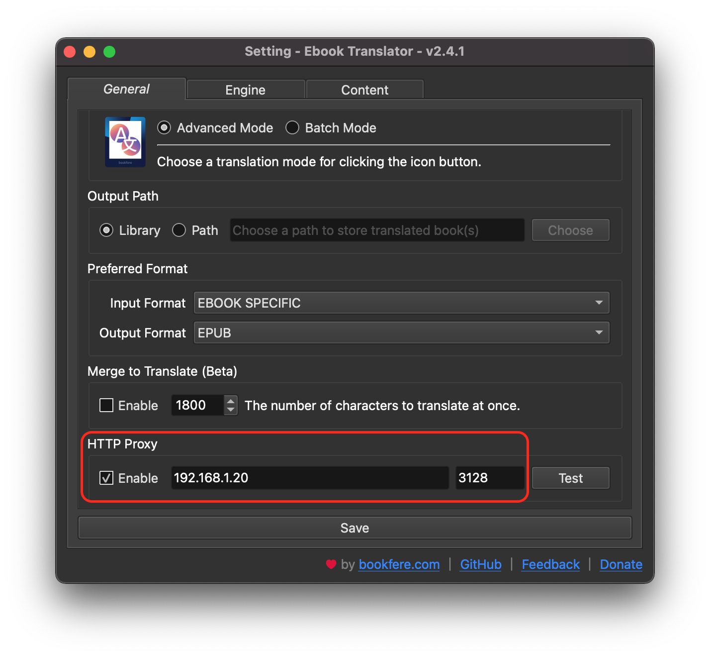
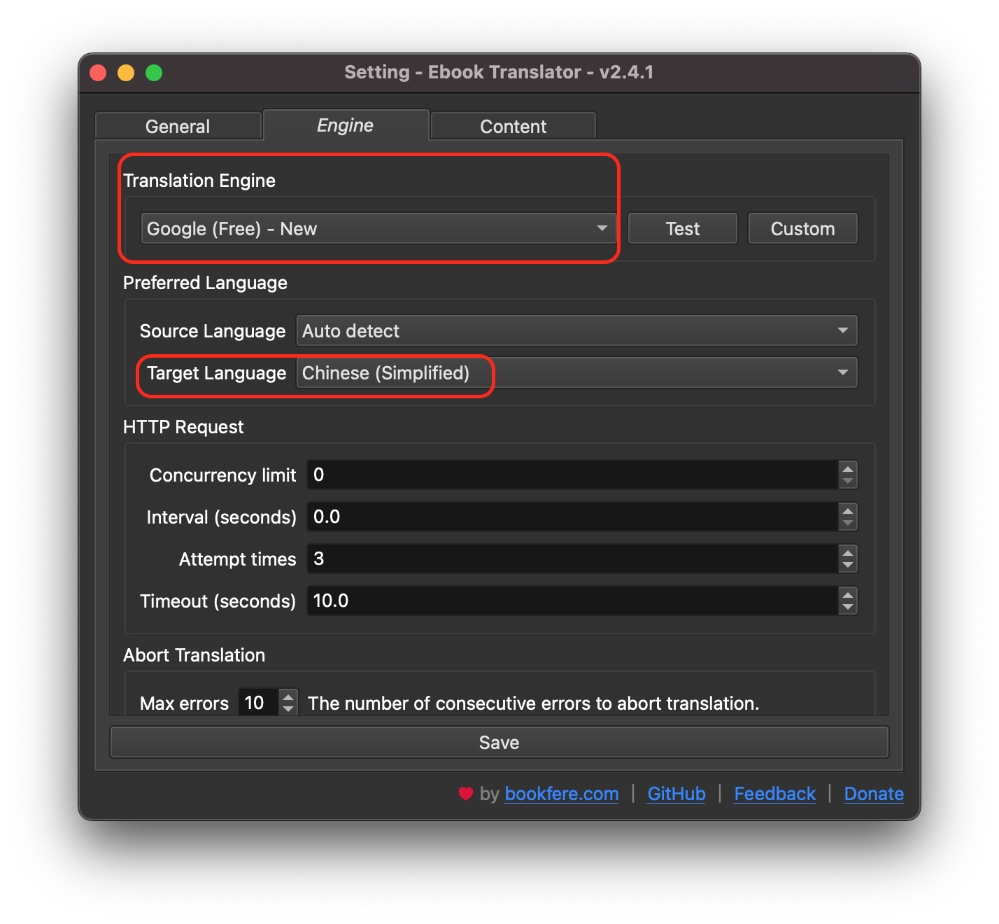
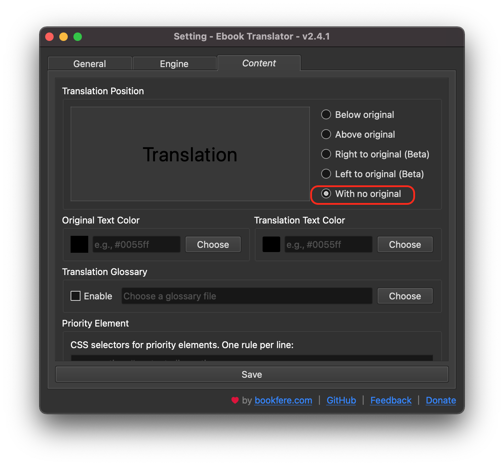
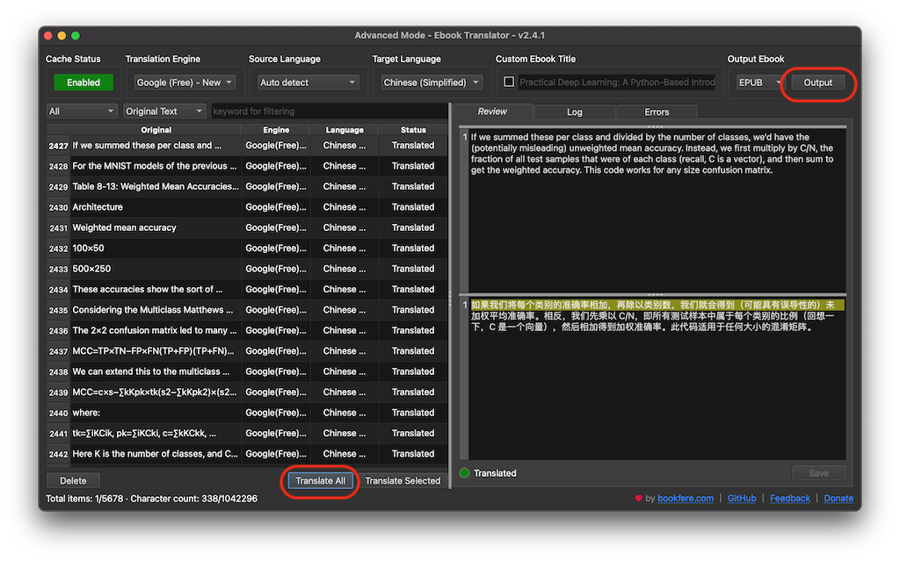
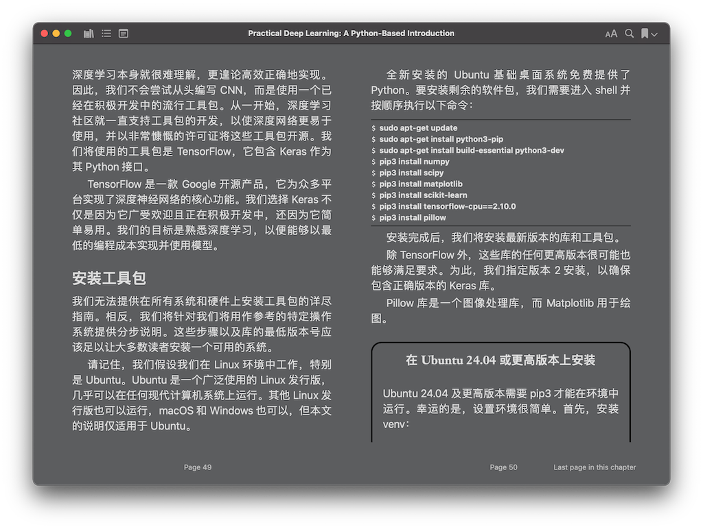

.. _calibre_ebook_translator:

===============================
Calibre Ebook Translator插件
===============================

**强烈安利** `Ebook-Translator-Calibre-Plugin <https://github.com/bookfere/Ebook-Translator-Calibre-Plugin>`_ ，一款Calibre电子书翻译插件!!!

一直以来，受困于中国文化审查，大陆出版的书籍往往是阉割版，甚至是扭曲版。对于像我这样英语水平有限，直接阅读原版电子书比较吃力，又不甘心浪费时间看国内翻译版本，就需要有一个能够自由翻译的工具软件。

`Ebook-Translator-Calibre-Plugin <https://github.com/bookfere/Ebook-Translator-Calibre-Plugin>`_ 作为开源Calibre插件，能够借助 Goole Translator 或者 DeepL 等免费引擎，甚至收费的ChatGPT引擎来完成电子书翻译。只要翻译引擎支持的语言都能实现电子书全文翻译。

安装
=====

- 从 `GitHub: bookfere/Ebook-Translator-Calibre-Plugin <https://github.com/bookfere/Ebook-Translator-Calibre-Plugin>`_ 下载最新的RELEASE版本，下载的文件是一个 ``Ebook-Translator-Calibre-Plugin_v2.4.1.zip`` 压缩文件，不需要解压缩

- 启动 Calibre ，然后选择菜单 ``Calibre > Preferences``
- 点击 ``Plugins`` 按钮，然后点击右下角 ``Load plugin from file`` ，在文件选择对话框中选择刚才下载的 ``Ebook-Translator-Calibre-Plugin_v2.4.1.zip`` ，然后点击 ``Open`` 完成安装

设置
=====

- 需要设置翻墙代理，否则无法连接Google Translate( ``Translate Book按钮下拉菜单选Setting`` => ``HTTP Proxy`` )

- 在设置中有一个 ``Engine`` 面板可以调整翻译的目标语言( ``Target Language`` )，对于大陆用户选择 ``Chinese(Simplified)`` 可以免去每次翻译epub电子书重新选择语言；此外，选择 ``Google`` 作为翻译引擎( ``Translation Engine`` )也是不错的选择，免费且实用:

- 设置中 ``Content`` 面板可以调整翻译后内容是 "中英文对照" ( ``Below original`` ) 还是 "完全中文" ( ``With no original`` )，可以按需选择。例如，我只想获得完整翻译的中文书籍，那么就选择 ``With no original`` )

使用
=======

- 点击 ``Translate All`` 按钮开始全文翻译，等翻译完成后，再点击 ``Output`` 转存翻译后的 epub 电子书

使用体验
==========

- 特别适合翻译技术类书籍: 技术类书籍主要是翻译准确即可，无需语言再创作，所以Google Translate提供的翻译非常精准
- 计算机类电子书中代码部分会自动保留不翻译(google translate就能做到)，这对我们阅读代码类书籍非常友好
- 保留了epub电子书原本格式，所以阅读无障碍，以下是我使用 ``Ebook Translator插件`` 翻译的电子书 《Practical Deep Learning》其中一页的截图，可以看到电子书的格式完美，源代码清晰:

感叹
======

随着 :ref:`machine_learning` 技术飞速发展，自动翻译技术已经非常实用，甚至比大多数人工翻译都要精准。

我感觉，现在除了文学类书籍翻译，需要翻译者进行二次创作，可能还能再坚持一段时间(不过在 :ref:`llm` 训练下，也许模拟翻译名家也能够做到)。

其他技术类、经济类翻译，完全只追求快、稳、准，可以说 **已经没有人工翻译的价值** (价值极小)。

作为个人来说，翻译技术确实打开了世界的大门，可以快速吸收外部知识，只要自己有心去探索。

但是，未来英语(或其他外语)可能更重要了，重要性不是翻译死的书籍，而是文化交流和面对面沟通，人和人之间的流畅交流，永远是语言学习的精髓。

参考
======

- `Ebook Translator官网 <https://translator.bookfere.com/>`_
