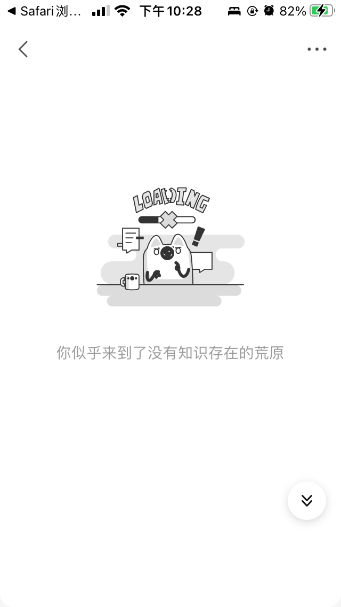
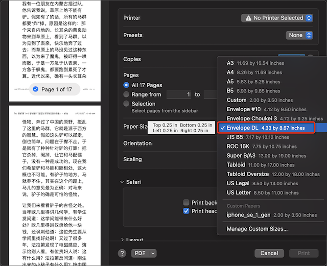

.. _save_web_page_as_pdf:

==============================
保存网页作为适合手机阅读的pdf
==============================

随着审查的日趋严格，很多内容平台的精彩文章往往在数小时或数分钟之后不翼而飞。这使得我们想要再次重温或欣赏时扼腕叹息...

最为常见的知乎页面 - ``你似乎来到了没有知识存在的荒原`` ，这句话多么嘲讽: 这是谁造成的知识的荒漠?

无奈的解决方法是，尽可能把看到的好文本地保存下来。

我试过不同的方法，例如:

- 通过 evernote 网页抓取插件保存到evernote中，只要是evernote付费用户，可以保存大量的的WEB页面
- 直接在浏览器中将页面保存为本地html文件(Safari有一个非常好的保存为 ``Web Archive``) ，需要时再使用浏览器观看

但是，上述方法也有一些不足:

- 需要使用专用软件: 例如evernote的收费服务，不适合我这样需要在macOS和Linux平台不断切换的折腾(我希望不被任何平台绑架)
- Safari的 ``Web Archive`` 会保存整个页面元素，也包含了不需要的广告等，而且该文件只能用Safari打开

其实，我早就找到一个比较通用的跨平台方法: 

- macOS支持打印WEB页面(也包含其他可打印文件)，在打印时可以选择保存为 ``pdf`` 文件，这样就可以将文件放到任何平台上(包括kindle)阅读

  - 如果使用苹果全家桶，则可以使用iBook管理pdf文件同步，可以在所有苹果设备上同步阅读
  - 如果使用Google全家桶，则可以使用Google Play Book管理pdf文件同步，这样也能在移动设备上阅读
  - Kindle对pdf也有一定支持

- 手机iOS系统 内置了 Share to Books 功能，其实就是生成 ``pdf`` 文件，自动同步到苹果的iBook软件中多平台同步管理

但是，我也遇到一个不太方便的地方: 生成的pdf文档适合大屏幕平板或者电脑阅读，默认是A4纸规格。而我平时使用的 :ref:`iphone_se1` 只有4英寸小屏幕，pdf字体在小屏幕下阅读实在太吃力了。

今天，偶然发现，其实有一个比较巧妙的方法可以解决，分享如下:

- Safari浏览器支持 ``Reader View`` 方式阅读WEB页面，也就是摈弃掉所有不需要WEB元素，生成一个非常干净的阅读页面，这个页面是可以直接打印保存为 ``pdf`` 文件的
- 在保存pdf时候，一定要选择合适的打印页面格式: 原来pdf打印是根据目标页面来排版的，实际上选择更适合手机屏幕的纸张格式就可以。经过尝试，我发现 macOS 内置的 ``Envelope DL 4.33 by 8.67 inches`` 就非常适合手机这种屏幕宽度有限的移动设备(应该也适合Kindle)

   选择Envelope DL纸张格式

- 保存的pdf文件可以使用 :ref:`macos` 操作系统中的 ``Books`` 软件打开，这样就会自动同步到iCloud，所有注册到当前icloud账号的设备会同步接收到这个文件，就可以在所有移动设备上阅读
- 如果在 iOS 平台的App Store中购买过 ``GoodReader`` pdf专业阅读软件，就可以在 ``Books`` 软件中 ``share`` 给 ``GoodReader`` 软件来阅读: ``GoodReader`` 提供了一个内置的 ``Crop`` 功能，可以把pdf文件所有页面都按照一定的规格进行 **裁边** ，这样就更适合手机阅读了

总之，只要使用电脑设备结合pdf保存和管理同步，就非常适合全设备平台阅读自己保存的文档。

.. note::

   我尝试过epub格式保存:  `Turning webpages into EPUBs on iOS using Scriptable, Shortcuts, and EpubPress <https://www.mozzafiller.com/posts/webpage-to-epub-ios>`_ 给出了一个将页面保存为通用的 ``epub`` 文档方式。也是一个非常巧妙的方案，但是我没有解决WEB页面图片嵌入的问题。

   此外，看起来所有将 ``pdf`` 转换为 ``epub`` 文件的方案似乎都是相同的转换引擎，类似 :ref:`pandoc` 。但是pdf转换epub虽然能阅读文字也包含了图片，可是pdf文件的换行在epub中非常难看。或许有更好的文字转换方式(我感觉pandoc应该有参数可以解决)，后续再做尝试。
