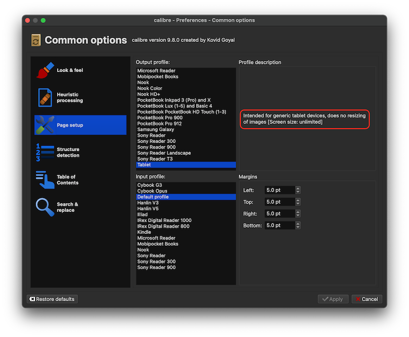
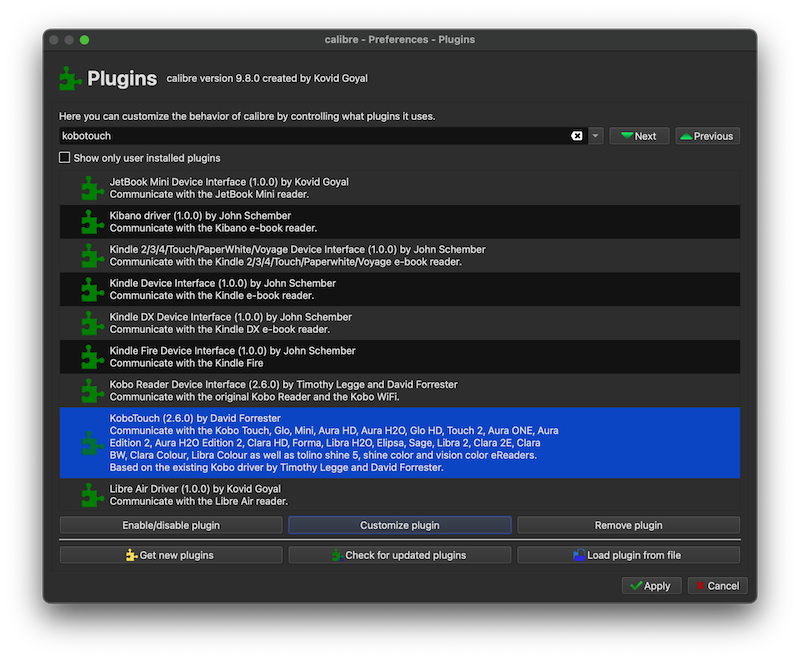
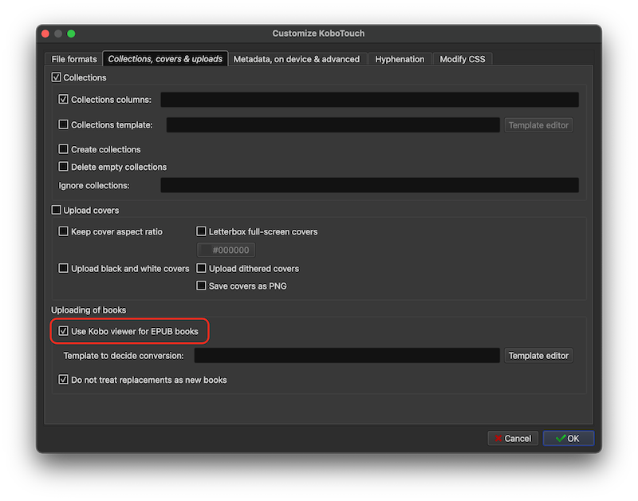

.. _calibre_kobo:

======================
针对Kobo优化Calibre
======================

由于我现在购买和使用 :ref:`kobo_libra_h2o` ，所以在使用Calibre管理图书时，需要相应做一些调整:

当首次安装使用Calibre时，在 Calibre 的欢迎向导（Welcome Wizard）中，会有一步是选择电子书设备，针对Kobo品牌，有两个选项 "Kobo Vox, Aura and Glo families" 和 "Kobo and Kobo Touch Readers" 。实际上选择哪个都可以，因为无论你选哪个，当设备通过 USB 连上 Mac 时，Calibre 都会使用同一个通用的 Kobo 驱动插件（KoboTouch 驱动）来识别它。

不过，建议选择 “Kobo and Kobo Touch Readers” (另一个是早期设备)

输出配置文件（Output Profile）
==============================

在欢迎向导里选择设备，Calibre 主要是为了帮你初始化“输出配置文件”（Output Profile）。这个文件决定了 Calibre 在转换电子书格式（比如将 mobi/azw3 转换为 epub）时， **图片会被强制裁剪、缩放到多大的分辨率。**

Kobo Libra H2O 分辨率是 ``1600x1264`` ，所以为了能够获得完美画质，建议在完成向导进入 Calibre 主界面后，做如下修改：

- 选择菜单 ``Preferences(首选项) => Common options(公共选项) => Page Setup (页面设置)``
- 在 ``Output profile`` 栏中，选择最后面的 ``Table(平板电脑)`` 

.. note::

   选择 Tablet 后，Calibre 在转换电子书时完全不会压缩和裁剪图片，会保持原汁原味的高清原图。这样传到 :ref:`kobo_libra_h2o` 上时，就能完美利用它那块 300 ppi 的高分辨率屏幕。

KEPUB
==========

Kobo 对原生 epub 格式支持较弱（翻页卡顿、不能看章节剩余时间、无法缩放图片）。现在最新版本的Calibre内置了一个 ``KoboTouch - Metaguide Driver`` 插件，这个插件会在连接Kobo设备时自动发送 ``kepub`` 格式。

为确保内置驱动实现KEPUB自动转换，请检查

- ``Preferences（首选项） => Advanced（高级） => Plugins（插件）`` 找到 ``KoboTouch`` 插件

- 点击 ``Customize plugin（自定义插件）``
- 在弹出的设置窗口中，切换到 ``Collections, covers & uploads（收藏夹、封面与上传）`` 标签页
- 找到并勾选 ``Use Kobo viewer for EPUB books`` （或者在某些汉化版本中显示为 ``为 EPUB 书籍使用 Kobo 阅读器/发送为 kepub`` ）

- 点击 OK 保存驱动设置，然后点击总菜单右上一角的 Apply（应用）。为了确保生效，建议重启一次 Calibre。

.. note::

   另外推荐安装 ``Kobo Utilities`` ，能帮你备份 Kobo 的设备数据库、同步阅读进度以及管理设备上的字体和样式，配合内置的 ``KoboTouch`` 使用体验最佳。

参考
=====

- gemini
