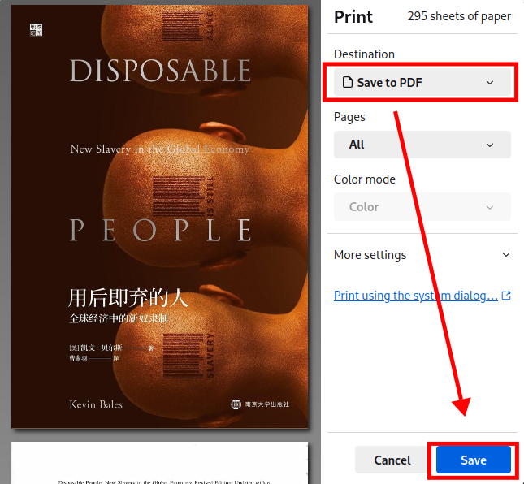

.. _embed_fonts_into_pdf:

========================
PDF嵌入字体
========================

在使用 :ref:`kobo_libra_h20` 阅读中文PDF时候，我发现中文页面是完全空白的。这表明PDF文档没有内嵌字体(以前在 :ref:`linux` 平台阅读中文PDF时常遇到)，解决的方法是修订PDF，将其引用的字体嵌入到PDF文件中。

.. warning::

   我最后放弃在 :ref:`kobo_libra_h20` 阅读PDF文档:

   - 7"屏幕还是太小了，即使对PDF文档切边以后，依然字体太小，看起来非常吃力
   - PDF内嵌文档转换非常缓慢，特别是一些PDF文档慢到令人发指，而且转换后PDF文档非常庞大，对于 Kobo 这样的电子阅读器负载太重

     - 原因是有些PDF文档内嵌了图片背景，转换时会对每个页面重复嵌入一张图片，导致转换后PDF文档急剧膨胀

方法一: 通过ghostscript实现
=============================

当PDF文档转换成PS文档，然后再转换回PDF时，所生成的PDF文件将内嵌所需字体:

.. literalinclude:: embed_fonts_into_pdf/pdf_ps
   :caption: 通过 PDF->PS->PDF 格式转换来将字体嵌入到PDF中

方法二: 通过PDF打印实现
=========================

在桌面系统中，当通过PDF打印时选择 ``save to pdf`` 功能，就会实现依次PDF打印到PDF文件的过程，且这个过程会嵌入所需字体(Windows平台也是如此):

- 我使用的是 :ref:`firefox` 来阅读PDF(包括网络下载PDF文档也是FireFox内部打开阅读)，此时使用Firefox的文档打印功能能:

   利用打印到PDF的功能将字体内嵌

参考
======

- `Fonts are not embedded into a pdf? <https://askubuntu.com/questions/50274/fonts-are-not-embedded-into-a-pdf>`_
