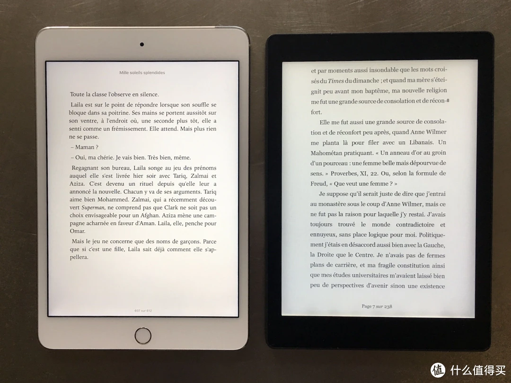

.. _kobo_aura_one:

======================
Kobo Aura ONE
======================

缘起
=====

在使用了多年以后，我的 Kindle PaperWhite 3 触摸屏失灵了，一直以来心心念念的 Kindle Oasis 实在太过昂贵，即使现在(2024年10月)Kindle已经停止中国区服务，并且也停产了Oasis系列，二手价格依然在1.5k~2k之间。

偶然看到有人在评论最新上市的 Kindle ColorSoft 时提到，市场上有更早推出彩色Eink阅读器的乐天Kobo，据说电子书仅次于Kindle，激起我的兴趣去了解这个品牌。在淘宝上搜索了一些相关产品，注意到 Kobo Aura ONE 似乎比较符合我的需求:

- 7.8"黑白Eink屏幕: 这是目前能够找到比较适合阅读 ``切边`` pdf的 ``7"`` 以上Eink屏幕
- 价格非常低廉: 大约RMB 600以内

Kobo Aura ONE 是Kobo于2016年9月6日发布的旗舰型号，当时售价229美元。

当然放到8年后的今天，其硬件已经是非常古老的。不过，好在电子书阅读器迭代非常缓慢，我们使用的目的就是简单好看书，所以硬件弱一些，影响有限。

.. note::

   我最终选择了 :ref:`kobo_libra_h20`

规格
=====

- Carta 7.8英寸 E Ink显示屏,分辨率1872x1404, 300PPI

  - 光线技术: Comfort Light PRO (支持冷暖光调节)

- 1GHz处理器，512MB RAM
- 8GB存储，不支持扩摘卡
- IPX8防水
- 支持802.11b/g/n Wi-Fi
- 230g重量,195.1 x 138.5 x 6.9 mm
- 支持文档格式: PDF, MOBI, EPUB, EPUB3, CBZ(漫画)

其他:

- 屏幕右上方有一个状态等，通过红色、蓝色、绿色显示主机状态
- 状态灯旁有一个光线感应器，能够根据环境光线自动调节亮度
- Micro USB 接口充电和传输

优点
=====

- 7.8" 墨水屏是便携电子阅读器中兼顾大屏和便携的尺寸，差不多接近iPad mini尺寸:

实际显示效果类似于国内的32开书，即《读库》《单读》等便携 MOOK 的开本。(将《读库》内文页扫描为 PDF 后传入 Aura ONE，显示出的文字大小基本是一致的)

缺点
=====

- 重量较大(230g)，比较起来Kindle Oasis 1代(130g)，握持感觉差一些
- 古早产品(2016年)，所以充电和数据端口是micro USB，对于现代主流的type C充电使用不方便

特点
=========

- :ref:`kobo_pocket` 稍后阅读功能，类似全功能Pocket客户端
- (待验证)现在新版firmware已经完美支持中文(目录)不再需要倒腾中文字体(替换日文字体)
- (待验证)现在支持pdf全屏
- :ref:`kobo_koreader`
- 显示效果和kindle相当(据说稍微差一点，待我后续对比验证)
- 「Natural Light」功能: 照明灯可以调整色温，从而模拟出微微泛黄的纸张色泽
- 有趣的特色功能: 长按页面边角可以高速翻页

参考
=====

- `Rakuten Kobo > User Guides > eReaders > Kobo Aura ONE <https://help.kobo.com/hc/en-us/articles/360019127213-Kobo-Aura-ONE>`_
- `电纸书并不只有 Kindle，还有另一种自由的选择：Kobo Aura ONE <https://sspai.com/post/44688>`_
- `如何评价Kobo Aura ONE? <https://www.zhihu.com/question/49740584>`_
- `KOBO aura one是否值得购买？简评 one <https://zhuanlan.zhihu.com/p/36578508>`_
