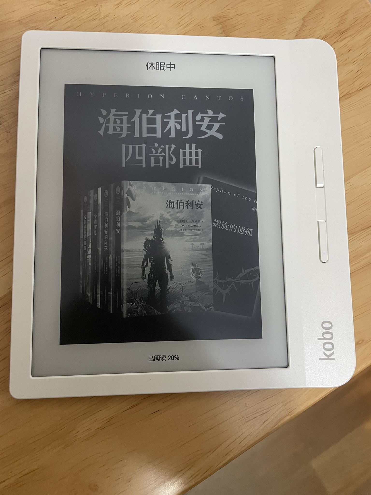

.. _kobo_libra_h20:

=========================
Kobo Libra H2O
=========================

.. note::

   选择  Kobo Libra H2O 是因为价格低廉，它的后一代产品 Libra 2 更好一些，但是二手价格要超过1k

Kobo Libra H2O上市时售价169.99美金，比Kobo Forma(8英寸)的280美金要便宜很多，采用了折衷大小的300ppi墨水屏。设计非常类似Kindle Oasis，相比较而言各有擅长。

我最后购买的是白色版本的 ``Kobo Libra H2O`` :

- 根据网上资料，这款 Kobo Libra H2O 屏幕清晰
- 外形接近Kindle Oasis，且重量控制在 192克，也就是和 Oasis 2相当: 我想体验类似Oasis这样的物理按键翻页

规格
=======

- 重量: 192克

   kobo 可以在休眠状态显示正在阅读图书的封面

特点
==========

- 屏幕没有采用镜面屏: 避免了多一层覆盖，所以Kobo Libra H2O 屏幕通透性更好，显示字体更清晰
- Kobo支持阅读界面左侧通过手指上下滑动调节亮度，比 :ref:`kindle` 方便
- 支持色温调节，并且可以根据时间自动调节

.. note::

   在使用 Calibre 电子书管理软件时，有一个选择电子书设备列表配置，有两种选项:

   - Kobo Vox, Aura and Glo Families: Kobo Libra H20 看起来是属于这类(参考 `Welcome to Calibre: What device family is the Kobo libra H2O? <https://www.reddit.com/r/kobo/comments/p51jpz/welcome_to_calibre_what_device_family_is_the_kobo/>`_ 信源是 `wikipedia: Kobo eReader <https://en.wikipedia.org/wiki/Kobo_eReader>`_ Kobo touch 是最早3代2011年产品，而Libra H20算是2019年出品比较新的)
   - Kobo and Kobo touch readers

使用体验
============

实际上手使用，我发现现在Kobo软件系统已经做得非常完善，并没有网上所说的早期系统需要hack才能正常使用中文阅读。实际上，我也没有坐任何折腾，开机即用，连接calibre之后，直接导入转换后的 ``epub`` 电子书，阅读体验极佳。

略微不足的是，我发现电子书还是越轻越好， ``192克`` 虽然看上去还不如一个手机重，但是阅读书籍比手机要更长久的举持，哪怕重一点点也是负担。所以，我现在感觉，或许类似 ``Kindle Oasis 一代`` 这样极端的轻薄是可能更好的选择(如果每天阅读量不是超长，能够接受反复充电的话)。

不过，重点是阅读，电子书只是一个载体。所以，anyway，先尽量多阅读才是王道。

参考
=======

- `Kobo Libra H2O Review <https://www.pcmag.com/reviews/kobo-libra-h2o>`_
- `Kobo Libra H20 可能是功能最齐全的电子书阅读器 <https://zhuanlan.zhihu.com/p/151072253>`_
- `Kobo Libra H2O 使用体验和设置指南 <https://sspai.com/post/78528#!#>`_
- `【实测】Kobo Libra H2O－旗舰机 Forma 的 7 吋缩小版，中间定位两面讨好 <https://www.kotoo.com/k56133>`_
- `KOBO Libra H2O電子閱讀器開箱及使用心得｜12個你必買的原因 <https://notonlyblogger.com/kobo-libra-h2o-ereader-review/>`_
  - `Kobo Libra 2阅读器细致评测！ <https://www.bilibili.com/video/BV15V4y1g7mq/?vd_source=9e81a12fc8eb4223ba7650a40a5ce9a7>`_ 非常细致的电子阅读器评测视频，也解疑了屏幕显示的效果差异原因(不过Libra 2是Libra H2O的下一代产品，只能作为对比参考)
