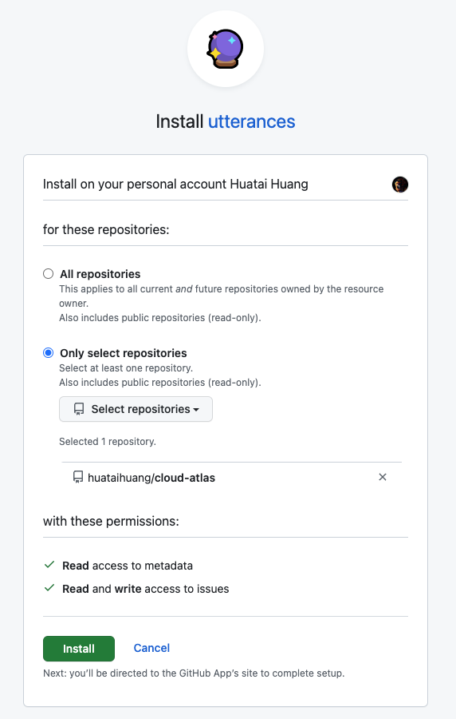

.. _sphinx_comments:

======================
Sphinx文档评论系统
======================

我在折腾 :ref:`cn_samsung_galaxy_watch_4_wich_android` ，意外发现 `非国行的Android不能使用国行的Watch4？不指望三星，自力更生完美解决 <https://blog.xuegaogg.com/posts/1931/>`_ 博主 `雪糕博客 <https://blog.xuegaogg.com/>`_ 使用了 `utterances <https://utteranc.es/>`_ 作为 :ref:`hugo` 的评论系统，非常巧妙和灵活:

- 依靠稳定的 GitHub issues 作为数据存储，背靠大树好乘凉: GitHub可靠性和稳定性肯定比自建博客评论系统要稳定多了
- 虽然GitHub已经被墙，但是作为纯技术博客来说，受众基本上都是能够翻墙自己折腾的同行
- 如果用户看不到评论(例如墙内没有架梯子)，那么通过简单的提示也可以让用户知道为何看不到

安装 Utterances
===================

- 在GitHub上需要安装 ``utterances GitHub App`` ，也就是 ``A lightweight comments widget built on GitHub issues`` ，访问 `utterances GitHub App <https://github.com/apps/utterances>`_ 页面，点击 ``Installation`` 按钮； 或者在 `GitHub Marketplace / Apps / utterances <https://github.com/marketplace/utterances>`_ 中也可以找到安装入口

  - 选择GitHub账号，然后 ``下一步``

  - 选择需要安装 ``utterances`` 的仓库，例如，这里是我的仓库 ``huataihuang/cloud-atlas`` :

   安装 ``utterances`` 时选择指定仓库

- 安装完成后，在自己的 `GitHub Settings >> Installations <https://github.com/settings/installations>`_ 会看到刚才安装的应用 ``utterances`` 应用，并且提供了 ``Configure`` 配置按钮来调整刚才的完成的配置

.. note::

   一切就绪(已经完成GitHub端配置)，现在就是如何在Sphinx文档中嵌入和引用 ``Utterances`` 来实现直接在GitHub中提交issues(讨论)

评论模版(template)
======================

我是在阅读 `基于 utterance 插件为博客部署评论系统（适用于 Sphinx 文档） <https://iswbm.com/678.html>`_ 受到启发的，原文采用直接修改 ``sphinx_rtd_theme`` layout.html 来引用自定义的 ``comments.html`` 。我想到之前自己采用 :ref:`sphinx_footer` 扩展默认 ``layout`` 不就是能够采用这种方法么。

.. note::

   本段在 :ref:`sphinx_footer` 基础上完成(已经完成默认 layout 扩展，增加了页面的自定义footer)

- (已在 :ref:`sphinx_footer` 完成)修订文档项目的 ``conf.py`` 指定模版目录:

- 修订 :ref:`sphinx_footer` 中 ``foot.html`` ，增加以下内容:

.. literalinclude:: ../../../_templates/footer.html
   :language: html
   :emphasize-lines: 9-11

- 然后在 ``_templete/comments.html`` 引用 `utterances <https://utteranc.es/>`_ 的 ``clients.js`` :

.. literalinclude:: ../../../_templates/comments.html
   :language: html

-

``sphinx-comments`` 插件(归档参考)
=====================================

`Sphinx Comments <https://sphinx-comments.readthedocs.io/en/latest/index.html>`_ 开源Comments系统完美结合了 `utterances <https://utteranc.es/>`_ 和 :ref:`sphinx_doc` ，正是我所需期待的文档评论功能的利器。

.. note::

   实际上我最后没有采用这里介绍的 `Sphinx Comments <https://sphinx-comments.readthedocs.io/en/latest/index.html>`_ 插件，原因是我之前已经采用了 :ref:`sphinx_footer` ，和 ``sphinx-comments`` 插件貌似冲突。所以我实际采用了上文直接修订 :ref:`sphinx_footer` 嵌入一段 `utterances <https://utteranc.es/>`_ ``client.js`` 来实现。原理其实和 ``sphinx-comments`` 类似

安装和配置 ``sphinx-comments``
---------------------------------

- 使用 :ref:`pip` 完成 ``sphinx-comments`` 安装(安装前可以先 :ref:`upgrade_all_python_packages_with_pip` ):

.. literalinclude:: sphinx_comments/install
   :caption: :ref:`pip` 安装 ``sphinx-comments``

- 然后修改 ``conf.py`` :

.. literalinclude:: sphinx_comments/activate_sphinx-comments
   :caption: 在 :ref:`sphinx_doc` 配置中激活 ``sphinx-comments``

- 然后开始 ``make html`` 编译输出文档

参考
======

- `utterances <https://utteranc.es/>`_
- `基于 utterance 插件为博客部署评论系统（适用于 Sphinx 文档） <https://iswbm.com/678.html>`_
- `Sphinx Comments <https://sphinx-comments.readthedocs.io/en/latest/index.html>`_
