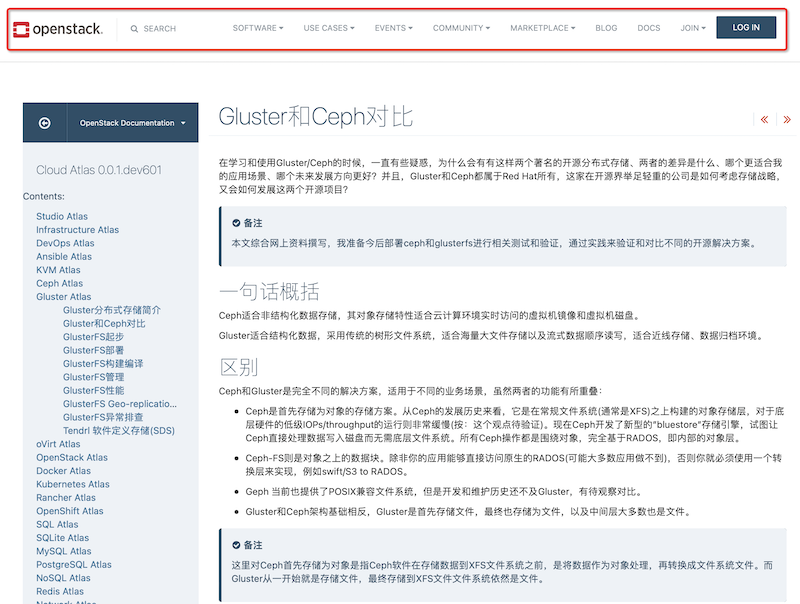

.. _sphinx_openstackdocstheme:

=================================
Sphinx使用OpenStackDosTheme风格
=================================

我在 :ref:`think_write_doc` 时，非常想采用OpenStack Documentations的文档风格。也是偶然发现， `OpenStack Sphinx themes <https://docs.openstack.org/openstackdocstheme/latest/>`_ 就是关键，通过简单配置，我尝试了将自己网站转换风格。

.. note::

   `Sphinx Themes Gallery <https://sphinx-themes.org/>`_ 提供了常用的Sphinx Themes展示和说明，可以参考配置风格。一些themes和Markdown网站的用例相似，例如 `Conestack theme <https://sphinx-themes.org/sample-sites/sphinx-conestack-theme/>`_

安装和简单使用
================

- 同样类似 :ref:`write_doc` 方法，在 :ref:`virtualenv` 中安装pip模块:

.. literalinclude:: sphinx_openstackdocstheme/install
   :caption: 安装 ``openstackdocstheme`` 风格

- 修订项目文档 ``conf.py`` :

.. literalinclude:: sphinx_openstackdocstheme/conf.py
   :caption: 修订 ``conf.py`` 启用 ``openstackdocstheme``
   :language: python

- 构建文档::

   make html

.. note::

   实际 ``conf.py`` 中还需要配置一些选项，包括仓库名等，主要是适配OpenStack项目，所以很多配置都关联了OpenStack项目

.. note::

   :ref:`starlingx` 是结合了 :ref:`openstack` 和 :ref:`kubernetes` 的边缘云计算项目，这个项目是从 OpenStack衍生出来的轻量级云计算项目。 ``StarlingX`` 也采用了 ``openstackdocstheme`` 风格，其文档结构可以参考学习。

使用体验
=============

`OpenStack Sphinx themes <https://docs.openstack.org/openstackdocstheme/latest/>`_ 确实有一种比较独特都美感，采用了非常纤细的字体以及淡雅的配色，而文档代码又采用冲击力较强的深色模式，非常适合代码相关文档。

限制和不足(待修改):

- 生成文档包含了很多已经固化OpenStack文档网站的导航、页脚、版权等信息，冲掉了之前定制的页脚信息
- 由于OpenStack网站采用了多文档模式，所以左方目录导航结构包含了一些OpenStack文档的索引结构(例如语言选择、OpenStack固有的文档索引)

总之，不是开箱即用，有些绑定比较固化。

思考
=====

我觉得可能比较好的方式是结合 ``sphinx_rtd_theme`` 和 ``openstackdocstheme`` :

- 总体结构采用 ``sphinx_rtd_theme``
- 字体和一些 ``note`` 采用 ``openstackdocstheme``
- 两者结合，取长补短

后续我在学习 :ref:`javascript` 时会尝试改进

参考
======

- `OpenStack Sphinx themes <https://docs.openstack.org/openstackdocstheme/latest/>`_
