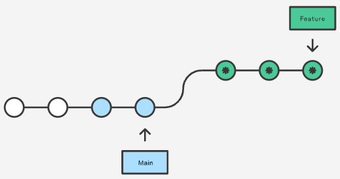

.. _git_merge_rebase:

=========================
git merge 和 git rebase
=========================

.. note::

   我没有深入学习和实践，仅仅是作为参考和方便后续开发学习，请参考学习原文 `【Git】：git rebase和git merge有什么区别？ <https://joyohub.com/2020/04/06/git-rebase/>`_

简单地说
==========

- 融合代码到公共分支的时使用 ``git merge`` ,而不用 ``git rebase`` ::

   git checkout master
   git pull origin master
   git merge feature
   git push origin master

- 融合代码到个人分支的时候使用 ``git rebase`` ，可以不污染分支的提交记录，形成简洁的线性提交历史记录::

   git checkout feature
   git rebase master

参考
======

- `【Git】：git rebase和git merge有什么区别？ <https://joyohub.com/2020/04/06/git-rebase/>`_ 这篇中文blog应该是基于 `Merging vs. Rebasing <https://www.atlassian.com/git/tutorials/merging-vs-rebasing>`_ 翻译的
- `How do I safely merge a Git branch into master? <https://stackoverflow.com/questions/5601931/how-do-i-safely-merge-a-git-branch-into-master>`_
