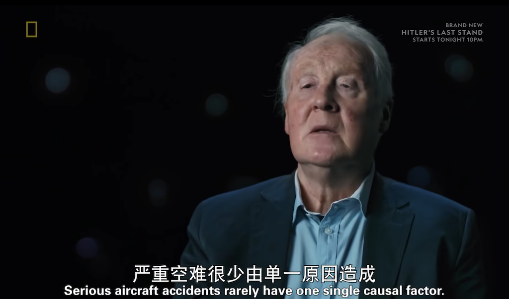

.. _think_mayday:

=======================
「空中浩劫」的思考
=======================

``「Serious aircraft accidents rarely have one single causal factor.」/ 「严重空难很少由单一原因造成」``
=========================================================================================================

我很喜欢看「空中浩劫」系列，因为我发现航空业作为目前公认的最安全交通工具，实际上是由非常严谨的设计、制造、维护、事故分析、业内公开透明交流和 :strike:`强制` 标准化操作来实现的。这对于我们计算机行业的开发、运维，其实由非常深刻的借鉴意义。
