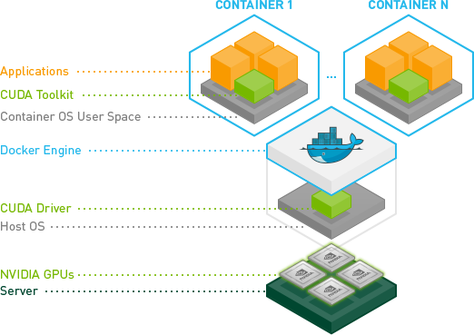

.. _nvidia-docker:

==========================
Docker运行NVIDIA容器
==========================

在机器学习中，需要通过GPU加速矩阵计算来实现卷积神经网络CNN。在云计算环境中， :ref:`gpu_passthrough_with_kvm` 可以将一块物理GPU显卡分割成多块虚拟GPU卡提供给虚拟机使用。同样类似，在Docker容器中，nVidia通过 ``nvidia-container-runtime-hook`` 将Host主机的GPU驱动共享给容器，这样就不需要在每个容器中单独安装驱动。

.. note::

   本文的实践是在MacBook Pro 2013 later笔记本上完成，显卡 ``GeForce GT 750M Mac Edition`` ::

      lspci | grep VGA

   显示显卡版本::

      01:00.0 VGA compatible controller: NVIDIA Corporation GK107M [GeForce GT 750M Mac Edition] (rev a1)

   Nvidia官方网站提供了 `CUDA Drivers for MAC <https://www.nvidia.com/object/mac-driver-archive.html>`_ 可以在Mac平台支持CUDA开发。

   在 `nvidia GEFORCE 驱动下载 <https://www.geforce.com/drivers>`_ 可以获取最新的Linux驱动。

.. warning::

   2023年8月以后， ``nvidia-docker`` 已经停止开发，按照 `Build and run Docker containers leveraging NVIDIA GPUs <https://github.com/NVIDIA/nvidia-docker>`_ 官方文档指引，现在解决方法是采用 ``NVIDIA Container Tookit`` 。(前半部分 ``cuda-driver`` 还是要安装的)

   请参考 :ref:`nvidia_p4_pi_docker` 实践，安装部署 ``NVIDIA Container Tookit`` 来实现容器中使用NVIDIA GPU

安装NVIDIA图形卡的CUDA
=========================

通过NVIDIA软件仓库安装CUDA
~~~~~~~~~~~~~~~~~~~~~~~~~~~~~

.. note::

   参考 `NVIDIA CUDA Installation Guide for Linux <https://docs.nvidia.com/cuda/cuda-installation-guide-linux/>`_ 请确保系统:

   - 根据 http://developer.nvidia.com/cuda-gpus 验证自己的显卡是否支持CUDA
   - 确保已经安装了gcc
   - 已经安装了当前内核头文件和开发包::

      sudo apt-get install linux-headers-$(uname -r)

参考 `NVIDIA graphical card installation guide <https://docs.nvidia.com/cuda/cuda-quick-start-guide/index.html#linux>`_ 安装最新的CUDA版本。注意，在Ubuntu上安装NVIDIA的CUDA有两种方式，一种是Runfile安装，一种是Debian安装。Runfile安装只提供本地安装，需要下载很大的初始安装文件。而Debian安装既可以本地安装也可以通过网络安装，并且网路安装可以只下载你需要的文件。这里案例采用Debian Installer的Network方式::

   sudo dpkg --install cuda-repo-<distro>-<version>.<architecture>.deb
   sudo apt-key adv --fetch-keys https://developer.download.nvidia.com/compute/cuda/repos/<distro>/<architecture>/7fa2af80.pub
   sudo apt-get update
   sudo apt-get install cuda

.. note::

   这里 ``<distro>-<version>.<architecture>`` 请使用 ``lsb_release -a`` 命令检查，并从 https://developer.download.nvidia.com/compute/cuda/repos/ 对应下载对应的repo包，例如，我使用Ubuntu 18.10，则下载 `cuda-repo-ubuntu1810_10.1.105-1_amd64.deb <https://developer.download.nvidia.cn/compute/cuda/repos/ubuntu1810/x86_64/cuda-repo-ubuntu1810_10.1.105-1_amd64.deb>`_ ，所以实际执行的命令是::

      wget https://developer.download.nvidia.cn/compute/cuda/repos/ubuntu1810/x86_64/cuda-repo-ubuntu1810_10.1.105-1_amd64.deb
      sudo apt-key adv --fetch-keys http://developer.download.nvidia.com/compute/cuda/repos/ubuntu1810/x86_64/7fa2af80.pub
      sudo dpkg --install cuda-repo-ubuntu1810_10.1.105-1_amd64.deb
      sudo apt-get update
      sudo apt-get install cuda

.. note::

   由于安装了NVIDIA的软件仓库，实际安装CUDA时候会将图形卡驱动更新到官方最新版本，比Ubuntu发行版提供的驱动要新很多。

更新环境变量
~~~~~~~~~~~~~~~~~~~~~~~~~~~~~

- 编辑 `~/.bashrc` 添加::

   # CUDA
   export PATH="/usr/local/cuda/bin:$PATH"
   export LD_LIBRARY_PATH="/usr/local/cuda/lib64:$LD_LIBRARY_PATH"

.. note::

   ``/usr/local/cuda`` 是软链接到 ``/usr/local/cuda-10.1`` ，当前安装的CUDA版本是 10.1

- 并且重新加载环境变量::

   source ~/.bashrc

NVIDIA持久化服务
~~~~~~~~~~~~~~~~~~~~~~~~~~~~~

在NVIDIA软件启动之前，需要先启动NVIDIA持久化服务 NVIDIA Persistence Daemon，这个持久化服务是为了保持CPU初始化状态，即使没有客户端连接上来，并且会将服务状态保持在CUDA任务处理上。这个步骤是必须的。

.. note::

   在Ubuntu 18.10上测试安装NVIDIA提供的CUDA包，可以看到安装包已经创建了 ``/lib/systemd/system/nvidia-persistenced.service`` 配置文件，所以这步虽然是必须的，但也可能可以默认忽略。

- 创建 ``/lib/systemd/system/nvidia-persistenced.service`` (根据发行版规则，这个文件也可能是 ``/usr/lib/systemd/system/nvidia-persistenced.service`` )内容如下::

   [Unit]
   Description=NVIDIA Persistence Daemon
   Wants=syslog.target

   [Service]
   Type=forking
   PIDFile=/var/run/nvidia-persistenced/nvidia-persistenced.pid
   Restart=always
   ExecStart=/usr/bin/nvidia-persistenced --verbose
   ExecStopPost=/bin/rm -rf /var/run/nvidia-persistenced

   [Install]
   WantedBy=multi-user.target

- 然后激活服务::

   sudo systemctl enable nvidia-persistenced

禁用一些UDEV规则
~~~~~~~~~~~~~~~~~~~~~~~~~~~~~

``udev`` 规则（物理设备和系统之间的接口）会妨碍NVIDIA驱动正常工作，所以需要编辑 ``/lib/udev/rules.d/40-vm-hotadd.rules`` 文件，并注释掉 ``memory`` 子系统规则::

   # Memory hotadd request
   # SUBSYSTEM=="memory", ACTION=="add", DEVPATH=="/devices/system/memory/memory[0-9]*", TEST=="state", ATTR{state}="online"

验证CUDA安装
~~~~~~~~~~~~~~~~~~~~~~~~~~~~~

重启主机，然后测试CUDA是否安装正确。这个验证还是通过以下案例的编译来验证的::

   cuda-install-samples-10.1.sh ~
   cd ~/NVIDIA_CUDA-10.1_Samples
   make

然后以下文件的输出::

   # take a book, go for a walk, or any other activity that takes time...

   ./bin/x86_64/linux/release/deviceQuery | tail -n 1

如果输出内容 ``Result = PASS`` 则表明CUDA安装成功。

安装NVIDIA Docker
=====================

安装 ``nvidia-docker`` 仓库
~~~~~~~~~~~~~~~~~~~~~~~~~~~~~

- 执行以下命令安装 ``nvidia-docker`` 仓库配置::

   curl -s -L https://nvidia.github.io/nvidia-docker/gpgkey | \
     sudo apt-key add -
   distribution=$(. /etc/os-release;echo $ID$VERSION_ID)
   curl -s -L https://nvidia.github.io/nvidia-docker/$distribution/nvidia-docker.list | \
   sudo tee /etc/apt/sources.list.d/nvidia-docker.list
   sudo apt-get update

.. note::

   `nvidia-docker Repostory configuration <https://nvidia.github.io/nvidia-docker/>`_ 提供了针对不同发行版的软件仓库，但是 ``nvidia-docker`` 只提供Ubuntu LTS发行版支持，所以不直接支持Ubuntu 18.10。参考 `Ubuntu 18.10 is definitely missing <https://github.com/NVIDIA/nvidia-docker/issues/909>`_ 和 `ubuntu:18.10 support <https://github.com/NVIDIA/nvidia-docker/issues/908>`_ 采用 ``nvidia-docker version for ubuntu 18.04`` ::

      curl -s -L https://nvidia.github.io/nvidia-docker/ubuntu18.04/nvidia-docker.list | \
        sudo tee /etc/apt/sources.list.d/nvidia-docker.list

.. _install_docker-ce:

安装 ``docker-ce``
~~~~~~~~~~~~~~~~~~~

在安装 ``nvidia-docker2`` 工具之前，需要确保系统使用的是最新官方Docker版本，即 ``docker-ce`` ，参考 `official documentation <https://docs.docker.com/install/linux/docker-ce/ubuntu/>`_ 先卸载发行版docker，然后安装官方docker::

   # remove all previous Docker versions
   sudo apt remove docker docker-engine docker.io

   # add Docker official GPG key
   curl -fsSL https://download.docker.com/linux/ubuntu/gpg | sudo apt-key add -

   # Add Docker repository (for Ubuntu Bionic) 注意：nvidia-docker会检查docker-ce版本，强制要求 ubuntu-bionic
   # 所以这里必须采用 bionic 仓库安装 docker-ce
   sudo add-apt-repository \
       "deb [arch=amd64] https://download.docker.com/linux/ubuntu bionic stable"

   sudo apt update
   sudo apt install docker-ce

安装 ``nvidia-docker``
~~~~~~~~~~~~~~~~~~~~~~~~

- 安装 ``nvidia-docker`` 并重新加载Docker daemon配置::

   # Install nvidia-docker2 and reload the Docker daemon configuration
   sudo apt-get install -y nvidia-docker2
   sudo pkill -SIGHUP dockerd

验证NVIDIA容器的GPU
======================

验证容器中的nvidia GPU
~~~~~~~~~~~~~~~~~~~~~~~~~~~

- 使用名为 ``nvidia-smi`` 的Docker镜像来验证，这个镜像允许NVidia工具监控和管理GPU::

   docker run --runtime=nvidia --rm nvidia/cuda nvidia-smi

完成后会提示信息显示GPU信息::

   +-----------------------------------------------------------------------------+
   | NVIDIA-SMI 418.40.04    Driver Version: 418.40.04    CUDA Version: 10.1     |
   |-------------------------------+----------------------+----------------------+
   | GPU  Name        Persistence-M| Bus-Id        Disp.A | Volatile Uncorr. ECC |
   | Fan  Temp  Perf  Pwr:Usage/Cap|         Memory-Usage | GPU-Util  Compute M. |
   |===============================+======================+======================|
   |   0  GeForce GT 750M     Off  | 00000000:01:00.0 N/A |                  N/A |
   | N/A   64C    P0    N/A /  N/A |      1MiB /  1999MiB |     N/A      Default |
   +-------------------------------+----------------------+----------------------+
   
   +-----------------------------------------------------------------------------+
   | Processes:                                                       GPU Memory |
   |  GPU       PID   Type   Process name                             Usage      |
   |=============================================================================|
   |    0                    Not Supported                                       |
   +-----------------------------------------------------------------------------+

.. note::

   从NVIDIA下载的官方镜像 ``nvidia/cuda`` 提供了完整的CUDA支持，并且具备了类似 ``nvidia-smi`` 这样的监控工具。后续可以使用这个镜像来启动创建容器，并安装TensorFlow（由于硬件限制需要自己编译TensorFlow)。

.. _compare_gpu_cpu_in_tensorflow:

对比GPU和CPU运行TensorFlow案例
~~~~~~~~~~~~~~~~~~~~~~~~~~~~~~~~~~

既然已经完成了 ``nvidia-docker`` 的部署，我们可以通过运行TensorFlow的案例来比较使用GPU加速和使用CPU的运算效率。这段benchmark脚本是 `learningtensorflow.com <https://learningtensorflow.com/lesson10/>`_ 提供的，请将以下这段脚本保存为 ``benchmark.py`` ::

   import sys
   import numpy as np
   import tensorflow as tf
   from datetime import datetime
   
   device_name = sys.argv[1]  # Choose device from cmd line. Options: gpu or cpu
   shape = (int(sys.argv[2]), int(sys.argv[2]))
   if device_name == "gpu":
       device_name = "/gpu:0"
   else:
       device_name = "/cpu:0"
   
   with tf.device(device_name):
       random_matrix = tf.random_uniform(shape=shape, minval=0, maxval=1)
       dot_operation = tf.matmul(random_matrix, tf.transpose(random_matrix))
       sum_operation = tf.reduce_sum(dot_operation)
   
   startTime = datetime.now()
   with tf.Session(config=tf.ConfigProto(log_device_placement=True)) as session:
           result = session.run(sum_operation)
           print(result)
   
   # It can be hard to see the results on the terminal with lots of output -- add some newlines to improve readability.
   print("\n" * 5)
   print("Shape:", shape, "Device:", device_name)
   print("Time taken:", str(datetime.now() - startTime))

以上脚本有2个参数， ``cpu`` 或 ``gpu`` 以及矩阵大小。以下容器命令采用了 ``tensorflow/tensorflow:latest-gpu`` 的Docker镜像::

   docker run \
    --runtime=nvidia \
    --rm \
    -ti \
    -v "${PWD}:/app" \
    tensorflow/tensorflow:latest-gpu \
    python /app/benchmark.py cpu 10000

然后，我们再将上述docker命令的 ``cpu`` 参数替换成 ``gpu`` 对比。

.. note::

   在Docker中运行Tensorflow参考 `TensorFlow 官方Docker文档 <https://www.tensorflow.org/install/docker>`_

.. warning::

   TensorFlow发行版本对CUDA要求3.5，即对GPU硬件有要求，当前MacBook Pro 2015 later使用的NVIDIA GeForce GT 750M仅支持CUDA 3.0。所以上述测试会出现报错，解决方法是 :ref:`build_tensorflow`

升级Nvidia驱动
=================

.. note::

   这个问题我还没有实践，待续

参考
=======

- `Using NVIDIA GPU within Docker Containers <https://marmelab.com/blog/2018/03/21/using-nvidia-gpu-within-docker-container.html>`_
- `Enabling GPUs in the Container Runtime Ecosystem <https://devblogs.nvidia.com/gpu-containers-runtime/>`_
- `Build and run Docker containers leveraging NVIDIA GPUs <https://github.com/NVIDIA/nvidia-docker>`_
