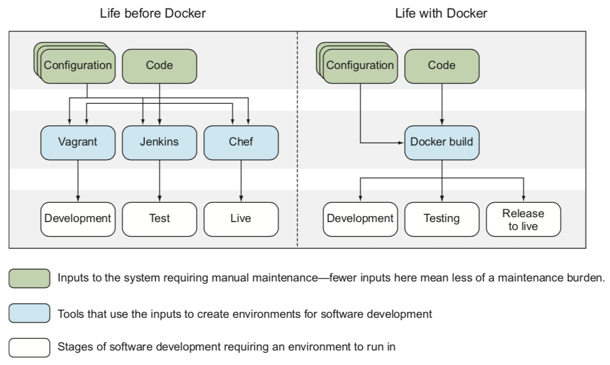
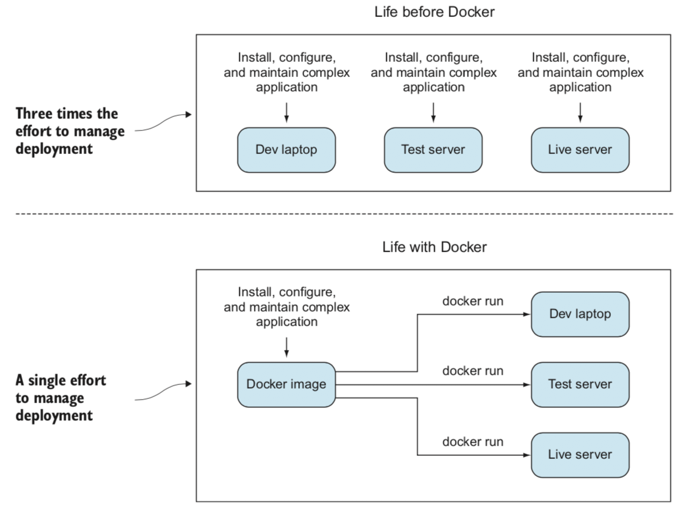

.. _introduce_docker:

=======================
Docker简介
=======================

Docker和容器
=======================

2013年Docker技术横空出世，为整个开发运维体系带来了全新的解决方案。然而，作为Docker的核心技术--容器并不是新概念：

* UNIX 系统一直以 chroot 命令来提供简单的文件系统隔离
* 自 1998 年起，FreeBSD 有了 jail 命令，它把 chroot 的沙盒机制扩展至进程
* 2001年，Solaris Zones 提供了一个相对完整的容器化技术，但它只能用于 Solaris 操作系统
* 2001 年，Parallels 公司（当时称为 SWsoft）推出用于 Linux 的商业容器技术，名为 Virtuozzo，并于 2005 年把核心技术开源，称其为 OpenVZ（很久以前，我也曾将尝试过OpenVZ - 需要对内核进行补丁，所以使用受到了限制）
* 谷歌开始为 Linux 内核开发 CGroups 机制，并开始将它的基础设施容器化
* 2008 年，Linux 容器（Linux Containers，LXC）项目启动，它把 CGroups、内核命名空间以及 chroot 等技术融合，提供了一套完整的容器方案
* Docker 于 2013 年补充了当时容器化技术的不足，将容器技术带入主流

Docker 利用现有的 Linux 容器技术，以不同方式将其封装及扩展——主要是通过提供可移植的镜像，以及一个用户友好的接口——来创建一套完整的容器创建及发布方案。

对实施快速迭代开发模式的开发者来说，Docker 容器能迅速启动至关重要，因为他们可以很快看到代码变更后的结果。容器能保障的可移植性及隔离特性，使得开发与运维部门之间更容易协作，因为开发者知道他们的代码在不同环境下都能工作，而运维部门只需专注于容器的托管及服务编排，而无需担心任何关于代码的事。

Docker带来的DevOps改变
=======================

在Docker技术诞生前，DevOps已经存在10年之久（ `A Short History Lesson in DevOps — And Where It’s Going <https://www.bluematador.com/blog/short-history-lesson-devops-where-its-going/>`_ ）。然而，整个开发、部署、持续交付的流程结合了不同的软件和技术，诸如 虚拟机、配置管理工具、软件编译系统、软件包管理系统以及复杂的库依赖。这些工具的组合令人眼花缭乱，需要特定的工程师来维护，并且缺乏统一的解决方案。

`Docker in Practice <https://www.amazon.cn/dp/B079GQV832>`_ 的示意图非常形象：

可以看到，虚拟机(vagrant)、自动编译、测试、部署系统(jenkins)和配置管理系统（chef）被融合到Docker系统中，成为一个整体，通过Docker build来实现软件持续交付的完整流程。

传统的DevOps使用了配置管理工具，需要管理不同配置资源的开发、测试、线上环境，以及管理大量VM的生命周期（启动、运行、停止、销毁），并仔细调度VM使用的资源。虚拟机不可避免带来虚拟化开销，浪费了很多物理主机的资源，也缺乏快速创建和销毁的灵活性。

使用Docker之后，配置管理被分解成资源管理：执行 ``docker run`` 下载环境的镜像并运行。由于容器不需要像虚拟机那样模拟完整x86硬件，所以消耗host硬件资源大为减少，启动和销毁速度更快。容器镜像中包含了所有运行应用的组件，包括OS、软件、配置，把复杂性封装在容器中，只要在最初构建镜像时完成了一次复杂工作，就可以在后续部署时非常简洁地运行。

.. note::

   可以把传统的DevOps理解成每次在线上部署时都按照基线（或者说标准配置）完整执行一次配置管理，也就是说有一万台主机，就需要执行一万次（并发）配置管理。虽然在Puppet、Chef等配置管理平台帮助下，配置管理可以做到完全自动化并且支持海量部署运维，但是依然无法避免消耗大量的时间和计算资源来完成每次海量部署。

   Docker部署的区别是，所有的配置管理都在开发环境完成，打包成一个image。只需要将image分发到线上启动运行，不需要再对线上系统进行配置管理。

   用建筑行业做一个比喻：传统的DevOps就是把标准图纸分发到所有工地，每个工地按照标准图纸现场搭建桥梁，一万个工地就需要现场实施一万次。Docker则是在中央工厂内完成桥梁的预制，把已经完工的桥梁运送到工地，直接树立起来使用。

实际上传统的虚拟机也可以实现集中在中心完成所有软件和配置的打包，然后通过分发镜像来实现类似的无需现场配置管理的自动部署。但是虚拟化技术的限制在于，数百G的镜像如果修改一个bit都需要重新下载和部署是难以实现的。

Docker最重要的突破是使用了镜像分层，相当于模块重用：相同的镜像层不需要重复制作和分发（主机只需要下载一次公用镜像层），在共同的镜像层之上，使用不同的镜像层来定制不同的镜像。这一技术飞跃加速了Docker镜像的部署和更新，也使得Docker超越了传统的虚拟机部署，更适合上述集中完成镜像更新，通过镜像分发来实现持续部署持续交付。

Docker带来的改变和冲击是巨大的：软件开发和运维工程师被融合到一起来使用相同的语言Docker，使用共同的管道输出可以用于任何目标的单一产物Docker容器。不再需要维护不同的工具组合，只需要将软件打包到一个Docker容器就可以运行。

.. note::

   实际上用Docker来完成整个持续交付依然是一个巨大的挑战，我也在摸索实践过程，在这里将不断更新。

微服务
=======================

微服务是容器最主要的用例，也是容器技术兴起的最大推动力。

微服务是一种软件系统开发和构成形式，由小而独立的组件组成，这些组件通过网络互相连接沟通。这与传统的`单一架构`（`monolith`）软件开发模式相反，后者只有一个庞大的程序，一般由 C++ 或 Java 实现。

微服务则设计成 ``横向扩展`` （ ``scale out`` ），为了满足增长的需求，只需部署多台机器摊分负载即可。微服务架构还可以针对系统中的瓶颈，只扩展某个特定服务所需的资源。

容器具有的轻量级和速度的优势，使得其非常适合微服务架构。

.. note::

   以上特征可以看到微服务是适合部署无状态服务的一种架构

   系统复杂度而言，微服务是把双刃剑 -- 每个单独的微服务都应该易于理解和修改，但是，在一个拥有几百个甚至成千上万这类服务的系统中，组件之间的交互会导致整体的复杂度增加。

容器和虚拟机的差异
=======================

- 虚拟机

  虚拟机提供了虚拟机管理程序hypervisor用于创建和运行虚拟机，控制访问底层操作系统和硬件的全县，以及在必要时解析系统调用接口。每个虚拟机需要一个完整的操作系统来运行应用程序以及程序库。

- 容器

  容器是底层操作系统中的一个进程，所以容器只能运行和主机相同的内核。

初次接触Docker的时候，很多人会习惯性将Docker理解成虚拟机，甚至在使用中也尽量把Docker容器改造成类似KVM/XEN这样的全功能虚拟机。这种误解实际上是 ``扬短避长`` ，就好比用千里马来运货一样浪费了资源。

Docker的优势和不足
=====================

.. warning::

   ``没有银弹`` -- 这是软件工程的真理

Docker擅长的场景（优点）
--------------------------

* 代替和 **host主机相同内核** 下运行的虚拟机

如果不依赖Guest操作系统的特定内核功能，而仅仅是运行应用程序，你很可能不需要完整的虚拟机操作系统，此时采用轻量级的Docker来替代VM可以节约虚拟机的资源消耗，不仅起停更快而且非常容易将整个应用程序运行环境迁移。由于容器剥离了完整操作系统中很多运行应用不必要的组件，所以更为轻量级且减少了过于臃肿的操作系统潜在的安全漏洞。

* 打包发布软件移植性更好

由于Docker镜像包含了运行应用程序所有的依赖，所以分发软件移植性更好。避免了类似RPM包安装前对系统的依赖软件包繁杂的依赖地狱，Docker容器在瞬间就可以提供一个运行应用的沙箱环境，一切就绪。类似Ubuntu和Red Hat都推出了类似容器镜像的打包发布沙箱环境，如Ubuntu的snap发布。

* 适合微服务架构

Docker容器提供了重构软件以便能够更好适应微服务架构，组件更灵活管理和可插拔，不会影响整体。

* 模型化网络

由于在一个主机上启动数百甚至数千个相互隔离的容器，可以构建一种模型化网络，轻量级网络可以用来测试真实的场景而不会引发整个系统故障。

* 开发环境、测试环境和生产环境一致

由于Docker的容器镜像分发和运行非常便捷，并且能够保持一致性，所以在开发环境、测试环境和生产环境中部署相同的容器镜像可以确保应用程序运行环境一致性。运维人员可以摆脱繁重而繁琐的运行环境维护工作，避免程序运行的库依赖错误、部署顺序错误、以及由于环境不一致导致的难以复现的幽灵错误（负载均衡时后端realserver环境差异容易引起这种情况）。Docker 提供了清晰的构建环境步骤，提供明确的系统属性，以及debug时可复用的运行环境，有利于开发人员排查问题。

* 镜像构建文档化

Docker的结构化层次化镜像，强制文档描述软件依赖等措施，使得移植软件时能够有清晰的参考文档。

* 持续集成的便利性

持续交付（continuous delivery, CD）是基于管道（piplone）的软件交付范例，每次修改都会重建系统并通过自动处理流程提交到生产环境（也称为 ``live`` ）。因为在Docker中可以更为精确控制build环境，所以 Docker 的build环境比传统软件build方式更可靠，更容易实现持续交付。标准的持续交付技术，例如蓝绿部署（Blue/Green delpoyment，即 ``live`` 和 ``last`` 部署可以持续维护）和涅槃部署（Phoenix deployment，即每次发布都完全重建整个系统），都可以在Docker相关的build流程中便捷地实现。

Docker容器的限制（缺点）
--------------------------

* 容器 ``安全性`` 比虚拟机弱

容器有一个天然限制，容器只能使用和Host相同的内核。实际上容器并非独立的虚拟机，只是Host上的一个进程，所以和Host是公用内核。这意味着容器内部攻破了内核会攻占整个Host主机并影响到Host主机上所有容器。

.. note::

   技术在不断发展，容器技术和虚拟化技术都在努力汲取对方的优点。例如，Google的 `gVisor <https://github.com/google/gvisor>`_ 、OpenStack的 `Kata Containers <https://katacontainers.io/>`_ 在容器技术的基础上，引入了KVM的内核隔离技术来增强容器的安全性。

* 和内核紧密相关的硬件驱动可能难以在容器内实现（我的推测，不过随着技术发展可能会变通解决）

容器作为Host主机上的已经受限制的进程，较难直接使用Host底层的硬件驱动。目前和硬件相关的设备大多在Host层进行处理，通过驱动插件将部分能力映射给容器使用。这样可能对某些传统的依赖直接控制底层硬件的集群可能会存在部署障碍：如分布式存储、Oracle RAC等。

.. note::

   `Rook <https://rook.io>`_ 是基于 `Ceph <https://ceph.com>`_ 分布式存储在Kubernetes中通过容器运行的Cloud Native服务，是一种分布式存储的容器实现，可以作为方案借鉴。
