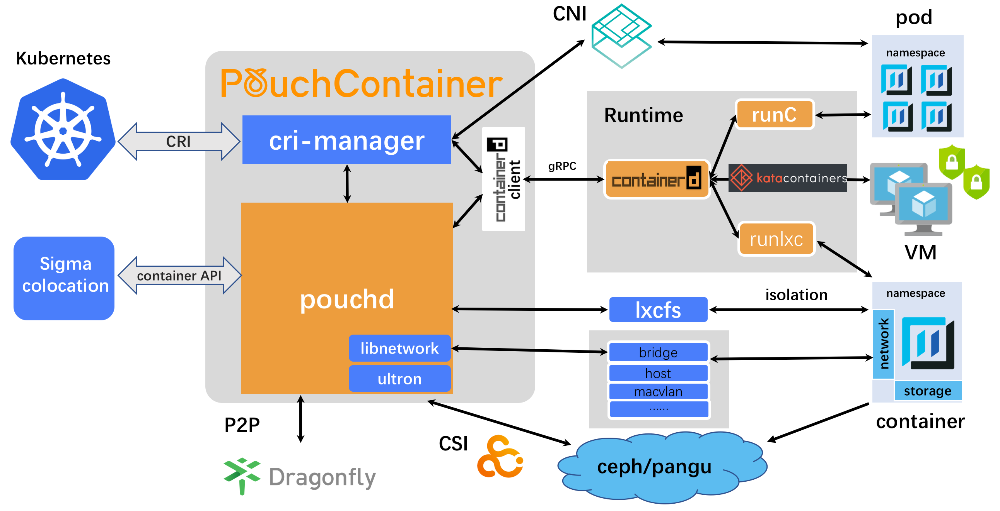

.. _oci_pouch:

=======================
基于OCI标准的Pouch容器
=======================

OCI标准
===========

Open Container Initiative (OCI) 是Linux基金会旗下负责 `操作系统层虚拟化(容器) <https://en.wikipedia.org/wiki/Container_(virtualization)>`_ 开放标准制定的项目。当前主要开发两项标准：

- 运行时标准 (Runtime Specification, `runtime-spec <http://www.github.com/opencontainers/runtime-spec>`_ )
- 镜像标准 (Image Specification, `image-spec <http://www.github.com/opencontainers/image-spec>`_ )

runtime标准概括了如何运行一个从磁盘解包的 `文件系统包 (filesystem bundle) <https://github.com/opencontainers/runtime-spec/blob/master/bundle.md>`_ (类似macOS上分发的软件bundle) 。从上层的OCI实现将下载一个OCI镜像，然后将镜像解包成为一个OCI运行时的文件系统包（OCI Runtime filesystem bundler）。此时OCI运行时文件系统包将被一个OCI runtime运行起来。

.. note::

   OCI标准定义了容器运行时和镜像规范，使得不同容器实现（LXC, Docker, Kata, rkt) 以相同的标准运行，这样开发人员构建、打包和部署容器，可以运行在不同厂商的解决方案上。

Pouch
=========

`PouchContainer <https://github.com/alibaba/pouch>`_ 是阿里巴巴集团创建并遵循OCI容器标准的开源容器方案，目前用于集团基础架构。支持以下容器运行：

- `runc <https://github.com/opencontainers/runc>`_ 集运Linux cgroups和namespaces的container runtime，即Docker
- `katacontainers <https://github.com/kata-containers/runtime>`_ 基于hypervisor的container runtime， `Kata Containers <https://katacontainers.io/>`_ 结合了内核虚拟化的轻量级容器，提供比单纯容器更好的安全隔离
- `runlxc <https://linuxcontainers.org/lxc/getting-started/>`_ 基于LXC的container runtime(对于较老的2.6.32+内核支持)

PouchContainer主要的功能:

- 提供了集成多个服务、hooks以及多种容器功能，这样可以兼容传统的运维模式。不过需要注意的是，pouch并不代表富容器，而是提供了富容器的部署选项；pouch也可以提供标准纯净的容器，通过插件实现富容器的支持。
- 支持基于hypervisor的容器(Kata Containers)提供跟多安全隔离
- 通过 `Dragonfly <https://github.com/alibaba/dragonfly>`_ 实现P2P的镜像分发，加速大规模镜像分发速度
- 支持 Kubernetes Native 实现，即符合 `Kubernetes Container Runtime Interface (CRI) <https://kubernetes.io/blog/2016/12/container-runtime-interface-cri-in-kubernetes/>`_ 标准，可以集成在Kubernetes集群

Pouch解析
=============

在上图中组件集成了很多开源项目和标准，以下做一个简单解析：

- `OCI <https://www.opencontainers.org/>`_ 维护OCI的运行时和镜像标准。当前的docker版本支持OCI镜像和运行时标准。

- `containerd <http://containerd.io/>`_ 是一个用于管理完整容器生命周期的容器运行服务，包括镜像传输和存储，以及容器运行，容器监督和容器网络都是由 ``contained`` 负责

- ``containerd-shim`` 负责处理headless 容器（没有显示输出的容器），即负责容器的初始化。

.. note::

   在计算机程序开发中， `shim <https://en.wikipedia.org/wiki/Shim_(computing)>`_ （英文原义是垫片，帮助两个物体更好组装而填补缝隙的薄片）是一种透明拦截API调用并更改传递的参数，以便处理不同软件（库）平台调用的转换兼容。

- `runc容器 <http://runc.io/>`_ 是一个轻量级统一运行时容器，遵守了OCI标准。 ``runc`` 是 ``containerd`` 使用的，用于启动并运行符合OCI标准的容器。这个进程也通常被 ``libcontainer`` 重新包装。

- `gRPC <http://www.grpc.io/>`_ 用于在docker-engine之间通讯。

参考
======

- `PouchContainer: How OCI Specifications Power Alibaba <https://www.opencontainers.org/blog/2018/08/29/pouchcontainer>`_
- `Docker components explained <http://alexander.holbreich.org/docker-components-explained/>`_
- `How containerd compares to runC <https://stackoverflow.com/questions/41645665/how-containerd-compares-to-runc>`_
