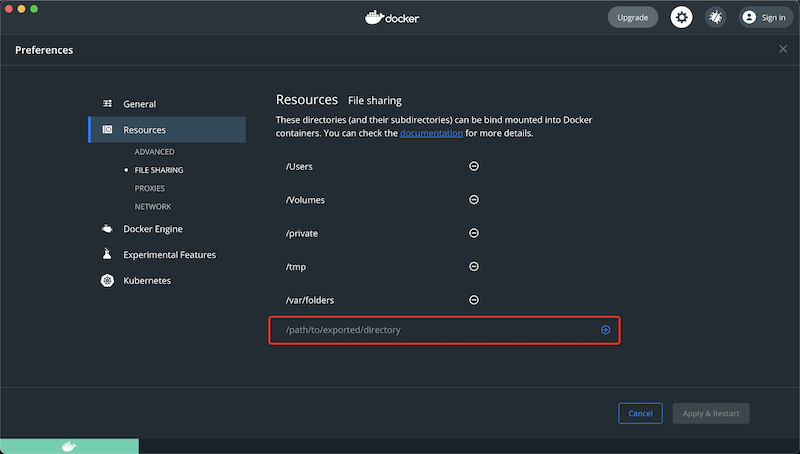

.. _docker_macos_file_share:

==================================
Docker Desktop for macOS文件共享
==================================

我在 :ref:`docker_studio` 中尝试在物理主机macOS共享磁盘目录给Docker容器使用，以便能够把Docker容器的数据持久化。最初考虑使用 :ref:`macos_nfs` ，不过没有解决挂载问题，所以改为采用Docker官方手册的 ``File sharing`` 方法。

File sharing
==============

所谓 ``File sharing`` 通常的场景是在host主机(macOS)上使用IDE开发代码，然后在容器内部运行和测试代码(Linux环境)。默认情况下，共享了 ``/Users`` , ``/Volume`` , ``/private`` , ``/tmp`` 和 ``/var/folders`` 目录。

- 你可以添加自己指定的共享目录，如下:

然后点击右下角的 ``Apply & Restart`` 按钮生效。

.. note::

   - 务必只在容器内共享需要的目录。文件共享后任何在物理host主机上修改的文件都会通知到Linux VM，所以共享更多的文件会导致高CPU负载以及缓慢的文件系统性能
   - 共享目录设计允许应用程序直接编辑host主机共享给容器的文件。对于非代码数据，例如缓存目录或者数据库，性能会比存储在Linux VM，也就是使用Docker卷的性能要好(我理解Docker卷实际上是读写Docker Desktop for Mac的Linux虚拟机中的共享目录，这个虚拟机性能有限，并且如果Linux VM被重置数据会丢失)
   - 如果将整个macOS上的home目录共享到容器内部，贼macOS可能会提示你需要给予Docker访问你home目录个人区域(例如Reminders或Downloads目录)的访问权。
   - 需要注意macOS文件系统默认是文件名大小写不区分，而Linux则是区分大小写，则可能导致应用在macOS和Linux上表现不一。

上述添加的 ``file sharing`` 目录如何映射到容器内部？

- 启动docker容器案例采用 :ref:`docker_studio` 的 ``dev`` 案例::

   docker build -t fedora-dev .
   docker run --name fedora-dev --hostname fedora-dev -p 122:22 --detach -ti -v /sys/fs/cgroup:/sys/fs/cgroup:ro -v /Users/huatai/home_admin/dev:/home/admin fedora-dev /usr/sbin/init

但是启动立即终止，使用 ``docker ps --all`` 可以看到::

   CONTAINER ID   IMAGE        COMMAND            CREATED          STATUS                        PORTS                                 NAMES
   96677398766c   fedora-dev   "/usr/sbin/init"   20 seconds ago   Exited (255) 18 seconds ago                                         fedora-dev

为何有返回错误码 255 呢？

查看启动日志::

   docker logs fedora-dev

可以看到::

   systemd v248.3-1.fc34 running in system mode. (+PAM +AUDIT +SELINUX -APPARMOR +IMA +SMACK +SECCOMP +GCRYPT +GNUTLS +OPENSSL +ACL +BLKID +CURL +ELFUTILS +FIDO2 +IDN2 -IDN +IPTC +KMOD +LIBCRYPTSETUP +LIBFDISK +PCRE2 +PWQUALITY +P11KIT +QRENCODE +BZIP2 +LZ4 +XZ +ZLIB +ZSTD +XKBCOMMON +UTMP +SYSVINIT default-hierarchy=unified)
   Detected virtualization docker.
   Detected architecture x86-64.
   Failed to create symlink /sys/fs/cgroup/net_cls: File exists
   Failed to create symlink /sys/fs/cgroup/net_prio: File exists
   Failed to create symlink /sys/fs/cgroup/cpu: File exists
   Failed to create symlink /sys/fs/cgroup/cpuacct: File exists

   Welcome to Fedora 34 (Container Image)!

   Failed to write /run/systemd/container, ignoring: Permission denied
   Failed to create /docker/96677398766c1bdd1a48396d9c4db2c8a16a918bde715626cc3fb65e38986b64/init.scope control group: Permission denied
   Failed to allocate manager object: Permission denied
   [!!!!!!] Failed to allocate manager object.
   Exiting PID 1...

这个问题在 `Building multiple docker images using the same kaniko executor gives 'file exists' error <https://groups.google.com/g/kaniko-users/c/_7LivHdMdy0>`_ 有

`Debian10 not working #168 <https://github.com/weaveworks/footloose/issues/168>`_ 提到是本地安装docker问题，需要重新安装一次docker初始。我参考 Docker Desktop for Mac 的 User manual ，尝试重置一次虚拟机：

- 点击 ``Troubleshoot`` 按钮 (有一个 ``甲虫`` 形状) :

  - ``Clean/Purge data`` : A disk image reset destroys all Docker containers and images local to the machine, preserving all settings.
  - ``Reset Docker Desktop to factory defaults`` : A factory reset destroys all Docker containers and images local to the machine, and restores the application to its original state, as when it was first installed.

.. figure:: ../../_static/docker/startup/docker_troubleshoot.png
   :scale: 75

我首先尝试 ``Clean/Purge data`` 这个过程实际上就是移除所有镜像和容器，完成以后，需要重新走以便镜像创建和容器创建，即再次执行::

   docker build -t fedora-dev .
   docker run --name fedora-dev --hostname fedora-dev -p 122:22 --detach -ti -v /sys/fs/cgroup:/sys/fs/cgroup:ro -v /Users/huatai/home_admin/dev:/home/admin fedora-dev /usr/sbin/init

无效，则执行 ``Reset Docker Desktop to factory defaults`` ，然后再次重复上述步骤。   

ARM环境Linux下尝试
====================

上述命令在ARM的Linux主机上执行::

   docker run --name fedora-dev --hostname fedora-dev -p 122:22 --detach -ti -v /sys/fs/cgroup:/sys/fs/cgroup:ro -v /home/ubuntu/dev:/dev fedora-dev /usr/sbin/init

出现报错::

   docker: Error response from daemon: failed to create shim: OCI runtime create failed: container_linux.go:380: starting container process caused: process_linux.go:545: container init caused: open /dev/ptmx: no such file or directory: unknown.

汗，低级错误 ``/dev`` 是容器内设备目录，不能映射覆盖，修正为::

   docker run --name fedora-dev --hostname fedora-dev -p 122:22 --detach -ti -v /sys/fs/cgroup:/sys/fs/cgroup:ro -v /home/ubuntu/dev:/home-dev fedora-dev /usr/sbin/init

启动失败，报错日志::

   systemd v248.4-1.fc34 running in system mode. (+PAM +AUDIT +SELINUX -APPARMOR +IMA +SMACK +SECCOMP +GCRYPT +GNUTLS +OPENSSL +ACL +BLKID +CURL +ELFUTILS +FIDO2 +IDN2 -IDN +IPTC +KMOD +LIBCRYPTSETUP +LIBFDISK +PCRE2 +PWQUALITY +P11KIT +QRENCODE +BZIP2 +LZ4 +XZ +ZLIB +ZSTD +XKBCOMMON +UTMP +SYSVINIT default-hierarchy=unified)
   Detected virtualization docker.
   Detected architecture arm64.

   Welcome to Fedora 34 (Container Image)!

   Failed to write /run/systemd/container, ignoring: Permission denied
   Failed to create /system.slice/docker-c11448d8691e10a0c89abd11dafd3d08e03dbbdec6bda771b4c93f943ab8daf8.scope/init.scope control group: Permission denied
   Failed to allocate manager object: Permission denied
   [!!!!!!] Failed to allocate manager object.
   Exiting PID 1...

参考
=====

- `Docker Desktop for Mac user manual <https://docs.docker.com/docker-for-mac/>`_
