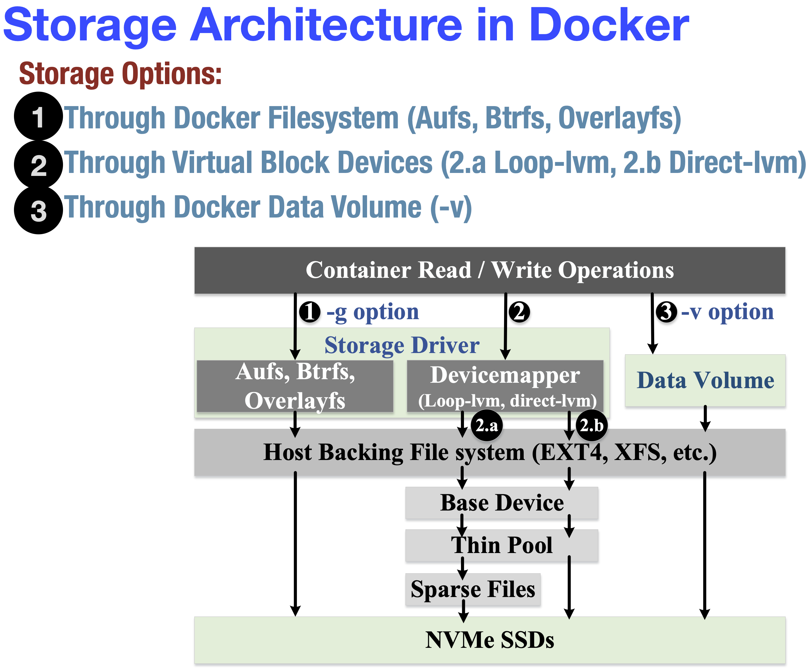
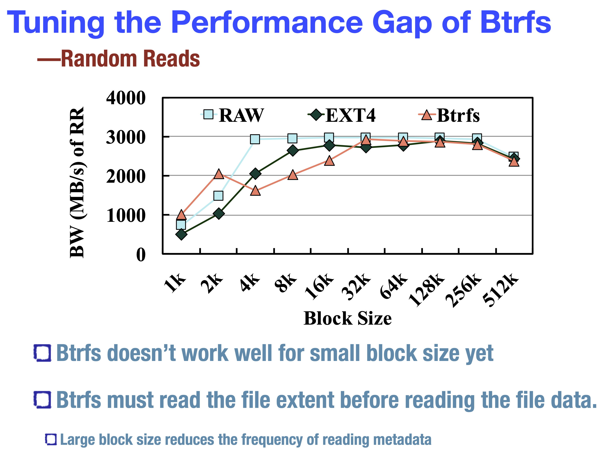
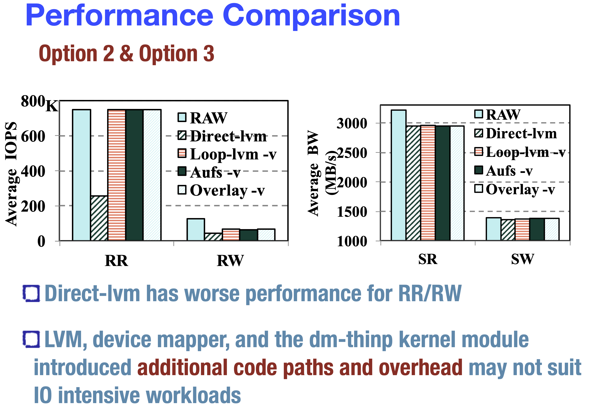

.. _docker_local_remove_storage_perf:

================================
Docker本地和远程存储性能(参考)
================================

在 `PERFORMANCE ANALYSIS OF CONTAINERIZED APPLICATIONS ON LOCAL AND REMOTE STORAGE <https://www.storageconference.us/2017/Presentations/PerformanceAnalysisOfContainerizedApplications-slides.pdf>`_ 有一些有意思的参考信息:

本地存储架构
================

- 使用 :ref:`nvme` 作为存储，通过精心优化配置可以接近于裸设备性能

文件系统对比
-------------

- 通过Docker文件系统(Aufs, Btrfs, Overlayfs):

  - Aufs(Advanced multi-layered Unification FileSystem): 高速可靠的统一文件系统
  - Btrfs(B-tree文件系统):现代化CoW文件系统，可以实现很多高级特性，如失效冗余,容易修复和管理
  - Overlayfs: 现代化的统一文件系统，比Aufs设计简化，所以潜在更快一些

测试采用 :ref:`fio` :

  - libaio: 异步IO
  - 32个并发任务，iodepth 32

EXT4和XFS
~~~~~~~~~~~~

- EXT4的随机读(RR) IOPS比raw低25%，但是XFS能够接近于raw
- XFS的几乎所有性能都接近raw，但是随机写(RW)性能不佳

.. note::

   XFS允许多个进程一起读一饿文件，而EXT4要求读操作使用 mutex locks

XFS在很高的线程数量时随机写性能下降( ``后续可以实践验证`` ): (独占锁exclusive locking影响写性能)

.. figure:: ../../_static/docker/storage/xfs_random_writes_high_thead.png
   :scale: 25 

Btrfs性能解析
~~~~~~~~~~~~~~~

- Btrfs在小磁盘块性能不佳
- Btrfs在读取文件数据前必须读取文件扩展(file extent)，所以块越小也就需要读取更多file extent，导致Btrfs对小文件性能不佳，而大数据块则降低了读取metadata所以Btrfs性能此时就提升上来了
- Btrfs由于采用了CoW，所以对于随机写(RW)性能不佳

虚拟块设备
-------------

- 通过 :ref:`docker_devicemapper_driver` 提供了精简配置(thin provisioning)和快照(snapshotting)能力
- ``loop-lvm`` 通过 ``稀疏文件`` (sparse files)可以构建精简配置池(thin-provisioned pools)
- ``direct-lvm`` 通过 ``块设备`` (block device)可以直接创建精简池(thin pools)，这也是Docker推荐方式

.. note::

   通过使用 :ref:`docker_devicemapper_driver` 可以充分发挥Docker的存储性能(毕竟LVM卷是非常薄的逻辑层，性能几乎无损)，同时带来灵活的管理存储能力(精简配置和快照)，所以是非常推荐的存储方案

数据卷(data volume, -v)
----------------------------

:ref:`docker_volume` 提供了数据持久化，并且可以在不同容器间共享数据

.. note::

   `Where are containerd’s graph drivers? <https://blog.mobyproject.org/where-are-containerds-graph-drivers-145fc9b7255>`_ 介绍了Graph drivers

- ``direct-lvm`` 在随机读和随机写上性能不佳
- LVM,device mapper和dm-thinp内核模块引入了附加读代码路径和负担，所以可能不适合IO敏感读应用负载

参考
=====

- `PERFORMANCE ANALYSIS OF CONTAINERIZED APPLICATIONS ON LOCAL AND REMOTE STORAGE <https://www.storageconference.us/2017/Presentations/PerformanceAnalysisOfContainerizedApplications-slides.pdf>`_
