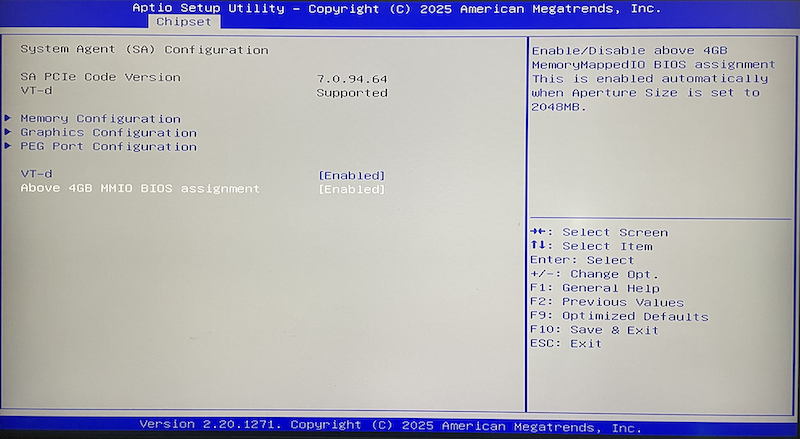

.. _linux_jail_nvidia_cuda:

==========================================
在FreeBSD Linux Jail中运行NVIDIA Cuda
==========================================

我一直在想如何能够实现一个 :ref:`freebsd_machine_learning` 环境，结合FreeBSD强大的 :ref:`zfs` 以及坚如磐石的基础，实现通常在Linux环境下的Machine Learning。

我最初想到的是 :ref:`bhyve_pci_passthru` ，毕竟这是非常直觉的想法，通过PCIe Passthrough实现GPU直通给Linux虚拟机，这样就避免了 :ref:`nvidia_gpu` 无法很好在FreeBSD支持的问题(我相像中厂商对FreeBSD硬件驱动支持都比较弱)。不过，现实总是比较残酷，在反复折腾 :ref:`bhyve_nvidia_gpu_passthru` 遇到各种问题，让人非常沮丧: 花费了大量的时间精力，这些时间本应该投入到现今火热一日千里的 :ref:`llm` 实践中。

linux jail思路
===============

`Davinci Resolve installed in Freebsd Jail <https://www.youtube.com/watch?v=zM0gqoseO7k>`_ 提供了一个新的思路:

- 在FreeBSD上安装 ``nvidia-driver linux-nvidia-libs libc6-shim libvdpau-va-gl libva-nvidia-driver`` (实际上和下文 ``linuxulator思路`` 是一致的)
- 配置 :ref:`linux_jail` 在Jail中运行 :ref:`ubuntu_linux`
- 在Ubuntu Linux Jail中运行安装 ``nvidia-driver`` (这里思路有点乱,我不太确定Linux Jail中是否还要安装driver，因为FreeBSD Host上已经安装过driver了) 和 ``nvidia-cuda-toolkit``
- 接下来就可以安装任意依赖NVIDIA CUDA的应用

.. note::

   另一种解决思路是 :ref:`linuxulator_nvidia_cuda` ，更为简便

.. warning::

   目前我的实践还遇到一些困难没有解决，待后续再尝试:

   - :ref:`linux_jail` 中缺乏 :ref:`systemd` 导致 ``nvidia-cuda-toolkit`` 无法安装

Host安装 :ref:`linuxulator` 软件栈
====================================

NVIDIA为FreeBSD提供了原生的 ``nvidia-driver`` 驱动，所以方案类似 :ref:`nvidia-docker` ，首先在FreeBSD Host中安装 ``nvidia-driver`` 以及支持 :ref:`linuxulator` 运行模拟Linux驱动的 ``linux-nvidia-libs`` 库文件(我理解是将Linux层调用Linux版本 ``nvidia-driver`` 的API转换成调用FreeBSD版本 ``nvidia-driver`` )。此外，附加安装 ``libc6-shim`` 能够获得一个 ``nv-sglrun`` 工具来包装使用CUDA:

.. literalinclude:: linux_jail_nvidia_cuda/install_cuda
   :caption: 在FreeBSD上安装 ``nvidia-driver`` (原生) 和 CUDA (Linux版)

.. note::

   `DaVinci Resolve Freebsd <https://github.com/NapoleonWils0n/davinci-resolve-freebsd-jail>`_ 中另外安装的两个库文件:

   - ``libvdpau-va-gl`` : Linux二进制程序，提供应用程序使用VDPAU(Video Decode and Presentation API)来实现硬件功能，将 VDPAU 调用转换成视屏加速API(VA-API, Video Acceleration API)，使用OpenGL来绘制和伸缩。这个库对于Intel GPU也有部分作用，因为Intel GPU没有实现原生VDPAU但支持VA-API
   - ``libva-nvidia-driver`` : Linux平台的NVIDIA GPU作为转换层提供硬件视频解码的软件包，桥接了 VA-API (Video Acceleration API)，被很多应用程序用于(NVIDIA)硬件解码。

   上述两个库似乎是视频相关，我暂时没有安装

- 重启系统后执行 ``nvidia-smi`` 发现报错:

.. literalinclude:: linux_jail_nvidia_cuda/nvidia-smi_no_driver
   :caption: 执行 ``nvidia-smi`` 显示没有驱动

- 手工加载 NVIDIA 驱动:

.. literalinclude:: linux_jail_nvidia_cuda/kldload_nvidia
   :caption: 手工加载nvidia驱动

此时检查 ``kldstat | grep nvidia`` 看到有一个内核模块加载:

.. literalinclude:: linux_jail_nvidia_cuda/kldstat_nvidia
   :caption: 检查 ``kldstat`` 输出中有 ``nvidia``

另外，还需要配置系统启动时自动加载 ``nvidia-devier`` ，设置 ``/boot/loader.conf`` :

.. literalinclude:: linux_jail_nvidia_cuda/loader.conf
   :caption: 设置 ``/boot/loader.conf``

.. warning::

   我遇到一个非常奇怪的问题，在 ``/boot/loader.conf`` 添加了 ``nvidia_load="YES"`` ，但是重启没有自动加载 ``nvidia`` 驱动，而是启动后每次都需要手工执行 ``kldload nvidia`` 加载。这让我很困惑，参考 `Loading kernel modules automatically <https://forums.freebsd.org/threads/loading-kernel-modules-automatically.26990/>`_ 似乎是配置文件有隐含特殊字符导致的，但是我没有找到解决方法。

输出显示:

.. literalinclude:: linux_jail_nvidia_cuda/kldstat_nvidia_output
   :caption: 检查 ``kldstat`` 输出中有 ``nvidia``

但是很不幸，发现 ``nvidia-smi`` 报错依旧:

.. literalinclude:: linux_jail_nvidia_cuda/nvidia-smi_no_driver
   :caption: 执行 ``nvidia-smi`` 显示没有驱动

- 检查系统日志 ``dmesg`` 显示:

.. literalinclude:: linux_jail_nvidia_cuda/dmesg_nvidia
   :caption: ``dmesg`` 显示分配BAR错误
   :emphasize-lines: 3,4

这说明系统没有设置 :ref:`above_4g_decoding` 或者说类似 :ref:`dl360_gen9_large_bar_memory` (相同概念的不同术语)，需要调整BIOS

BIOS设置 :ref:`above_4g_decoding`
------------------------------------

在 :ref:`above_4g_decoding` 针对我的 :ref:`nasse_c246` 需要配置2个BIOS位置:

- ``Above 4G Decoding``

.. figure:: ../../../_static/linux/server/hardware/chipset/above_4gb_decoding.png

- ``above 4GB mmio BIOS Assignment``

完成后重启主机，然后在FreeBSD Host主机上执行 ``nvidia-smi`` 此时就看到正常的输出信息(表明 :ref:`tesla_p10` 已经工作正常:

.. literalinclude:: linux_jail_nvidia_cuda/nvidia-smi_output
   :caption: ``nvidia-smi`` 输出显示GPU工作正常
   :emphasize-lines: 3,10

注意，这里输出信息中仅显示 ``Driver Version: 580.82.07`` ，而CUDA版本是空白的 ``CUDA Version: N/A`` 。这时因为当前使用的 ``nvidia-smi`` 仅仅是FreeBSD原生的 ``nvidia-driver``

- 通过 ``nv-sglrun`` 运行 ``nvidia-smi`` 则是执行Linux程序(通过 :ref:`linuxulator` )，会通过CUDA，此时会看到CUDA版本信息:

.. literalinclude:: linux_jail_nvidia_cuda/nv-sglrun
   :caption: 通过 ``nv-sglrun`` 运行 ``nvidia-smi``

输出信息:

.. literalinclude:: linux_jail_nvidia_cuda/nv-sglrun_output
   :caption: 通过 ``nv-sglrun`` 运行 ``nvidia-smi`` 输出信息中有CUDA版本信息
   :emphasize-lines: 5,12

至此，FreeBSD ``nvidia-driver`` 以及通过 :ref:`linuxulator` 运行 CUDA 已部署完毕，接下来就可以进行 :ref:`machine_learning` 工作。当然，为了进一步方便工作，还可以继续部署 :ref:`linux_jail` 来实现隔离且完整的机器学习环境

- 如果要直接在FreeBSD :ref:`linuxulator` 环境运行Linux版本Conda，可以安装 ``miniconda`` Linux版本:

.. literalinclude:: linux_jail_nvidia_cuda/linux-miniconda_install
   :caption: 安装Linux版本miniconda

此时会安装一个Linux版本的 miniconda，可以用于今后机器学习安装对应的软件包

Linux Jail实现CUDA实践
=========================

- 已经完成了上述Host主机上安装 ``nvidia-driver`` 等软件堆栈

- 已经完成了 :ref:`linux_jail_ubuntu-base`

.. note::

   由于上文已经在FreeBSD Host中安装了 ``nvidia-driver`` ，所以参考 :ref:`nvidia-docker` 架构，在Jail中，应该只需要安装Linux版本的 CUDA Toolkit，而不需要安装完整版本的CUDA(包含 ``cuda-toolkit`` 和 ``nvidia-driver`` )

- 从NVIDIA官方提供 `NVIDIA CUDA Toolkit repo 下载 <https://developer.nvidia.com/cuda-downloads>`_ 选择 ``linux`` => ``x86_64`` => ``Ubuntu`` => ``24.04`` => ``deb(network)``

.. literalinclude:: ../../../docker/gpu/bhyve_ubuntu_tesla_p4_docker/cuda_driver_debian_ubuntu_repo_install
   :caption: Debian/Ubuntu使用NVIDIA官方软件仓库安装CUDA驱动

- 安装 ``nvidia-cuda-toolkit`` :

.. literalinclude:: linux_jail_nvidia_cuda/install_nvidia-cuda-toolkit
   :caption: 安装 ``nvidia-cuda-toolkit``

.. note::

   我发现NVIDIA提供了不同的CUDA Toolkit: 仓库中有

   - ``nvidia-cuda-toolkit``
   - ``cuda-toolkit``

   两者在 :ref:`ubuntu_linux` core系统中安装:

     - ``nvidia-cuda-toolkit`` 需要 ``6037 MB`` 空间
     - ``cuda-toolkit`` 需要 ``7474 MB`` 空间
     - 两者安装的软件包和依赖有所不同

   以下这段内容来自Google AI:

   - ``nvidia-cuda-toolkit`` 是完整版本的CUDA Toolkit，也称为 ``full development suite`` 。包含了完整CUDA开发工具和库，适合需要完整toolchain来编译、调试和prifile CUDA程序的开发者。当安装完整版本 ``nvidia-cuda-toolkit`` 通常会处理依赖以及安装NVIDIA驱动
   - ( **这段似乎不正确** Google AI似乎搞混了Conda环境中的 ``cudatoolkit`` 包) ``cuda-toolkit`` 通常用于Conda包或者较为核心的toolkit，软件包较少仅包含运行软件(如 :ref:`tensorflow` )所需的库，没有包含完整的开发toolchain。这个软件包组合通常是最终用户使用的，仅用于预编译应用程序或Python软件包，如 :ref:`pytorch` 或 :ref:`tensorflow` 。安装 ``cuda-toolkit`` 通常假设系统已经安装了NVIDIA GPU驱动，所以安装软件更少。
   - 如果需要完整开发环境来编写C++ CUDA程序，则安装完整版本 ``nvidia-cuda-toolkit`` ; 如果只是最终用户运行预编译程序，例如安装运行 :ref:`deep_learning` 框架如 :ref:`pytorch` 或 :ref:`tensorflow` ，则通常安装轻量级 ``cuda-toolkit`` (通过 ``conda`` 或 ``pip`` 安装 ``cudatoolkit`` 软件包)

这里有一些报错，看来是安装 ``nvidia-cuda-toolkit`` 时自动安装和配置 :ref:`systemd` 导致的:

.. literalinclude:: linux_jail_nvidia_cuda/install_nvidia-cuda-toolkit_error
   :caption: 安装 ``nvidia-cuda-toolkit`` 报错

.. note::

   我曾经想是不是应该改为安装 :ref:`nvidia_container_toolkit` ？面向容器定制的toolkit或许可以避免 ``systemd`` 问题...

   我参考 `NVIDIA Container Toolkit <https://github.com/NVIDIA/nvidia-container-toolkit>`_ 发现也不行，这个 ``NVIDIA Container Toolkit`` 是一个复杂的安装在Host上的软件包，用于配置 :ref:`docker` 或其他 :ref:`container` 运行时来实现容器化运行 ``CUDA Toolkit`` 。

   也就是说，确实应该在容器(或者Jail)内部安装 ``CUDA Toolkit`` ，但是没法使用NVIDIA官方的 ``NVIDIA Container Toolkit`` ，这个软件包和Linux平台深度绑定，只是为了能够方便构建和运行容器，但无法在FreeBSD上使用。

这个问题似乎不好解决，但也可能可以解决(google ai给了启发):

- :ref:`devuan` 是一个 :ref:`debian` fork版本，采用了 ``sysvinit`` 系统替代 :ref:`systemd` ，理论上当安装 ``nvidia-cuda-toolkit`` 的依赖时或许可以避免 ``systemd`` 问题(不过也取决于NVIDIA开发的软件包是否强制依赖了 ``systemd`` )
- 使用CUDA runfile installer安装，有可能通过 ``--override`` 参数bypass掉依赖检查，不过CUDA系统可能会依赖才能工作

参考
=======

- `Davinci Resolve installed in Freebsd Jail <https://www.youtube.com/watch?v=zM0gqoseO7k>`_ 油管上NapoleonWils0n围绕FreeBSD有不少视频编码解码的解析，其中关于FreeBSD Jail运行Ubuntu来实现NVIDIA CUDA 文档见 `DaVinci Resolve Freebsd <https://github.com/NapoleonWils0n/davinci-resolve-freebsd-jail>`_
- `PyTorch and Stable Diffusion on FreeBSD <https://github.com/verm/freebsd-stable-diffusion>`_ 思路相同，通过结合FreeBSD ``nvidia-driver`` 和 :ref:`linuxulator` 运行Linux版本CUDA来实现一个机器学习环境
