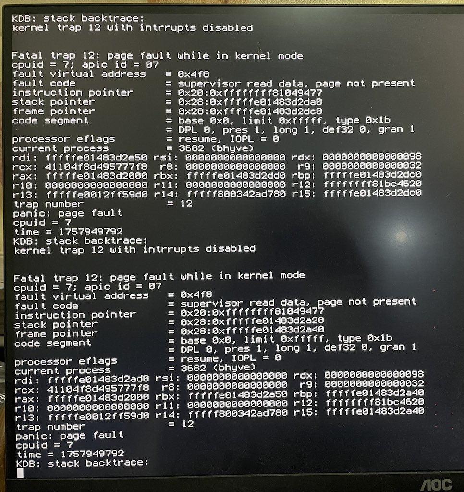
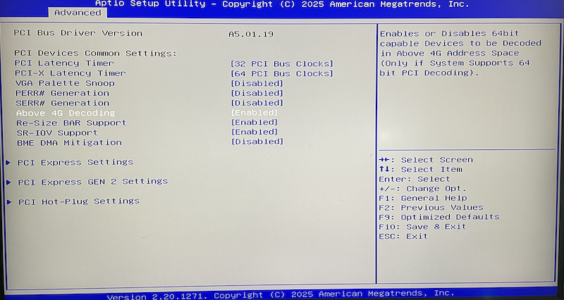

.. _bhyve_nvidia_gpu_passthru_freebsd_15:

==================================================
FreeBSD 15环境bhyve中实现NVIDIA GPU passthrough
==================================================

我的两次实践 :ref:`bhyve_nvidia_gpu_passthru` :ref:`bhyve_nvidia_gpu_passthru_intpin_patch` 都不太成功，考虑到当前开发的 `bhyve: assign a valid INTPIN to NVIDIA GPUs <https://reviews.freebsd.org/D51892>`_ 补丁是面向FreeBSD 15，并且FreeBSD 15还有2个多月(2025年12月2日)就要发布，我决定再尝试安装FreeBSD 15来验证是否可以支持我的两个 :ref:`tesla_p4` 和 :ref:`tesla_p10` ，如果还存在问题，也方便向社区提交bug。

.. warning::

   实践暂时没有成功，我需要排除BIOS设置(组装机的 :ref:`above_4g_decoding` 不确定是否正确，以及 :ref:`pcie_bifurcation` 配置也存疑)以及可能的硬件问题( :ref:`tesla_p4` 还么有实际成功使用过)

   我准备切换到 :ref:`lfs` 来尝试在Linux上先完成 :ref:`ovmf_gpu_nvme` ，验证无误后再重新尝试 ``bhyve`` 以便能够排除各种影响因素

准备工作
===========

安装 FreeBSD 15 Alpha 1 版本，不过我在 :ref:`vm-bhyve` 安装 :ref:`ubuntu_linux` 24.04.3 遇到安装过程出现 :strike:`crash导致没有安装成功`

正好当天发现社区发布了Alpha 2，所以 :ref:`freebsd_15_alpha_update_upgrade` 到 Alpha 2重新开始

但后来发现，在 Alpha 2 中也同样报错，不过实际操作系统已经安装完成，只是在以后 ``cloud-init`` 步骤时crash，似乎不影响后续vm启动运行。暂时忽略这个错误

完成 `在 bhyve 中运行 虚拟机 <https://docs.cloud-atlas.dev/zh-CN/architecture/virtual/bhyve/bhyve-vm>`_

配置PCI passthru
====================

- 检查 PCI 设备:

.. literalinclude:: bhyve_nvidia_gpu_passthru_intpin_patch/vm_passthru
   :caption: ``vm`` 检查 ``passthru`` 设备列表

.. note::

   我分别测试了 :ref:`tesla_p10` 和 :ref:`tesla_p4` ，单独安装其中任一设备，都识别为 ``BHYVE ID`` 是 ``1/0/0`` ，所以下文案例共用步骤

.. literalinclude:: bhyve_nvidia_gpu_passthru_intpin_patch/vm_passthru_output
   :caption: ``vm`` 检查 ``passthru`` 设备列表: Tesla P10
   :emphasize-lines: 3

.. literalinclude:: bhyve_nvidia_gpu_passthru_intpin_patch/vm_passthru_output_p4
   :caption: ``vm`` 检查 ``passthru`` 设备列表: Tesla P4
   :emphasize-lines: 3

- 配置 ``/boot/loader.conf`` 屏蔽掉需要passthru的GPU:

.. literalinclude:: bhyve_nvidia_gpu_passthru_intpin_patch/loader.conf
   :caption: 屏蔽掉 :ref:`tesla_p10` 或 :ref:`tesla_p4` ``1/0/0``

- 重启系统，然后再次检查 ``vm passthru`` ，此时看到 ``Tesla P10`` / ``Tesla P4`` 的设备一列应该显示为 ``ppt0`` :

.. literalinclude:: bhyve_nvidia_gpu_passthru_intpin_patch/vm_passthru_output_ppt0
   :caption: 屏蔽掉 :ref:`tesla_p10` 之后显示为 ``ppt0``
   :emphasize-lines: 3

.. literalinclude:: bhyve_nvidia_gpu_passthru_intpin_patch/vm_passthru_output_ppt0_p4
   :caption: 屏蔽掉 :ref:`tesla_p4` 之后显示为 ``ppt0``
   :emphasize-lines: 3

- 修订 ``xdev`` 虚拟机配置 ``/zroot/vms/xdev/xdev.conf``

.. literalinclude:: bhyve_nvidia_gpu_passthru_intpin_patch/xdev.conf
   :caption: 配置 ``xdev`` 添加直通PCI设备 ``1/0/0`` 也就是 :ref:`tesla_p10` / :ref:`tesla_p4`
   :emphasize-lines: 11

- 启动 ``xdev`` 虚拟机后，在虚拟机内部检查:

.. literalinclude:: bhyve_nvidia_gpu_passthru_freebsd_15/lspci_p4
   :caption: 虚拟机内部查看 Tesla p4

安装CUDA驱动
=============

参考之前在 :ref:`install_cuda_ubuntu` 经验，也包括我之前 :ref:`bhyve_ubuntu_tesla_p4_docker` ，快速完成 ``cuda-driver`` 安装:

- 采用 :ref:`debian_init` 纯后台服务器系统安装开发工具的方式(安装 ``build-essential`` 为主)

.. literalinclude:: ../../../../linux/debian/debian_init/debian_init_vimrc_dev
   :caption: 安装纯后台开发工具

- CUDA驱动需要内核头文件以及开发工具包来完成内核相关的驱动安装，因为内核驱动需要根据内核进行编译

安装 **linux-headers** (不过直接安装  ``cuda-driver`` 也会自动依赖安装):

.. literalinclude:: ../../../../docker/gpu/nvidia_p4_pi_docker/linux-headers
   :caption: 安装inux-headers

- 从NVIDIA官方提供 `NVIDIA CUDA Toolkit repo 下载 <https://developer.nvidia.com/cuda-downloads>`_ 选择 ``linux`` => ``x86_64`` => ``Ubuntu`` => ``24.04`` => ``deb(network)``

.. literalinclude:: ../../../../docker/gpu/bhyve_ubuntu_tesla_p4_docker/cuda_driver_debian_ubuntu_repo_install
   :caption: Debian/Ubuntu使用NVIDIA官方软件仓库安装CUDA驱动

- 安装驱动 ``cuda-driver`` :

.. literalinclude:: ../../../../machine_learning/hardware/nvidia_gpu/install_nvidia_linux_driver/cuda_driver_debian_ubuntu_repo_install
   :language: bash
   :caption: Debian/Ubuntu使用NVIDIA官方软件仓库安装CUDA驱动

- 重启虚拟机操作系统

:ref:`tesla_p4`
===================

没有 ``INTPIN`` 补丁之前
-------------------------

- 安装完驱动以后检查 ``lspci`` 信息

.. literalinclude:: bhyve_nvidia_gpu_passthru_freebsd_15/lspci_p4_nvidia_driver
   :caption: 安装驱动以后检查 ``lspci`` 信息

- 安装完驱动后检查(此时 ``bhyve`` 尚未安装补丁)，可以看到 ``dmesg`` 有报错信息:

.. literalinclude:: bhyve_nvidia_gpu_passthru_freebsd_15/dmesg_irq_error
   :caption: dmesg显示Tesla P4的IRQ有报错

安装 ``INTPIN`` 补丁之后
---------------------------

- 安装 `bhyve: assign a valid INTPIN to NVIDIA GPUs <https://reviews.freebsd.org/D51892>`_ 补丁

.. literalinclude:: bhyve_nvidia_gpu_passthru_intpin_patch/build
   :caption: 编译补丁以后的 ``bhyve``

- 重启虚拟机，然后检查 ``dmesg`` 发现报错信息显示 ``Failed to allocate NvKmsKapiDevice`` (不再抱IRQ错误)

.. literalinclude:: bhyve_nvidia_gpu_passthru_freebsd_15/dmesg_allocate_nvkmskapidevice_error
   :caption: 安装了 INTPIN 补丁之后，dmesg日志显示 ``Failed to allocate NvKmsKapiDevice`` 错误

上述报错有可能bios错误，也可能是硬件问题，也可能是vm passthru的问题。

.. note::

   我无法判断解决，这个杂牌的主机我之前配置了 PCI-E Bifurcation ，但是我现在又找不到BIOS的入口

   我尝试将BIOS的配置恢复为出场默认设置，但是启动虚拟机之后的GPU初始化报错依旧如上

:ref:`tesla_p10`
======================

- 当我将BIOS配置恢复为默认出厂设置，没有配置 :ref:`above_4g_decoding` 时，启动 ``xdev`` 虚拟机时，使用 :ref:`tesla_p10` 的虚拟机直接导致Host主机kernel panic了:

- 我重启到BIOS中，设置 :ref:`above_4g_decoding` 其中的一个步骤(只调整了一个参数)

这次启动VM后，Host主机不再kernel panic，但是，又回到之前的问题: 引入了 :ref:`tesla_p10` 的VM没有正常启动，VNC是黑屏
