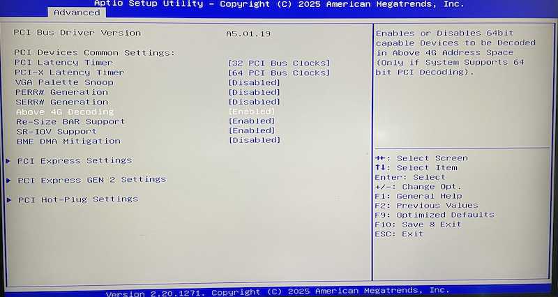

.. _linuxulator_nvidia_cuda:

==========================================
在 FreeBSD Linuxulator 中运行NVIDIA Cuda
==========================================

我在构建 :ref:`freebsd_machine_learning` 环境，一直没有解决 :ref:`bhyve_nvidia_gpu_passthru` ，但是发现基于 ``Linuxulator`` 是一种FreeBSD平台特有的解决方案:

linuxulator思路
===================

`PyTorch and Stable Diffusion on FreeBSD <https://github.com/verm/freebsd-stable-diffusion>`_ 思路相同，通过结合FreeBSD ``nvidia-driver`` 和 :ref:`linuxulator` 运行Linux版本CUDA来实现一个机器学习环境:

- FreeBSD Host主机安装 ``nvidia-driver`` (NVIDIA公司为FreeBSD提供了原生的驱动，但是没有提供CUDA)
- 安装 `libc6-shim <https://github.com/shkhln/libc6-shim>`_ ( :strike:`会同时` 依赖安装 ``nvidia-driver`` 和 ``linux-nvidia-libs`` )来获取 ``nvidia-sglrun`` (能够提供CUDA)
- 接下来就可以安装 ``miniconda`` 以及运行 :ref:`pytorch` 和 :ref:`stable_diffusion`

.. note::

   另一种解决思路是进一步使用 :ref:`linux_jail` 来构建隔离的 ``Linuxulator`` 运行环境: :ref:`linux_jail_nvidia_cuda`

   其实方案的核心都是使用 :ref:`linuxulator` 来实现Linux CUDA运行在FreeBSD ``nvidia-driver`` 上，性能和稳定性会受到一定影响，但是终究还是能够实 :ref:`freebsd_machine_learning` 环境。使用 :ref:`linux_jail` 比直接使用 :ref:`linuxulator` 的环境更干净隔离一些，其他差别不大。

   两种方案各有优势:

   - 采用 :ref:`linuxulator` 对于使用者来说还是直面FreeBSD，使用感受较好，也可以少安装一些环境依赖降低系统复杂度
   - 采用 :ref:`linux_jail` 则提供了隔离且模拟的Linux运行环境，相当于使用了Linux容器(比喻不当)，而且在Linux Jail基础上采用 :ref:`podman` (推测待实践)来部署OCI标准运行时，可以进一步实现 :ref:`kubernetes` 计算节点

BIOS开启 :ref:`above_4g_decoding`
===================================

.. note::

   对于大于8G显存的GPU卡，需要开启 :ref:`above_4g_decoding` 才能正常工作。本步骤是基于 :ref:`linux_jail_nvidia_cuda` 实践问题排查解决所总结的前置步骤。

   如果不启用 :ref:`above_4g_decoding` ，那么NVIDIA GPU初始化可能失败，系统日志 ``dmesg`` 显示:

   .. literalinclude:: ../../container/jail/linux_jail_nvidia_cuda/dmesg_nvidia
      :caption: ``dmesg`` 显示分配BAR错误
      :emphasize-lines: 3,4

在 :ref:`above_4g_decoding` 针对我的 :ref:`nasse_c246` 需要配置2个BIOS位置:

- ``Above 4G Decoding``

- ``above 4GB mmio BIOS Assignment``

.. figure:: ../../../_static/linux/server/hardware/chipset/above_4gb_mmio_bios_assignment.png

linuxulator实现CUDA实践
========================

NVIDIA为FreeBSD提供了原生的 ``nvidia-driver`` 驱动，所以方案类似 :ref:`nvidia-docker` ，首先在FreeBSD Host中安装 ``nvidia-driver`` 以及支持 :ref:`linuxulator` 运行模拟Linux驱动的 ``linux-nvidia-libs`` 库文件(我理解是将Linux层调用Linux版本 ``nvidia-driver`` 的API转换成调用FreeBSD版本 ``nvidia-driver`` )。此外，附加安装 ``libc6-shim`` 能够获得一个 ``nv-sglrun`` 工具来包装使用CUDA:

.. literalinclude:: ../../container/jail/linux_jail_nvidia_cuda/install_cuda
   :caption: 在FreeBSD上安装 ``nvidia-driver`` (原生) 和 CUDA (Linux版)

- 手工加载 NVIDIA 驱动:

.. literalinclude:: ../../container/jail/linux_jail_nvidia_cuda/kldload_nvidia
   :caption: 手工加载nvidia驱动

此时检查 ``kldstat | grep nvidia`` 看到有一个内核模块加载:

.. literalinclude:: ../../container/jail/linux_jail_nvidia_cuda/kldstat_nvidia
   :caption: 检查 ``kldstat`` 输出中有 ``nvidia``

- 需要配置系统启动时自动加载 ``nvidia-devier`` ，设置 ``/boot/loader.conf`` :

.. literalinclude:: ../../container/jail/linux_jail_nvidia_cuda/loader.conf
   :caption: 设置 ``/boot/loader.conf``

.. warning::

   我遇到一个非常奇怪的问题，在 ``/boot/loader.conf`` 添加了 ``nvidia_load="YES"`` ，但是重启没有自动加载 ``nvidia`` 驱动，而是启动后每次都需要手工执行 ``kldload nvidia`` 加载。这让我很困惑，参考 `Loading kernel modules automatically <https://forums.freebsd.org/threads/loading-kernel-modules-automatically.26990/>`_ 似乎是配置文件有隐含特殊字符导致的，但是我没有找到解决方法。

输出显示:

.. literalinclude:: ../../container/jail/linux_jail_nvidia_cuda/kldstat_nvidia_output
   :caption: 检查 ``kldstat`` 输出中有 ``nvidia``

- 在FreeBSD Host主机上执行 ``nvidia-smi`` 此时就看到正常的输出信息(表明 :ref:`tesla_p10` 已经工作正常:

.. literalinclude:: ../../container/jail/linux_jail_nvidia_cuda/nvidia-smi_output
   :caption: ``nvidia-smi`` 输出显示GPU工作正常
   :emphasize-lines: 3,10

注意，这里输出信息中仅显示 ``Driver Version: 580.82.07`` ，而CUDA版本是空白的 ``CUDA Version: N/A`` 。这时因为当前使用的 ``nvidia-smi`` 仅仅是FreeBSD原生的 ``nvidia-driver``

- 通过 ``nv-sglrun`` 运行 ``nvidia-smi`` 则是执行Linux程序(通过 :ref:`linuxulator` )，会通过CUDA，此时会看到CUDA版本信息:

.. literalinclude:: ../../container/jail/linux_jail_nvidia_cuda/nv-sglrun
   :caption: 通过 ``nv-sglrun`` 运行 ``nvidia-smi``

输出信息:

.. literalinclude:: ../../container/jail/linux_jail_nvidia_cuda/nv-sglrun_output
   :caption: 通过 ``nv-sglrun`` 运行 ``nvidia-smi`` 输出信息中有CUDA版本信息
   :emphasize-lines: 5,12

shim
========

.. note::

   shkhln开发了一个 `uvm_ioctl_override.c <https://gist.github.com/shkhln/40ef290463e78fb2b0000c60f4ad797e>`_ 工具提供了用于Linux二进制程序的shim，能够在FreeBSD中包装使用CUDA

**编译shim** : 在 `uvm_ioctl_override.c <https://gist.github.com/shkhln/40ef290463e78fb2b0000c60f4ad797e>`_ 提供

- 安装 ``Rocky Linux 9`` 开发工具(在 :ref:`linuxulator_startup` 中已经安装过 ``linux_base-rl9`` Rocky Linux 9 userland):

.. literalinclude:: linuxulator_nvidia_cuda/install_rl9-devtools
   :caption: 安装Rocky Linux 9 开发工具

这样在Host主机的 ``/compat/linux/bin/cc`` 就是 ``Rocky Linux 9`` 提供的 ``gcc11``

- 获取 ``uvm_ioctl_override.c`` :

.. literalinclude:: linuxulator_nvidia_cuda/fetch
   :caption: 获取 ``uvm_ioctl_override.c``

- 编译:

.. literalinclude:: linuxulator_nvidia_cuda/build
   :caption: 编译 ``uvm_ioctl_override.c``

初始化设置
============

初始化设置需要2个步骤:

- 安装缺失的软件包 ``linux-rl9-libglvnd`` (针对 ``Rocky Linux 9`` ，早期针对CentOS 7则安装 ``linux-c7-libglvnd`` )，目的是获取 ``libGL.so.1`` :

.. literalinclude:: linuxulator_nvidia_cuda/install_libglvnd
   :caption: 安装缺失的软件包 ``linux-rl9-libglvnd`` 获取 ``libGL.so.1``

- 建立 ``/sbin/md5`` 软链接: FreeBSD 13.1开始提供 ``/sbin/md5sum`` ，installer需要该执行程序，所以比较可靠的方式是在 ``~/bin`` 目录建立软链接:

.. literalinclude:: linuxulator_nvidia_cuda/link
   :caption: 建立 ``/sbin/md5sum`` 软链接

安装路径
===========

设置一个安装路径用于所有的Linux程序安装，我使用 ``${linux_dir}`` 作为存放所有Linux程序的基础目录(原文采用 ``${BASE_PATH}`` 环境变量):

.. literalinclude:: linuxulator_nvidia_cuda/linux_dir
   :caption: 使用 ``${linux_dir}`` 作为存放所有Linux程序的基础目录

Conda
=========

.. note::

   `Install minianaconda on FreeBSD <https://www.reddit.com/r/freebsd/comments/1g45wxq/install_minianaconda_on_freebsd/>`_ 提到直接下载官方 ``Miniconda3-latest-Linux-x86_64.sh`` 进行安装:

   .. literalinclude:: linuxulator_nvidia_cuda/miniconda3-installer
      :caption: 下载 ``Miniconda installer for Linux`` 最新版本进行安装

   但我实践发现也同样报错 ``[PYI-15462:ERROR] Module object for struct is NULL!`` (见下文，可能是同时安装了 Python 3.12 和 3.11 导致的)

需要在FreeBSD系统中安装原生python，运行 ``Miniconda3-latest-Linux-x86_64.sh`` 会依赖本地安装的python来执行脚本内容:

.. literalinclude:: linuxulator_nvidia_cuda/pkg_install_python3
   :caption: 安装python3

.. note::

   这里选择安装 python 3.11

   原因 **可能** 是安装 python312 会同时安装 python311 ，似乎会导致 miniconda3 安装成勋报错:

   .. literalinclude:: linuxulator_nvidia_cuda/miniconda-installer_error
      :caption: 安装 ``miniconda`` 报错
      :emphasize-lines: 12,16

   ``miniconda`` ``[PYI-15660:ERROR] Module object for struct is NULL!`` 错误是由于Python环境损坏或者混乱导致 ``PyInstaller`` 无法正确捆绑内置的 ``struct`` 模块。这个错误通常在 ``Conda`` 环境中使用 ``PyInstaller`` 时发生。

   根据 `linux-miniconda-installer Port details <https://www.freshports.org/sysutils/linux-miniconda-installer/>`_ 说明，软件包依赖 ``lang/python311``

`PyTorch and Stable Diffusion on FreeBSD <https://github.com/verm/freebsd-stable-diffusion>`_ 使用 ``pkg`` 安装Linux Conda( ``miniconda`` ):

.. literalinclude:: linuxulator_nvidia_cuda/miniconda-installer
   :caption: 安装 ``miniconda``

目前还存在的问题是 

.. literalinclude:: linuxulator_nvidia_cuda/miniconda-installer_error_again
   :caption: 安装 ``miniconda`` 依然报错
   :emphasize-lines: 14

google ai提示可能需要配置好Linux二进制兼容层: If the error persists, there may be a mismatch between the Conda-shipped libraries and the versions in your Linux base installation. Manually finding and replacing shared libraries is not recommended and is often a fragile fix. 

想到既然我已经构建过 :ref:`linux_jail_ubuntu-base` ，那么先尝试在 :ref:`linux_jail` 中安装 ``miniconda`` (反正也是集中在一个目录)，然后将 ``conda`` 目录取出在Host的 :ref:`linuxulator` 环境运行，看看问题到底在哪里。

参考
=======

- `Davinci Resolve installed in Freebsd Jail <https://www.youtube.com/watch?v=zM0gqoseO7k>`_ 油管上NapoleonWils0n围绕FreeBSD有不少视频编码解码的解析，其中关于FreeBSD Jail运行Ubuntu来实现NVIDIA CUDA 文档见 `DaVinci Resolve Freebsd <https://github.com/NapoleonWils0n/davinci-resolve-freebsd-jail>`_
- `PyTorch and Stable Diffusion on FreeBSD <https://github.com/verm/freebsd-stable-diffusion>`_ 思路相同，通过结合FreeBSD ``nvidia-driver`` 和 :ref:`linuxulator` 运行Linux版本CUDA来实现一个机器学习环境
