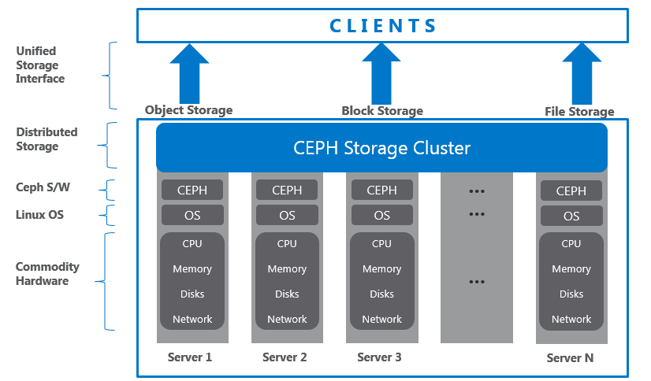
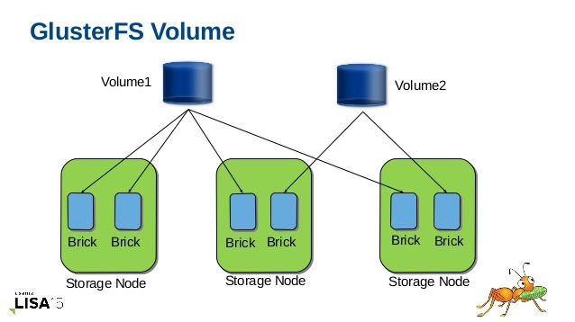

.. _gluster_vs_ceph:

===================
Gluster和Ceph对比
===================

在学习和使用Gluster/Ceph的时候，一直有些疑惑，为什么会有有这样两个著名的开源分布式存储、两者的差异是什么、哪个更适合我的应用场景、哪个未来发展方向更好？并且，Gluster和Ceph都属于Red Hat所有，这家在开源界举足轻重的公司是如何考虑存储战略，又会如何发展这两个开源项目？

.. note::

   本文综合网上资料撰写，我准备今后部署ceph和glusterfs进行相关测试和验证，通过实践来验证和对比不同的开源解决方案。

一句话概括
==============

Ceph适合非结构化数据存储，其对象存储特性适合云计算环境实时访问的虚拟机镜像和虚拟机磁盘。

Gluster适合结构化数据，采用传统的树形文件系统，适合海量大文件存储以及流式数据顺序读写，适合近线存储、数据归档环境。

区别
======

Ceph和Gluster是完全不同的解决方案，适用于不同的业务场景，虽然两者的功能有所重叠：

- Ceph是首先存储为对象的存储方案。从Ceph的发展历史来看，它是在常规文件系统(通常是XFS)之上构建的对象存储层，对于底层硬件的低级IOPs/throughput的运行则非常缓慢(按：这个观点待验证)。现在Ceph开发了新型的"bluestore"存储引擎，试图让Ceph直接处理数据写入磁盘而无需底层文件系统。所有Ceph操作都是围绕对象，完全基于RADOS，即内部的对象层。
- Ceph-FS则是对象之上的数据块。除非你的应用能够直接访问原生的RADOS(可能大多数应用做不到)，否则你就必须使用一个转换层来实现，例如swift/S3 to RADOS。
- Geph 当前也提供了POSIX兼容文件系统，但是开发和维护历史还不及Gluster，有待观察对比。

- Gluster和Ceph架构基础相反，Gluster是首先存储文件，最终也存储为文件，以及中间层大多数也是文件。

.. note::

   这里对Ceph首先存储为对象是指Ceph软件在存储数据到XFS文件系统之前，是将数据作为对象处理，再转换成文件系统文件。而Gluster从一开始就是存储文件，最终存储到XFS文件文件系统依然是文件。

- Gluster结构相对简单，易于部署，所以也方便在其上部署容器，虚拟机等。
- Gluster建议运行在XFS之上，底层辅助LVM实现快照

.. note::

   RedHat不建议在Gluster底层使用ZFS，因为其存在Bug。事实上，我自己的多年前的ZFS+Gluster实践遇到过数据错乱问题)。此外，不建议在Gluster底层使用EXT和btrfs。

- Gluster现在也具备了一个数据块层，以及一个对象层(swift)，这些层都是位于原生的glusterfs文件系统之上。要使他们正常运行，必须使用不同级别的技巧。
- Gluster可以扩展到极大的存储容量，但是在文件数量庞大的情况下存在性能问题，这是因为Metadata性能限制。
- Gluster不适合交易类场景，例如数据库，或者其他依赖实时严格锁的应用，类似的还有VMware(VMware和Gluster都已经支持NFSv4.1，但是运行glusterfs+gNFS over NFSv3则运行异常)(注意：这个场景需要验证，有可能NFSv4.1运行数据库类应用是可行的...)
- Gluster适合大型流文件，性能卓越。例如，在数PB的linux ISO或游戏数据流，则非常适合Gluster。
- Gluster和其他开源软件类似，缺乏统一的管理系统：Gluster依赖OS，LVM，VDO，文件系统以及其他存储层，如RAID卡，然而缺乏整体的管理平台接解决方案，你需要自己深入掌握并构建系统。少量节点尚可以忍受，海量服务器节点则是一个巨大的挑战。当前正在发展的 :ref:`glusterd2` 提供了restful api，也是 :ref:`cockpit` 的 :ref:`cockpit-gluster` 插件的运行基础，可以实现统一管控。

.. note::

   Red Hat企业版Gluster存储采用了 :ref:`tendrl` 来管理 :ref:`ceph` 和 :ref:`gluster` ，这是一个值得研究和借鉴的解决方案。

.. note::

   Ceph有些类似阿里云的盘古+oss的存储系统，面向对象存储，后期扩展出POSIX兼容文件系统以及块存储层。对于能够直接使用对象存储的OpenStack运计算系统，是一个比较全面的存储解决方案。但性能和稳定性需要投入大量的精力来达到预期目标。

适用场景
============

RedHat的副总裁兼总经理Ranga Rangachari描述Gluster和Ceph之间的区别如下：

Ceph是OpenStack架构的组成部分，大多数OpenStack实现都采用Cep作为存储子系统。Gluster则是经典的文件服务，常作为第二层存储和深度归档。

简而言之，Ceph和Gluster都是强大的存储，但是Gluster更易于伸缩，可以存储TB到PB的数据。Ceph则提供了快速的存储扩展，但是存储格式使其适合用户频繁访问的短时间存储。

.. note::

   你可以理解成Ceph适合作为用户实时访问数据存储，也就是运计算的虚拟机实例磁盘存储。而Gluster则适合文件归档，近线数据存储。

   Ceph是从对象存储发展到块存储和文件存储；Gluster则从文件存储发展到对象存储。

Ceph使用对象存储，意味着存储数据以二进制对象分布到大量的服务器上。Ceph提供了OpenStac私有云存储支持，并且用户可以在一套存储中混合非结构和结构数据。

Gluster使用块存储，即存储一系列数据到chunks，并分布到逻辑连接在一个统一命名空间的大量服务器上。Gluster提供了传统存储和文件传输协议支持，并且提供了高度伸缩和故障容灾支持。

决策采用Ceph或Gluster取决于数据存储类型，数据如何访问，以及数据存储在哪里。

非结构化数据的对象存储: Ceph
------------------------------

- Ceph本质上是基于对象的存储，类似Facebook存储图片、Dropbox存储客户端文件，对象存储支持非结构化数据，所以可以实现海量数据存储。整个存储系统是通过集群监控器，元数据服务器和日志存储来维护的，所以Ceph的结构较为复杂。

- 对象存储和基于块的数据存储意味着Ceph需要使用自己特殊的维护工具来管理存储，即系统管理员需要熟悉Ceph工具。
- Ceph也可以创建块存储，提供了访问块设备镜像能力，并将块设备条代化分布到整个集群。
- Ceph通过RESTful接口支持Amazon S3和OpenStack Swift API，这样就实现了高性能存储访问并兼容传统代码。

层次树形的块存储: GlusterFS
------------------------------

GlusterFS(也称为Gluster)，是更为传统的文件存储。Gluster易于部署，并且可以作为任何系统中的一个目录来使用。

Gluster的主要优点是易于使用，并且容易扩展和收缩，性能也比较好。请注意，Gluster比较适合大文件存储(大于4MB)以及顺序读写。集群可以跨物理服务器、虚拟机或云服务器，实现可伸缩存储虚拟化。

Gluster使用块存储，即数据的chunks存储在相连的集群设备的唯一命名空间。文件和块存储使用层次树形的一个文件系统。Gluster提供了基于集群的FUSE和NFS，对大多数系统管理员则是非常熟悉的底层架构。所以，Gluster相对Ceph而言更为简单，易于维护，并且广泛使用。但是，在特定的环境中(例如云计算虚拟机存储)，Ceph的性能优于Gluster。

企业级存储战略和云原生
======================

企业级存储战略
----------------

`Red Hat Storage strategy update <https://www.redhat.com/en/blog/red-hat-storage-strategy-update?channel=/en/blog/channel/red-hat-storage>`_ 阐明了IBM收购Red Hat之后的企业级存储战略: 在云原生软件定义存储(software-defined storage)， :ref:`openshift` Data Fundation 和 Red Hat Ceph Storage 都是在 :ref:`rook` 基础上定制开发，也就是围绕 Ceph 核心实现的 :ref:`k8s_storage` 解决方案(Red Hat还收购了 `noobaa.io <https://www.noobaa.io/>`_ 专注于Kubernetes数据网关)。

相对而言， Canonical( :ref:`ubuntu_linux` 公司) 和 SUSE ( :ref:`suse_linux` 公司 )没有同样级别的存储解决方案:

- SUSE已经结束了原先基于Ceph开发的SUSE Enterprise Storage产品，改为在收购的 `Rancher公司 <https://rancher.com/>`_ 产品 :ref:`rancher` (对标 :ref:`openshift` )集成 :ref:`k3s` 和 :ref:`longhorn` (基于iSCII的分布式存储) 实现边缘K8s和持久化存储
- Ubuntu?

云原生
---------

近些年醉着 :ref:`kubernetes` 的迅猛发展，云原生(kubernetes化)已经成为云计算的重要发展方向。企业级存储结合Kubernetes已经成为关键技术，也是我们观察存储技术发展未来的重要参考。

:ref:`k8s_persistent_volumes` 发展线路可以看到:

- :ref:`cephfs` ( :ref:`k8s_cephfs`  ) 和 :ref:`ceph_rbd` ( :ref:`k8s_rbd`  ) 得到Kubernetes的内置全面支持
- :ref:`gluster` ( :ref:`k8s_gluster`  ) 在Kuberntes 1.25放弃支持

从云原生存储管理框架来看 :ref:`rook` 作为 Red Hat Ceph Storage 上游开源项目，在 :ref:`openshift` 作为核心存储功能，发展十分迅猛。相比较而言，Gluster官方的 `gluster/gluster-kubernetes <https://github.com/gluster/gluster-kubernetes>`_ 已经在2019年中停止开发，这意味着社区已经放弃了在云原生中集成GlusterFS。同时，为Kubernetes提供GlusterFS REST管理框架的 :ref:`heketi` 也进入了维护状态(不再活跃开发)。

一句话总结
-----------

从Linux企业市场以及社区发展来看，至少云原生领域( :ref:`openstack` 虚拟化云计算其实也差不多 )，Ceph 已经超越 Gluster成为事实主流解决方案。所以，个人感觉专注于Ceph的技术可能更有发展前景。

参考
======

- `reddit讨论 "Ceph VS GlusterFS?" <https://www.reddit.com/r/sysadmin/comments/9onemk/ceph_vs_glusterfs/>`_
- `Big Data Storage Wars: Ceph vs Gluster <https://technologyadvice.com/blog/information-technology/ceph-vs-gluster/>`_
- `Glusterfs vs. Ceph: Which Wins the Storage War? <https://www.maketecheasier.com/glusterfs-vs-ceph/>`_
