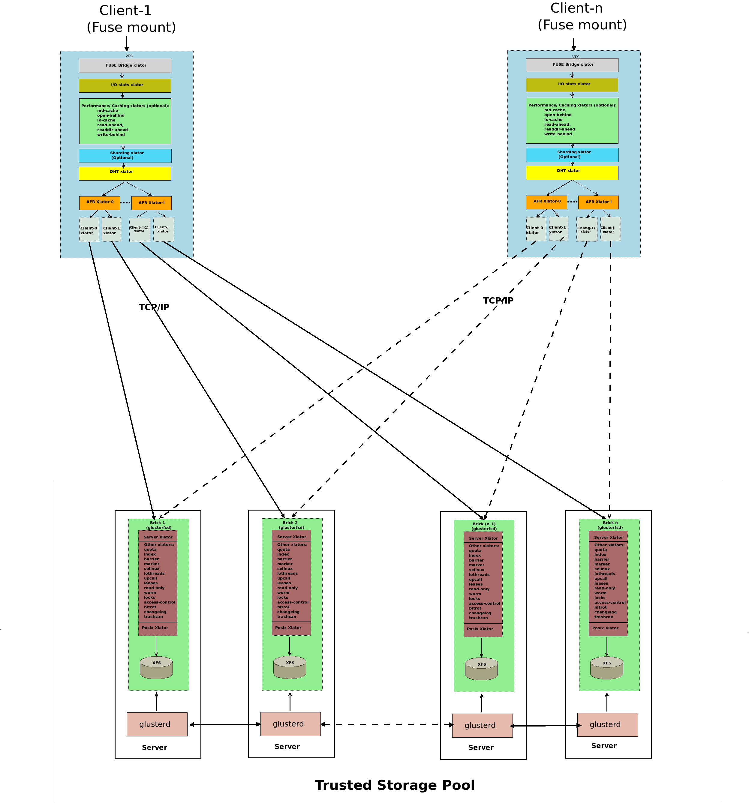
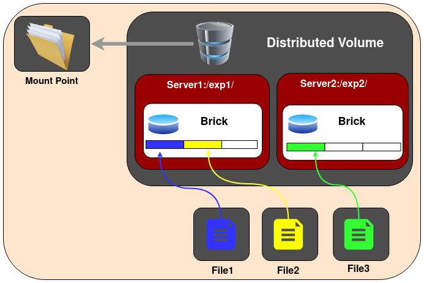
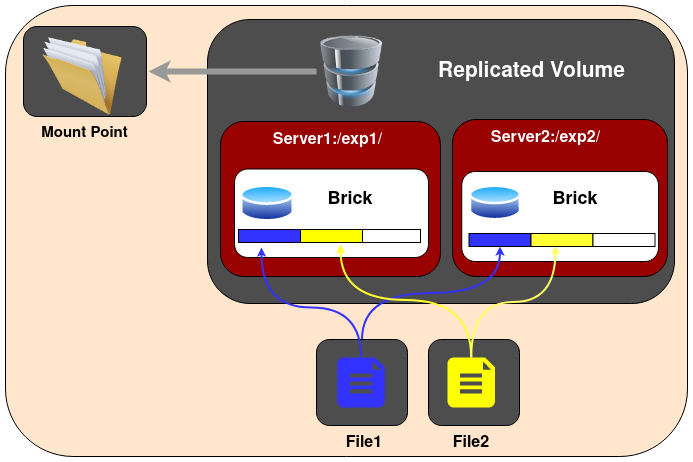
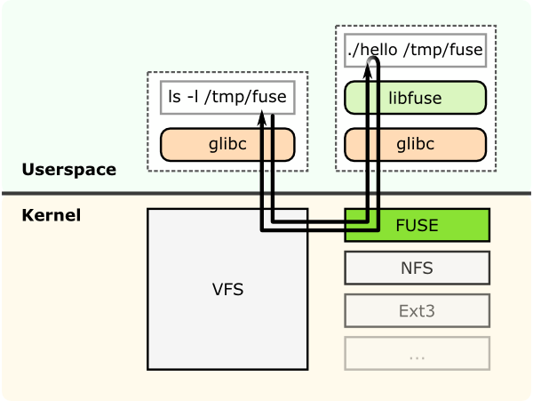
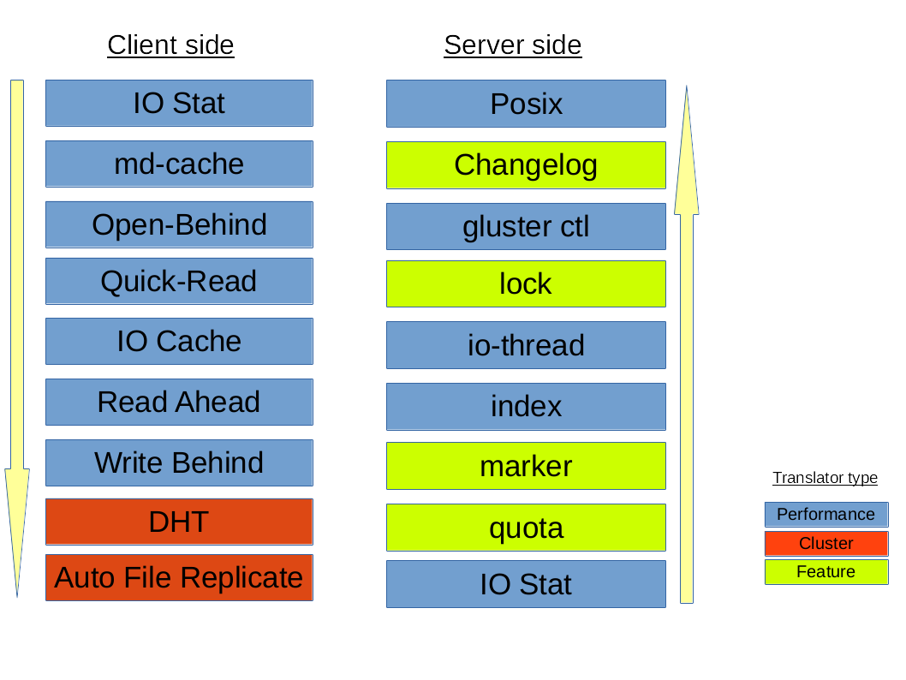

.. _gluster_architecture:

=====================
GlusterFS架构
=====================

在 :ref:`introduce_gluster` 中，我们初步了解了GlusterFS能够提供哪些功能，现在我们来解析组成GlusterFS分布式存储的底层技术。

GlusterFS卷类型
================

在gluster文件系统中卷volume是底层brick的集合，几乎所有操作都是在卷层面进行的。Gluster文件系统根据需求支持不同类型的存储卷。有些卷适合不断扩展的存储规模，有些卷则针对性能，也有一些卷则两者兼而有之。

分布式GlusterFS卷(Distributed GlusterFS Volume)
--------------------------------------------------

Distributed GlusterFS Volume是默认创建的GlusterFS卷，也就是如果不指定卷类型，就是创建distributed volume。在分布式卷中，文件会分散到卷的不同bricks上。也就是说，file1可能会存储到brick1或者brick2，但是不会同时存放到2个brick中。

.. warning::

   Discributed GlusterFS Volume就是纯粹的文件打散存储， **没有任何数据冗余** 所以这种分布式卷只提供了规模化和性能提升优点，存储卷中任何一个brick故障都会导致数据丢失。所以，Discributed GlusterFS Volume必须结合底层硬件数据保护(如RAID)，否则极其容易故障。

- 创建Distributed Volume命令::

   gluster volume create NEW-VOLNAME [transport [tcp | rdma | tcp,rdma]] NEW-BRICK...

例如创建一个使用TCP协议的4个存储服务器的分布式卷::

   gluster volume create test-volume server1:/exp1 server2:/exp2 server3:/exp3 server4:/exp4

然后就可以检查卷信息:

.. literalinclude:: gluster_architecture/gluster_volume_info
   :caption: 执行 ``gluster volume info`` 可以检查卷信息

显示信息类似::

   Volume Name: test-volume
   Type: Distribute
   Status: Created
   Number of Bricks: 4
   Transport-type: tcp
   Bricks:
   Brick1: server1:/exp1
   Brick2: server2:/exp2
   Brick3: server3:/exp3
   Brick4: server4:/exp4

GlusterFS复制卷(Replicated GlusterFS Volume)
==============================================

GlusterFS复制卷解决了纯分布式卷的数据丢失风险。在所有的bricks上，明确指定了数据需要维护的副本数量。在存储卷的副本数量可以在创建卷的时候由客户端决定。

如果我们需要创建双副本的存储卷，则至少需要2个bricks；同理，要创建3副本的存储卷，则需要至少3个bricks。当创建卷时候，需要确保bricks的数量是集群卷配置的副本数量的整数倍。例如，要创建3副本卷，则bricks数量必须是3的倍数，如3,6,9...

采用Replicated GlusterFS Volume的优点是，即使由一个brick出现故障，数据也不会丢失并且卷依然能够访问。所以，Replicated GlusterFS Volume是兼顾了可靠性和数据冗余的优点，在企业级使用非常广泛。

- 创建Replicated Volume::

   gluster volume create NEW-VOLNAME [replica COUNT] [transport [tcp |rdma | tcp,rdma]] NEW-BRICK...

以下案例在3台存储服务器上创建一个replicated volume::

   gluster volume create test-volume replica 3 transport tcp \
         server1:/exp1 server2:/exp2 server3:/exp3

.. _distributed_replicated_glusterfs_volume:

分布式复制GlusterFS卷(Distributed Replicated GlusterFS Volume)
---------------------------------------------------------------

.. note::

   当创建复制卷时候，如果bricks数量是replicas的2倍或更多倍时，创建的就是分布式复制卷(Distributed Replicated GlusterFS Volume)。这是因为GlusterFS不仅构建文件副本，还会把文件分散到多个bricks集上，实现更大范围的数据分布，从而提高访问性能。

在Distributed Replicated GlusterFS Volume 分布式复制卷中，文件会在bricks的复制集上打散分布。Distributed Replicated GlusterFS Volume要求bricks的数量必须是replica数量的整数倍，并且在创建卷时指定的bricks顺序对于数据分布紧密相关。

Distributed Replicated GlusterFS Volume用于要求高可用数据同时要求数据冗余和可扩展的存储环境。

.. note::

   注意，文件分布是首先实现多副本存储(replicas)，然后再实现分布式存储(distributed)，所以需要关注创建GlusterFS时候设置的bricks的顺序。见下文图示。

.. figure:: ../../_static/gluster/startup/distributed_replicated_gluster_volume.png
   :scale: 80

上图是 ``replicas 2`` 的分布结构。如果在创建卷的时候，提供了8个bricks，则结构就是 2x4 。同理，如果在8个bricks上创建 ``replicas 4`` 卷，则结构就是 4x2 。

- 创建分布式复制卷::

   gluster volume create NEW-VOLNAME [replica COUNT] [transport [tcp | rdma | tcp,rdma]] NEW-BRICK...

举例，创建6节点分布式复制卷，使用3副本，即 3x2 ::

   gluster volume create test-volume replica 3 transport tcp server1:/exp1 server2:/exp2 server3:/exp3 server4:/exp4 server5:/exp5 server6:/exp6

纠错卷(Dispersed GlusterFS Volume)
-----------------------------------

Dispersed Volume是基于ErasureCodes（纠错码）的一种新类型的Volume（3.6版本正式发布该特性），类似于RAID5/6。将文件的编码数据条带化，然后加上一些冗余信息，然后将这些数据打散到GlusterFS卷的多个bricks上。通过配置Redundancy（冗余）级别提高可靠性，在保证较高的可靠性同时，可以提升物理存储空间的利用率。

文件是被分割成大小相同的Chunk(块)，而每个Chunk又被分割成fragment，而冗余信息的Fragment也随之生成，且同一个Fragment只会保存一个Brick上。

冗余信息
~~~~~~~~~

每个纠错卷都有一个在创建卷的时候定义的redundancy value(冗余值)，这个值决定了多少bricks丢失情况下都不会中断卷的操作。卷的使用空间取决于以下计算公式::

   <Usable size> = <Brick size> * (#Bricks - Redundancy)

.. figure:: ../../_static/gluster/startup/dispersed_gluster_volume.png
   :scale: 80

- 创建纠错卷::

   gluster volume create test-volume [disperse [<COUNT>]] [disperse-data <COUNT>] [redundancy <COUNT>] [transport tcp | rdma | tcp,rdma] <NEW-BRICK>

- 就创建3节点纠错卷，冗余数据level 1（2+1）::

   gluster volume create test-volume disperse 3 redundancy 1 server1:/exp1 server2:/exp2 server3:/exp3

.. note::

   采用 纠错卷(Dispersed GlusterFS Volume) 可以极大节约存储消耗，特别是 ``brick`` 越多存储效率越高(因为只有 ``Redundancy`` 是校验数据 ``brick`` 没有利用上)

分布式纠错卷(Distributed Dispersed Volume)
--------------------------------------------

分布式纠错卷(Distributed Dispersed Volume)类似分布式复制卷，只不过将复制的副本替换为纠错子卷。分布式纠错卷必须使用第一个子卷的复数个数的bricks。这样的分布式纠错卷比较容易扩展卷大小，并且将负载分不到不同bricks上。

.. figure:: ../../_static/gluster/startup/distributed_dispersed_gluster_volume.png
   :scale: 80

- 创建分布式纠错卷::

   gluster volume create [disperse [<COUNT>]] [disperse-data <COUNT>] [redundancy <COUNT>] [transport tcp | rdma | tcp,rdma] <NEW-BRICK>

举例，6节点分布式纠错卷，冗余度1，也就是 2x(2+1)=6 ::

   gluster volume create test-volume disperse 3 redundancy 1 server1:/exp1 server2:/exp2 server3:/exp3 server4:/exp4 server5:/exp5 server6:/exp6

.. note::

   - 纠错卷可以指定在纠错集中的bricks数量，指定冗余bricks中数量，或者同时指定
   - 如果没有指定纠错，或者 ``<count>`` 缺失，则整个交卷就是被视为一个单独纠错集
   - 如果没有指定冗余，则自动计算优化值

FUSE
======

GlusterFS是一个用户空间文件系统(userspace filesystem)，这种方式可以避免使用内核模块。由于是一个用户空间文件系统，为了和内核VFS交互，GlusterFS需要使用FUSE(File System in
Userspace)。长期依赖，实现一个用户空间文件系统是非常重要的，FUSE就是这样一个解决方案。FUSE是一个内核模块，支持在内核VFS和没有特权用户应用程序之间交互，并且FUSE有一个API可以从用户空间访问。通过使用这个API，任何文件系统都几乎可以使用任意编程语言编写，事实上确实有很多中绑定了FUSE和其他语言的实现。

上述示意图是假设一个 "hello world" 文件系统，编译用于创建一个二进制"hello"。这个文件系统被挂载到 ``/tmp/fuse`` 。当用户执行 ``ls -l /tmp/fuse`` 命令时，这给命令通过glibc到达VFS，由于这个挂载 ``/tmp/fuse`` 是对应的FUSE文件系统，所以VFS将命令传递给FUSE模块。FUSE内核模块则联系实际的文件系统二进制"hello"，然后传递给glibc和用户空间的FUSE库(libfuse)。这个结果就是通过相同路径返回"hello"给 ``ls -l``
命令。

这里在FUSE内核模块和FUSE库(libfuse)的通讯是通过打开的 ``/dev/fuse`` 而获得的特殊文件描述符。这个文件可以被多次打开，并且获得的文件描述符被传递给mount系统调用来匹配挂载的文件系统的描述符。

转换器(Translators)
====================

- ``translator`` (转换器)负责将用户请求转换为存储请求
- ``translator`` (转换器)可以在请求经过时修改请求: 将一种请求类型转换为另一种请求，包括修改路径(path)、标记(flags)甚至是数据(例如 ``加密`` )
- ``translator`` 还可以实现拦截或阻断请求(例如，访问控制)
- ``translator`` 也可以产生新的请求(例如，预取)

.. note::

   所谓 Gluster Translators ，你可以理解成类似 Linux VFS 这样的文件系统层，每一层 Translator 提供了一个独立功能，通过叠加 Translator 来实现复杂的功能组合。

``Translator`` 工作原理
------------------------

- 共享对象
- 根据 ``volfile`` 动态加载:  ``dlopen`` / ``dlsync`` 通过 ``fops`` 设置指向 ``父`` / ``子`` 指针 调用 ``init`` (构造函数) 调用 IO 功能
- 验证/传递选项等约定
- ``translator`` 配置从GlusterFS 3.1开始采用 ``gluster`` 命令来进行管理

``Translator`` 类型
---------------------

.. csv-table:: Gluster Translator类型
   :file: gluster_architecture/gluster_translators.csv
   :widths: 20, 80
   :header-rows: 1

默认/通用 ``vol`` 文件的转换器层次结构:

   
   默认/通用 ``vol`` 文件的转换器层次结构

在上述 ``Translator`` 中，最重要的两类是:

- ``Cluster Translator`` :

  - **DHT** ( ``Distributed Hash Table`` ): 分布式哈希表
  - **AFR** ( ``Automatic File Replication`` ): 自动文件复制

- ``Performance Translator`` :

  - ``io-cache``
  - ``io-threads``
  - ``md-cache``
  - ``O-B`` (open behind)
  - ``QR`` (quick read)
  - ``r-a`` (read-ahead)
  - ``w-b`` (write-behind)

其他Translator:

- ``Feature Translator`` :

  - ``changelog``
  - ``locks`` : 提供内部锁操作( ``inodelk`` , ``entrylk`` )，自动文件复制(Automatic File Replication, AFR)使用锁来实现对相互冲突的文件或目录的操作同步
  - ``marker``
  - ``quota``

- ``Debug Translator`` :

  - ``trace`` : 跟踪Translator之间通讯过程中产生的错误日志
  - ``io-stats``

DHT(Distributed Hash Table) Translator
=======================================

**重要且核心概念**

DHT(分布式哈希表)是GlusterFS实现跨多个服务器聚合容量和性能的真正核心。DHT负责将每个文件正确存放到一个子卷上 - 不像 复制(将副本放在它的所有子卷上) 或 条带化(将文件切片放在它的所有子卷上)。DHT是一个路由功能，而不是拆分或者复制。

DHT(分布式哈希表)使用的基本方法是 ``一致性哈希表`` ，每个子卷( ``brick`` )都被分配了一个32位哈希空间内的范围，覆盖了整个范围，没有缺漏或重叠。然后每个文件通过文件名的哈希来确定该空间的一个值，此时就会有一个 ``brick`` 符合这个文件名哈希以后值所落在这个范围内，也就是表示这个文件要存储在对应的 ``brick`` 上。

不过，实际上会有很多复杂的情况，例如，当 ``brick`` 集合在文件创建后发生变化，或者当一个 ``brick`` 存储满的情况。DHT中大部分复杂性都和这些特殊情况有关。

当使用 ``open()`` 打开一个文件，分布式 translator 将提供一个信息来查找文件。DHT通过将文件名转换成哈希以后的数字来定位文件存储位置。

.. note::

   有关一致性哈希算法后续补充

AFR(Automatic File Replication) Translator
============================================

自动文件复制(Automatic File Replication) Translator是GlusterFS利用文件系统扩展属性来跟踪文件操作，负责跨 ``brick`` 复制数据:

- 保持复制一致性(即两个 ``brick`` 上的数据应该相同: 只要副本集replica set的所有 ``brick`` 都已启动，即使从多个应用程序/挂载点并行对同一个文件/目录进行操作的情况下)
- 提供在发生故障时恢复数据的方法: 只要至少有一个 ``brick`` 具有正确的数据
- 为 ``read / stat / readdir`` 等提供新数据

Geo-Replication
==================

待续...

参考
======

- `GlusterFS Architecture <https://docs.gluster.org/en/latest/Quick-Start-Guide/Architecture/>`_
- `GlusterFS的数据分布(DHT)和文件副本(AFR)机制 <https://cloud.tencent.com/developer/article/1536260>`_ 腾讯工程师邵靖撰写的架构解析，非常详尽
- `GlusterFS Dispersed Volume(纠错卷)总结 <https://blog.csdn.net/xdgouzongmei/article/details/52748812>`_
