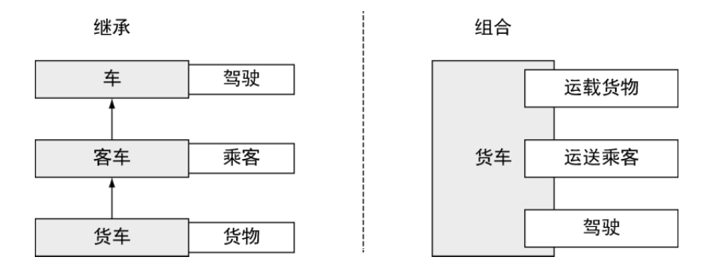

.. _intro_golang:

=====================
Go语言简介
=====================

.. note::

   本文不包含完整的Go语言特性介绍，仅仅是我个人为了便于记忆和了解go语言整理的提纲

   也许并不准确，我会在不断学习中进行修订

并发
=========

Go语言并发使用 ``goroutine`` :

- ``goroutine`` 类似线程，但占用内存远少于线程，并且使用 ``goroutine`` 的代码较少
- Go语言使用同一个线程来执行多个 ``goroutine``

  - 类似于线程的丝程(我的假设比喻，也许就是一根丝线被分成更多更细的丝)
  - 每个 ``goroutine`` 接收的请求都自动在自己的 ``goroutine`` 中处理(每个goroutine具有完整的处理逻辑)

- ``goroutine`` 会并行处理
- ``channel`` 是内置的数据结构，可以让不同 ``goroutine`` 之间同步发送具有类型的消息(goroutine之间通过消息进行同步)

  - ``channel`` 确保同一时刻只有一个 ``goroutine`` 修改数据，这样能够确保线程不会在没有同步保护的情况下修改同一个数据

类型系统
==========

Go使用组合(composition)设计模式: 一个类型嵌入到另一个类型就能复用所有的功能:

- 一个类型由其他更微小的类型 **组合** 而成，避免了传统的基于继承的模型

  - 不需要考虑复杂庞大的继承链，只需要考虑功能组合

   继承和组合的对比

- 允许用户对行为进行建模，而不是对类型进行建模
