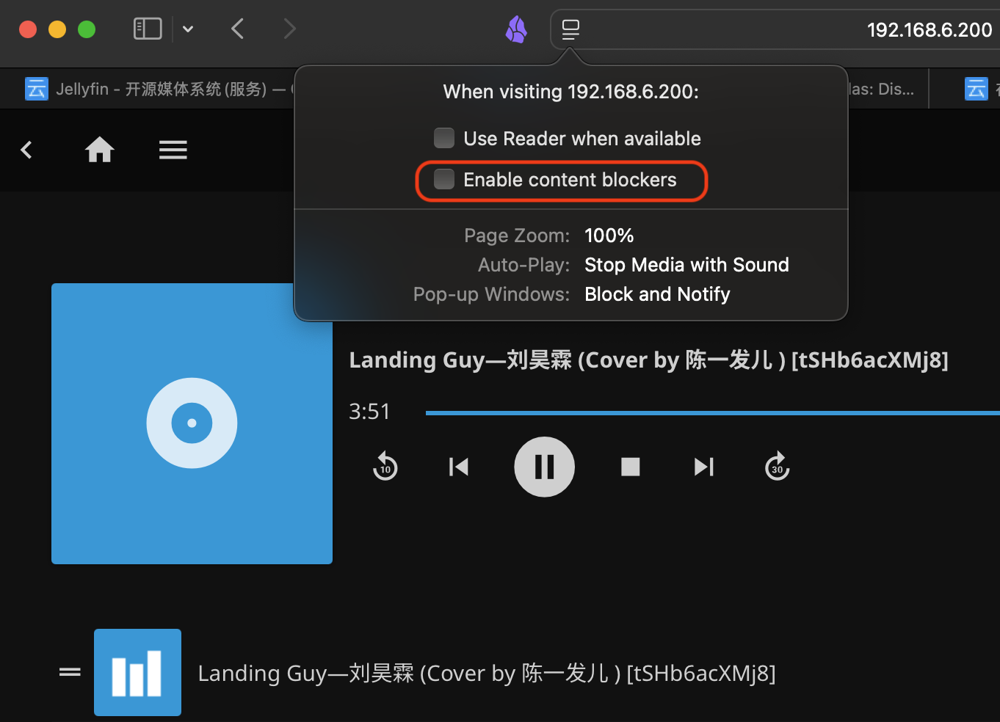

.. _jellyfin_music:

======================
Jellyfin音乐播放
======================

Jellyfin支持音乐播放，类似于 :ref:`jellyfin_tvshow` ，只需要将音频文件存放到类似 ``/media/musics`` 目录下的子目录(可以按照自己的喜好，如专辑、歌手等)，然后在Dashboard中的 ``Libraries`` 中，创建一个Content type为 ``Musice`` 的媒体库就可以自动索引并创建列表。

``无声`` 问题处理
====================

我刚开始使用Safari来访问创建好的Music库，意外发现播放音乐虽然显示进度条在前进，但是却没有任何声音。我最初以为是音频输出设备错误(毕竟MacBook有多个声音output设备，例如耳机、内置喇叭和HDMI显示输出)，但是我发现我通过Jellyfin观看视频是完全正常的，也没有 ``mute`` 。

经过gemini提示，了解到原来现代浏览器（尤其是 macOS 上的 Safari 和 Chrome）为了防止流氓网站自动外放小广告而引入的严格沙箱安全机制： **音频自动播放限制（Autoplay Policy）** 。

在 Jellyfin 网页端点击一首歌时，Jellyfin 的前端代码会自动触发 ``play()`` 指令。如果此时浏览器判定 “用户在打开或刷新这个网页后，没有与页面进行过有效的物理交互（比如点击、敲击键盘）”，浏览器底层的 Web Audio API 就会强制将这个音频轨道进行 **静音（Muted）** 或 **挂起（Suspended）** 处理，但进度条依然会正常走。

在看视频时，通常会先点进详情页，再点击大大的播放按钮，或者调整 Quality，这期间与页面发生了多次交互，成功激活了浏览器的音频锁；而连续播音乐时，切歌往往是系统后台自动进行的，极易触发这个阻断。

解决方法:

- 点击Safari上方地址栏左侧的 “网站设置 (Settings for This Website)” ，点击 ``Website Settings...``
- 默认设置是 ``Enable content blockers`` ，请务必 **取消这个选项**

连续播放问题处理
====================

在解决了音乐播放无声的问题之后，我惊讶地发现Jellyfin不会连续播放音乐，即使看起来音乐列表排列着很多首歌。

gemini提供了一些可能性，我做了一一排查:

- 浏览器"标签页休眠 / 冻结"机制: 现代 Mac 系统（尤其是 macOS Sonoma/Sequoia）为了极端省电和压榨 CPU 功耗，对浏览器引入了极其激进的 “标签页休眠（Tab Freezing / Sleeping Tabs）” 策略。

  - 通过把 Jellyfin 的网页保持在屏幕最前（前台可见，不切到后台），观察是否能够自动跳到下一首歌。如果能够完成自动播放，并且切到后台就断，则是"标签页休眠"问题
  - 很不幸，我验证发现即使前台也没有解决

- (未验证)我的这批 ``.m4a`` 歌曲是通过 :ref:`yt-dlp` 从YouTube下载的，所以gemini推测可能是Meta头修改过导致 Google 封装工具写入的物理总时长（Duration）与实际音频流的最后一个时间戳（Timestamp）存在极细微的对齐偏差，Jellyfin 的 ffmpeg 分段器在切最后一个片时，可能会产生一个 0 字节的空分段（Null Segment），或者抛出一个 dts out of range（解码时间戳越界）的警告。

.. note::

   我偶然发现，其实Jellyfin并不是不能自动播放下一首歌曲，而是在播放下一首歌曲前会等待很长时间。

 - Jellyfin 服务端在切歌时默认会"实时检索元数据"，此时后台会尝试去开源数据库下载歌曲的内嵌歌词、专辑插图或流派信息。由于国内连接音乐元数据服务器的网络环境极其恶劣，所以Jellyfin 的后台线程会被卡在 HTTP 请求的 Timeout 状态里。直到系统设定的超时阈值耗尽，Jellyfin 才会松开卡死的线程，把音频流传输给客户端浏览器。

  - 登录后台 -> 控制台 (Dashboard) -> 媒体库 (Libraries) ，找到音乐媒体库，点击 ``...`` 管理媒体库: 把所有联网的勾选（如 MusicBrainz 等）全部取消勾选（保持留空）
  - 很不幸，验证后发现依然没有解决

.. note::

   对比浏览器发现，如果采用Chrome浏览器，则Jellyfin的Music听歌时就能自动切换。看起来很有可能是Safari的安全沙箱机制导致了这个问题...

.. warning::

   目前还是没有解决 **Safari浏览器播放音乐自动切歌** 这个问题!!!

   我现在改为采用Jellyfin官方的Media Player来使用Media播放，则没有无法自动切歌的问题。不过，客户端在播放歌曲时候也是有不足的: 当屏幕关闭后歌曲无法后台播放，这点看来Media Player还是作为视频客户端来使用较好。
