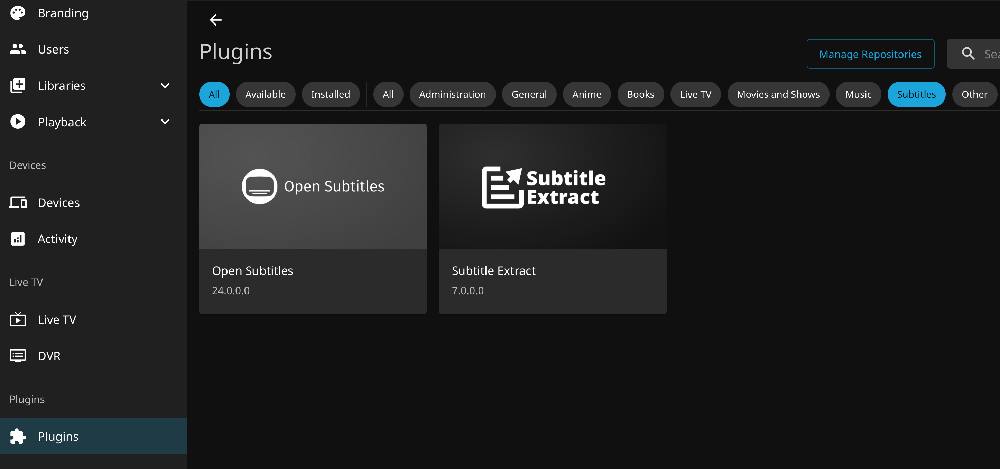
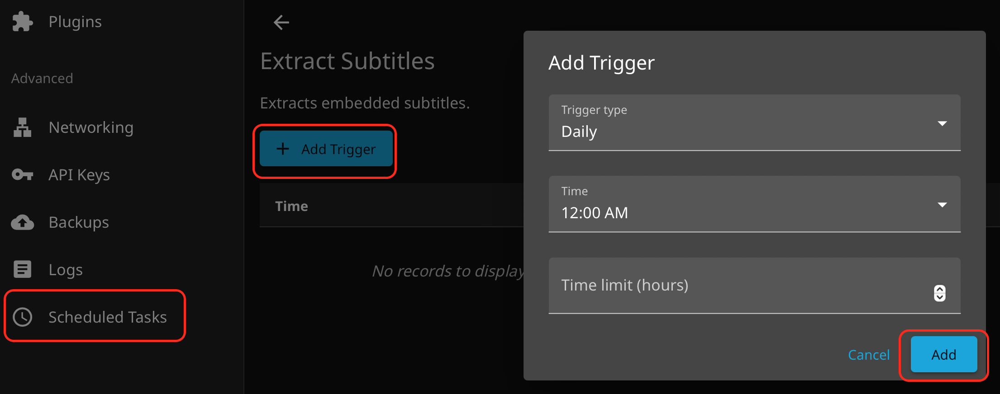

.. _jellyfin_subtitle:

=============================
Jellyfin字幕
=============================

Jellyfin 内置 OpenSubtitles 官方字幕刮削器
==============================================

Jellyfin 原生集成了一个全球最大的开源字幕库服务 —— OpenSubtitles。只要配置好它，服务器就会在后台自动比对电影的 Hash 值，帮你把中文字幕脱水下载到本地。

- 注册账号：先去 `OpenSubtitles.com <https://www.opensubtitles.com>`_ 官网(替代了早期的 `OpenSubtitles.org <https://www.opensubtitles.org/>`_ )免费注册一个账号
- 登录 Jellyfin 管理员后台，进入 ``控制台 (Dashboard) -> 插件 (Plugins)``
- 点击 ``All`` 和 ``Subtitles`` 标签，就可以看到官方提供的 ``Open Subtitles`` 插件，激活使用

.. note::

   在大陆访问Jellyfin仓库是被GFW屏蔽的，所以刷新不出仓库，也看不到 ``open-subtitles`` 插件

   我这里采用手工安装方法，见下文

手工安装
-----------

- 下载插件 Zip 包:

.. literalinclude:: jellyfin_subtitle/wget
   :caption: 下载 OpenSubtitles 插件包

- 将下载的 OpenSubtitles 插件包 .zip 文件复制到 Jellyfin 的配置目录下的 ``plugins/OpenSubtitles`` 目录(这个目录需要手工建立)，并解压缩:

.. literalinclude:: jellyfin_subtitle/zip
   :caption: 复制并解压缩OpenSubtitles 插件包 .zip 文件

- 重启 Jellyfin 服务，此时可以看到 Plugins 下增加了 Open Subtitles 插件

- **重要步骤** 点击 Open Subtitles 插件 ``Settings`` 配置，填写刚才在 `OpenSubtitles.com <https://www.opensubtitles.com>`_ 注册的账号

.. note::

   至此，如果一切正常，那么在重新扫描libraries之后，视频目录下会出现字幕文件，并且能够在观看视频时加载字幕

   但是，对于中文用户来说 OpenSubtitles 最大的不便是很多老电影或小众电影没有人上传中文字幕，所以自动下载的字幕可能只有英文版本。所以，我们要执行下一步，通过 :ref:`docker_compose` 同时运行一个 ``chinesesubfinder`` 容器来专门下载中文字幕

extract subtitles插件
------------------------

Subtitle Extract（字幕提取插件）能够将内置字幕的 .mkv 容器内部的封装字幕提取出来。

虽然浏览器（如 Safari、Chrome）或者电视盒子直接播放这些 MKV 时能够读取字幕，但是客户端往往需要高频向服务器请求读取大文件内部的块数据，这就极易引发画面卡顿、字幕不同步、或者干脆无法加载。

激活 Subtitle Extract 插件之后，Jellyfin 会在后台利用一个定时任务，把所有新入库电影中封装在 MKV 内部的字幕，全部物理抽离、解压出来，变成一个个独立的缓存小文件存放在服务器端。

激活以后，请配置 计划任务 (Scheduled Tasks):

- 进入 控制台 -> 计划任务 (Scheduled Tasks)
- 在列表里找到 Extract Subtitles（提取字幕） 这一项
- 点击它进入触发器设置，建议将其设置为每天凌晨 3:00 或 4:00 自动触发

chinesesubfinder
===================

- ``docker-compose.yml`` :

.. literalinclude:: running_jellyfin_in_docker/docker-compose.yml
   :caption: 配置 ``docker-compose.yml``

注意:

- 两个容器的目录挂载必须保持一致，并且用户的ID也一致
- ``- PERMS=false`` 可以避免chinesesubfinder启动时不用执行media目录下所有文件属主修订UID/GID，这个过程对于大量为文件的目录可能会导致非常缓慢，并影响后续服务启动
- 首次访问 http://<你的服务器IP>:19035 需要按照向导设置管理员账号密码，另外需要按照页面settings配置 ``伪射手网 (AssRT)`` 的访问API token(按照提示去AssRT网站注册一个账号并生成token)
